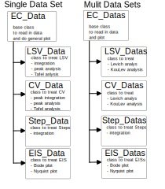

# EC4py documentation - Data Treament of Electrochemcial data made easy

**Source code:** [EC4py on Github](https://github.com/NordicEC/EC4py)

__________________________________
This Module offers classes representing data recorded different kinds of electrochemical techniques. Each class has a single and a multi data version. The latter version funktion as an array, and can be iterated.  
 
   

### Keywords
| Keyword        | Meaning           | Where to use  |
| ------------- |:-------------| -----:|
| IRCOMP = "Z" | iR-compensation using measured   absolute impedance| When loading a dataset |
| IRCOMP = "R" | iR-compensation using measured  real part of the impedance |When loading a dataset|
| IRCOMP = 1.0 | Manual iR-compensation where the number corresponds to the Rsol | When loading a dataset |

#### For plotting
| Keyword        | Meaning           | Where to use  |
| ------------- |:-------------| -----:|
| y_smooth = 3 | iR-compensation using measured   absolute impedance| When loading a dataset |
| x_smooth = 4 | iR-compensation using measured  real part of the impedance |When loading a dataset|
| IRCOMP = 1.0 | Manual iR-compensation where the number corresponds to the Rsol | When loading a dataset |

### Arguments

#### For CV_Data, CV_Datas
| Keyword        | Meaning           | Where to use  |
| ------------- |:-------------| -----:|
| POS | Select the positive sweep| |
| NEG | Select the negative sweep| |
| AVG | Select the average sweep from positive and negative sweeps| |
| DIF | Select the difference  between the positive and negative sweeps| |

   intro
   install
   - [Install](/EC4py/install/)
   - [Package](/EC4py/package/)
   - [Examples](/EC4py/examples/)
    

