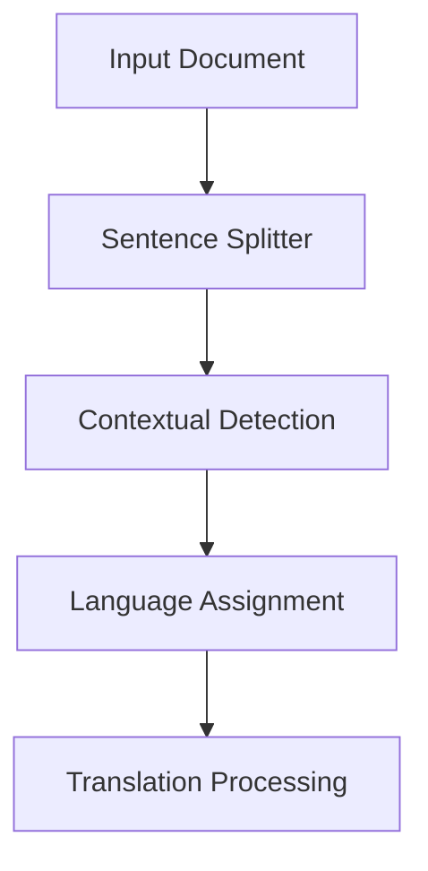

# Advanced Language Detection

This document describes the context-aware language detection system used in add2anki, which now leverages the [contextual-langdetect](https://github.com/osteele/contextual-langdetect) package for improved language detection.

## Overview

add2anki now uses the contextual-langdetect package, which provides:

1. Context-aware language detection for better accuracy
2. Built-in handling of document-level language patterns
3. Improved detection for short or ambiguous sentences
4. Simplified integration with minimal dependencies

## System Architecture



## How Contextual Detection Works

The contextual-langdetect package implements a statistical approach to language detection that:

1. Analyzes the entire document as a whole, not just individual sentences
2. Builds a language model based on the document's content
3. Uses this context to improve detection accuracy for ambiguous sentences
4. Handles mixed-language documents more effectively

## Integration with add2anki

add2anki integrates contextual-langdetect through a simplified interface:

```python
from contextual_langdetect import contextual_detect

# Process a batch of sentences with context awareness
sentences = ["Hello", "你好", "Good day", "今天天气很好"]
detected_languages = contextual_detect(sentences)
# Returns: ["en", "zh", "en", "zh"]

# Process a single sentence (without context)
# But can provide expected languages as hints
lang = contextual_detect(["你好"], languages=["zh", "en"])
# Returns: ["zh"]
```

This simplified API makes the code more maintainable while improving detection accuracy.

## Key Benefits

1. **Improved Accuracy**: The contextual approach significantly improves detection for:
   - Short sentences (less than 6 characters)
   - Similar languages (Chinese vs. Japanese without kana)
   - Mixed-language documents

2. **Simplified Code**: By using the contextual-langdetect package:
   - No need to implement complex statistical models
   - Reduced code complexity and better maintainability
   - Fewer dependencies (no need for numpy, scikit-learn, etc.)

3. **Better User Experience**:
   - Fewer false detections
   - Less need for explicit language specification
   - More consistent results across different content types

## Implementation Details

### Single Sentence Mode

For interactive use (REPL mode), add2anki:

1. Maintains a history of detected languages
2. Uses this history to provide hints to contextual-langdetect
3. For very short sentences, applies extra scrutiny
4. Falls back to the most frequent language when detection is ambiguous

### Batch Processing

For batch processing (files, CSV, etc.), add2anki:

1. Passes all sentences to contextual-langdetect
2. Uses the package's built-in context awareness
3. Processes each sentence based on its detected language
4. Filters out sentences that are already in the target language

## Language State Tracking

add2anki maintains a LanguageState object for REPL mode that:

1. Records detected languages
2. Tracks language frequency
3. Identifies primary languages (those appearing >10% of the time)
4. Provides context for future detections

This state tracking enhances the contextual-langdetect package's capabilities when processing sentences one at a time.

## Future Improvements

While the current implementation provides excellent results, future improvements could include:

1. More sophisticated handling of ambiguous short sentences
2. Better feedback for uncertain detections
3. Fine-tuning expected languages based on user preferences
