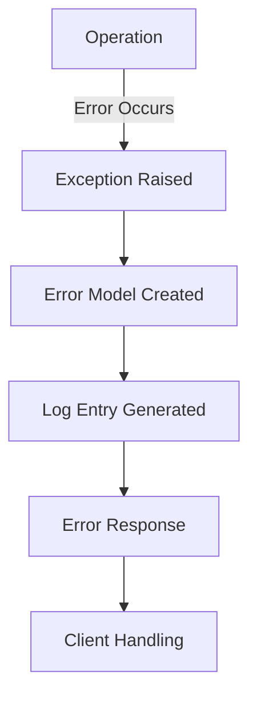

# AIVK Base Module | AIVK 基础模块 | AIVK ベースモジュール

## Overview | 概述 | 概要

AIVK 基础模块提供了框架的核心功能和基础设施。  
AIVK Base Module provides core functionality and infrastructure.  
AIVK ベースモジュールはフレームワークのコア機能とインフラストラクチャを提供します。

## Components | 组件 | コンポーネント

### Utils | 实用工具 | ユーティリティ
[详细文档](./utils.MD) | [Details](./utils.MD) | [詳細](./utils.MD)

- 命令执行器 | Command Executor | コマンド実行
- 统一操作接口 | Unified Operations | 統一操作
- 工具函数集 | Utility Functions | ユーティリティ関数

### Models | 数据模型 | モデル
[详细文档](./models.MD) | [Details](./models.MD) | [詳細](./models.MD)

- 错误信息模型 | Error Models | エラーモデル
- 日志条目模型 | Log Entry Models | ログエントリモデル
- 响应数据模型 | Response Models | レスポンスモデル

### Exceptions | 异常处理 | 例外処理
[详细文档](./exceptions.MD) | [Details](./exceptions.MD) | [詳細](./exceptions.MD)

- 异常类层次 | Exception Hierarchy | 例外階層
- 错误代码系统 | Error Code System | エラーコードシステム
- 错误处理策略 | Error Handling Strategies | エラー処理戦略

## Architecture | 架构 | アーキテクチャ

```
base/
├── utils.py       # 工具函数 | Utilities | ユーティリティ
├── models.py      # 数据模型 | Data Models | データモデル
├── exceptions.py  # 异常处理 | Exceptions | 例外処理
└── docs/         # 文档 | Documentation | ドキュメント
```

## Integration | 集成 | 統合

### Error Handling Flow | 错误处理流程 | エラー処理フロー



### Module Operations | 模块操作 | モジュール操作


## Usage Examples | 使用示例 | 使用例

### Basic Usage | 基本使用 | 基本使用

```python
from aivk.base import aivk_on, AivkExecuter, AivkException

# Module operations | 模块操作 | モジュール操作
await aivk_on("load", "fs")

# Command execution | 命令执行 | コマンド実行
result = await AivkExecuter.aexec("git status")
```

### Error Handling | 错误处理 | エラー処理

```python
try:
    result = await aivk_on("load", "invalid_module")
except AivkException as e:
    logger.error(f"Error {e.code}: {e.message}")
```

## Development | 开发 | 開発

### Adding New Features | 添加新功能 | 新機能の追加

1. 创建功能模型 | Create Feature Model | 機能モデルの作成
2. 实现异常处理 | Implement Error Handling | エラー処理の実装
3. 添加工具函数 | Add Utility Functions | ユーティリティ関数の追加
4. 更新文档 | Update Documentation | ドキュメントの更新

### Testing | 测试 | テスト

- 单元测试 | Unit Tests | ユニットテスト
- 集成测试 | Integration Tests | 統合テスト
- 错误处理测试 | Error Handling Tests | エラー処理テスト

## Best Practices | 最佳实践 | ベストプラクティス

1. Error Handling | 错误处理 | エラー処理
   - Use appropriate exceptions | 使用合适的异常 | 適切な例外を使用
   - Include error codes | 包含错误代码 | エラーコードを含める
   - Provide helpful messages | 提供有用的消息 | 役立つメッセージを提供

2. Logging | 日志记录 | ログ記録
   - Log all operations | 记录所有操作 | すべての操作を記録
   - Include context | 包含上下文 | コンテキストを含める
   - Use appropriate levels | 使用适当的级别 | 適切なレベルを使用

3. Documentation | 文档 | ドキュメント
   - Keep docs updated | 保持文档更新 | ドキュメントを最新に
   - Include examples | 包含示例 | 例を含める
   - Multi-language support | 多语言支持 | 多言語サポート
````

# AIVK Base Module | AIVK 基础模块 | AIVK ベースモジュール

## Models | 模型 | モデル

### ErrorInfo | 错误信息 | エラー情報

Data model for error information.  
错误信息的数据模型。  
エラー情報のデータモデル。

```python
@dataclass
class ErrorInfo:
    code: int          # Error code | 错误代码 | エラーコード
    message: str       # Error message | 错误消息 | エラーメッセージ
    details: dict      # Additional details | 附加细节 | 追加詳細
    timestamp: str     # Error timestamp | 错误时间戳 | エラーのタイムスタンプ
```

### ErrorLogEntry | 错误日志条目 | エラーログエントリ

Model for error log entries.  
错误日志条目的模型。  
エラーログエントリのモデル。

```python
@dataclass
class ErrorLogEntry:
    error: ErrorInfo   # Error info | 错误信息 | エラー情報
    module: str        # Module name | 模块名称 | モジュール名
    function: str      # Function name | 函数名称 | 関数名
    stack_trace: str   # Stack trace | 堆栈跟踪 | スタックトレース
    user_info: dict    # User context | 用户上下文 | ユーザーコンテキスト
```

### ErrorResponse | 错误响应 | エラーレスポンス

Model for error responses.  
错误响应的模型。  
エラーレスポンスのモデル。

```python
@dataclass
class ErrorResponse:
    error: ErrorInfo     # Error info | 错误信息 | エラー情報
    success: bool        # Success flag | 成功标志 | 成功フラグ
    request_id: str      # Request ID | 请求ID | リクエストID
    suggestions: list    # Help suggestions | 帮助建议 | ヘルプ提案
```

## Usage Examples | 使用示例 | 使用例

### Creating Error Info | 创建错误信息 | エラー情報の作成

```python
error_info = ErrorInfo(
    code=404,
    message="Resource not found",  # 资源未找到 | リソースが見つかりません
    details={"resource_type": "file"}
)
```

### Creating Log Entry | 创建日志条目 | ログエントリの作成

```python
log_entry = ErrorLogEntry(
    error=error_info,
    module="fs",
    function="read_file",
    stack_trace="...",
    user_info={"user_id": "123"}
)
```

### Creating Error Response | 创建错误响应 | エラーレスポンスの作成

```python
response = ErrorResponse(
    error=error_info,
    request_id="req-123",
    suggestions=[
        "Check if file exists",          # 检查文件是否存在 | ファイルの存在を確認
        "Verify access permissions"       # 验证访问权限 | アクセス権限を確認
    ]
)
```

## Integration | 集成 | 統合

### With Exception System | 与异常系统集成 | 例外システムとの統合

```python
try:
    # Operation | 操作 | 操作
    raise AivkNotFoundError("File not found", "file")
except AivkException as e:
    error_info = ErrorInfo(
        code=e.code,
        message=e.message,
        details=e.details
    )
```

### With Logging System | 与日志系统集成 | ログシステムとの統合

```python
logger.error(
    "Operation failed",        # 操作失败 | 操作が失敗
    extra={
        "error_info": error_info,
        "log_entry": log_entry
    }
)
```

## Best Practices | 最佳实践 | ベストプラクティス

1. Always include error codes | 始终包含错误代码 | 常にエラーコードを含める
2. Use descriptive messages | 使用描述性消息 | 説明的なメッセージを使用
3. Add helpful suggestions | 添加帮助建议 | 役立つ提案を追加
4. Include context details | 包含上下文细节 | コンテキストの詳細を含める
5. Log with proper levels | 使用适当的日志级别 | 適切なログレベルを使用