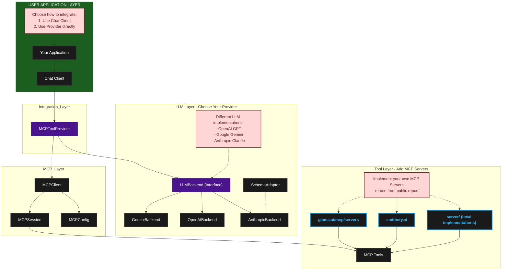

# Agentical: MCP-Compliant LLM Integration Framework

A robust Python framework for integrating Large Language Models (LLMs) with tools using the Model Context Protocol (MCP). This implementation provides a clean, type-safe, and maintainable way to connect LLMs with external tools and data sources.

## Features

- 🔌 MCP Protocol Integration
- 🚀 Async/Await First Design
- 🛠️ Modular LLM Backend Support (OpenAI, Gemini)
- 🎯 Type-Safe Tool Integration
- 🔍 Comprehensive Error Handling
- 🧹 Automatic Resource Management with AsyncExitStack
- 🔒 Robust Configuration Validation
- 🎮 Interactive Server Selection
- 📦 Clean Separation of Concerns

## Quick Start

### Installation

```bash
# Create and activate virtual environment
python -m venv .venv
source .venv/bin/activate  # Linux/Mac
# or
.venv\Scripts\activate  # Windows

# Install from PyPI
pip install beanone-agentical
```

### Basic Usage

1. Configure your environment:
   ```bash
   # .env file
   # Set the API key for your chosen LLM backend
   OPENAI_API_KEY=your_openai_key  # If using OpenAI backend
   # or
   GEMINI_API_KEY=your_gemini_key  # If using Gemini backend
   
   # Optional LLM configuration
   OPENAI_MODEL=gpt-4-turbo-preview  # Default model for OpenAI
   GEMINI_MODEL=gemini-pro          # Default model for Gemini
   ```

2. Set up your MCP configuration in `config.json`:
   ```json
   {
       "terminal-server": {
           "command": "python",
           "args": ["server/terminal_server.py"],
           "env": {
               "WORKSPACE_DIR": "/path/to/workspace"
           }
       },
       "filesystem-server": {
           "command": "python",
           "args": ["server/fs_server.py"],
           "env": {
               "WORKSPACE_DIR": "/path/to/workspace"
           }
       },
       "weather-server": {
           "command": "python",
           "args": ["server/weather_server.py"],
           "env": {
               "OPENWEATHERMAP_API_KEY": "your-api-key-here"
           }
       }
   }
   ```

3. Run the example:
   ```bash
   # Run with OpenAI backend
   python demo_openai.py
   
   # Or with custom configuration
   python demo_openai.py -c custom_config.json
   ```

4. When prompted, you can:
   - Select a specific MCP server to use its tools
   - Choose "Connect to all servers" to let the LLM use tools from any available server

Example queries using multiple tools:
```python
# Using filesystem and weather tools together
    "Read the contents of config.json and tell me if it has a weather API key configured. "
    "If yes, what's the current weather in that location?"

# Using terminal and filesystem tools together
    "List all Python files in the current directory and show me the contents of any file that imports 'asyncio'"
```

The LLM will automatically select the appropriate tool based on the query when multiple servers are connected.

5. Choose and use your LLM backend:

  ```python
  import asyncio
  import agentical.chat_client as chat_client

  from agentical.gemini_backend.gemini_chat import GeminiBackend


  async def main():
      await chat_client.run_demo(GeminiBackend())


  if __name__ == "__main__":
      asyncio.run(main()) 
  ```

## Multiple MCP Server Usage

The framework supports connecting to multiple MCP servers simultaneously, allowing you to combine tools from different servers in a single query. This enables powerful cross-tool functionality and complex operations.

### Connecting to Multiple Servers

When running the demo, you'll see an option to "Connect to all servers":

```
Available MCP servers:
1. terminal-server
2. filesystem-server
3. weather-server
4. github-server
5. brave-search
6. All above servers
```

Selecting "All above servers" will:
- Connect to all available servers concurrently
- Make all tools from every server available
- Allow using tools from different servers in a single query

### Example Multi-Server Queries

Here are some example queries that demonstrate the power of combining multiple servers:

1. **Weather Comparison Across Cities**:
   ```
   Use the calculator-server to find the temperature difference between Seattle and Beijing in celsius
   ```
   This query uses the weather server to:
   - Get current weather in Seattle
   - Get current weather in Beijing
   - Calculate and display the temperature difference

2. **Research and Local Storage**:
   ```
   Search for Python async best practices and save them to a local markdown file
   ```
   This query combines:
   - Brave Search server for research
   - File system server for saving results

3. **Weather-Aware GitHub Analysis**:
   ```
   Find active Python projects on GitHub from developers in cities where it's currently sunny
   ```
   This query uses:
   - GitHub server for project search
   - Weather server for city conditions
   - Brave Search for additional context

4. **System Analysis with Documentation**:
   ```
   Check system memory usage and create a GitHub issue if it's above 80%
   ```
   This combines:
   - Terminal server for system checks
   - GitHub server for issue creation

### Benefits of Multi-Server Usage

1. **Cross-Tool Integration**: Seamlessly combine functionality from different tools
2. **Complex Workflows**: Create sophisticated automation pipelines
3. **Context Enrichment**: Add environmental context to operations
4. **Flexible Tool Selection**: LLM automatically chooses the right tools for each task

### Best Practices

1. **Clear Intent**: Make queries clear about which tools should be used
2. **Explicit Requirements**: Specify exact requirements for multi-tool operations
3. **Error Handling**: Be prepared for some servers to be unavailable
4. **Resource Management**: Consider the impact of using multiple servers simultaneously

## Architecture

The framework follows a clean, layered architecture:

```
┌─────────────────┐    agentical/
│    API Layer    │    ├── api/                   # Core abstractions & interfaces
│                 │    │   └── llm_backend.py     # LLM abstraction layer
├─────────────────┤    │
│ MCP Integration │    ├── mcp/                   # MCP protocol integration
│                 │    │   └── provider.py        # Tool provider implementation
├─────────────────┤    │
│     Client      │    ├── chat_client.py         # Generic LLM client implementation
│ Implementation  │    │
│                 │    ├── anthropic_backend/     # Anthropic implementation
│                 │    ├── gemini_backend/        # Gemini implementation
│                 │    └── openai_backend/        # OpenAI implementation
└─────────────────┘
```

For detailed information about specific components:

- [Provider Architecture](docs/provider_architecture.md) - Detailed documentation about the LLM provider system

Here is  a more detailed view of the system architecture and component relationships:




### Key Components

- **MCPToolProvider**: MCP interactions
  - Load MCP servers from configuration (Discovery based can be implemented later)
  - Handles server connection
  - Manages resource lifecycle with AsyncExitStack
  - Provides clean error handling and validation

- **LLMBackend**: Abstract interface for LLM implementations
  - Type-safe tool integration
  - Async query processing
  - Pluggable provider support

- **chat_client**: A Facade that encapsulates the integration of LLM with MCPToolProvider
  - Async tool execution
  - Resource cleanup guarantees
  - Error handling


### Available MCP Servers

The framework includes several example MCP servers to demonstrate how easily new MCP-compliant tools can be developed. These serve as both useful tools and reference implementations for creating your own MCP servers.

#### Built-in Servers

#### Terminal Server
- **Purpose**: Execute shell commands in a controlled workspace
- **Tool**: `run_command`
- **Configuration**: 
  - `WORKSPACE_DIR`: Optional, defaults to `~/mcp/workspace`

#### Filesystem Server
- **Purpose**: Safe, cross-platform file operations
- **Tools**:
  - `read_file`: Read contents of a file
  - `write_file`: Write content to a file
  - `list_directory`: List contents of a directory
- **Configuration**:
  - `WORKSPACE_DIR`: Optional, defaults to `~/mcp/workspace`

#### Weather Server
- **Purpose**: Fetch current weather information
- **Tool**: `get_weather`
- **Configuration**:
  - `OPENWEATHERMAP_API_KEY`: Required, your OpenWeatherMap API key

#### Test MCP Servers

The framework can integrate with any MCP-compliant server without modification. The examples below demonstrate how to configure popular external MCP servers that can be used as-is, requiring only configuration changes in your `config.json`:

#### Knowledge Graph Server
```json
{
    "knowledge-graph": {
        "command": "npx",
        "args": ["-y", "@beanone/knowledge-graph"],
        "env": {
            "WORKSPACE_DIR": "/path/to/workspace"  // Optional
        }
    }
}
```

#### Brave Search Server
```json
{
    "brave-search": {
        "command": "npx",
        "args": ["-y", "@beanone/brave-search"],
        "env": {
            "BRAVE_API_KEY": "your-api-key-here"  // Required
        }
    }
}
```

#### Memory Server
```json
{
    "memory": {
        "command": "npx",
        "args": ["-y", "@beanone/memory"],
        "env": {
            "MEMORY_STORE_PATH": "/path/to/store"  // Optional
        }
    }
}
```

To integrate external servers:
1. Install the required packages (if using npm packages, ensure Node.js is installed)
2. Add the server configuration to your `config.json`
3. Set any required environment variables
4. The servers will be automatically available through the `MCPToolProvider`

Each server in the configuration must implement the Model Context Protocol. The configuration specifies:
- `command`: The command to launch the MCP server
- `args`: Arguments passed to the server command
- `env`: Optional environment variables for the server
- `working_dir`: Optional working directory for the server

### Environment Variables

The framework uses environment variables for configuration. These can be set in a `.env` file:

```bash
# API Keys (Required for respective backends)
OPENAI_API_KEY=your_openai_key     # Required for OpenAI backend
ANTHROPIC_API_KEY=your_claude_key  # Required for Anthropic backend
GEMINI_API_KEY=your_gemini_key    # Required for Gemini backend

# Model Selection (Optional - will use defaults if not set)
OPENAI_MODEL=gpt-4-turbo-preview     # Default model for OpenAI
ANTHROPIC_MODEL=claude-3-opus-20240229  # Default model for Anthropic
GEMINI_MODEL=gemini-2.0-flash-001      # Default model for Gemini

# Server Configuration (Set based on your MCP servers)
OPENWEATHERMAP_API_KEY=your_weather_key  # Required for weather server
WORKSPACE_DIR=/path/to/workspace         # Optional for file operations
```

Each LLM backend has its own environment variables for API keys and model selection:

1. **OpenAI Backend**
   - `OPENAI_API_KEY`: Required for authentication
   - `OPENAI_MODEL`: Optional, defaults to "gpt-4-turbo-preview"

2. **Anthropic Backend**
   - `ANTHROPIC_API_KEY`: Required for authentication
   - `ANTHROPIC_MODEL`: Optional, defaults to "claude-3-opus-20240229"

3. **Gemini Backend**
   - `GEMINI_API_KEY`: Required for authentication
   - `GEMINI_MODEL`: Optional, defaults to "gemini-2.0-flash-001"

Additional server-specific variables can be specified in server configs under the `env` field.

## Error Handling

The framework provides comprehensive error handling:

- **Configuration Validation**
  - Server configuration validation
  - API key verification
  - Type checking for all inputs

- **Connection Management**
  - Server connection error handling
  - Resource cleanup on failures
  - Automatic session management

- **Runtime Protection**
  - Tool execution error handling
  - Type-safe parameter validation
  - Resource cleanup guarantees

## Development

### Prerequisites

- Python 3.10+
- Virtual environment (venv)
- OpenAI API key (for OpenAI backend)
- Gemini API key (for Gemini backend)

### Setup Development Environment

```bash
# Clone repository
git clone <repository-url>
cd agentical

# Create and activate virtual environment
python -m venv .venv
source .venv/bin/activate

# Install package in development mode
pip install -e .

# Install development dependencies
pip install -r requirements-dev.txt
```

### Implementing New LLM Backends

1. Inherit from `LLMBackend` abstract base class
2. Implement required methods:
   - `process_query`: Handle query processing and tool execution
   - `convert_tools`: Convert MCP tools to LLM-specific format
3. Add proper error handling and resource management
4. Follow existing patterns in OpenAI/Gemini implementations

## Contributing

1. Fork the repository
2. Create a feature branch
3. Implement changes with tests
4. Ensure all tests pass
5. Create a Pull Request

## License

[MIT License](LICENSE)

## Acknowledgments

- Built on the [Model Context Protocol](https://modelcontextprotocol.io/)
- Uses the official [MCP Python SDK](https://github.com/modelcontextprotocol/python-sdk) 