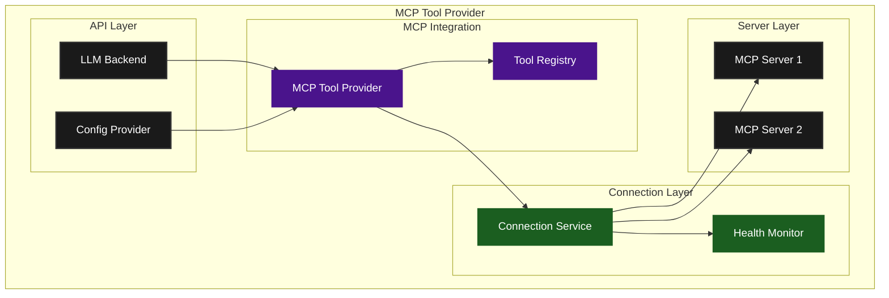
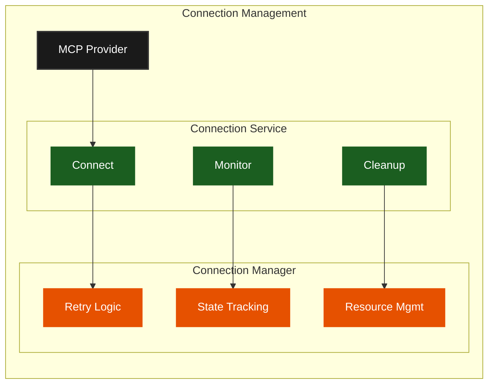
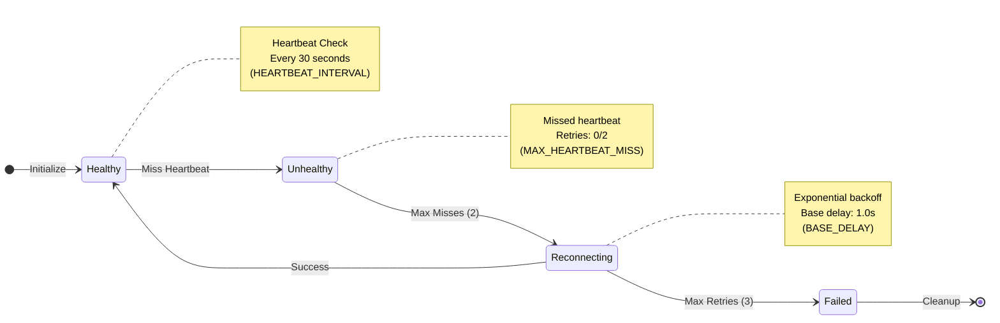
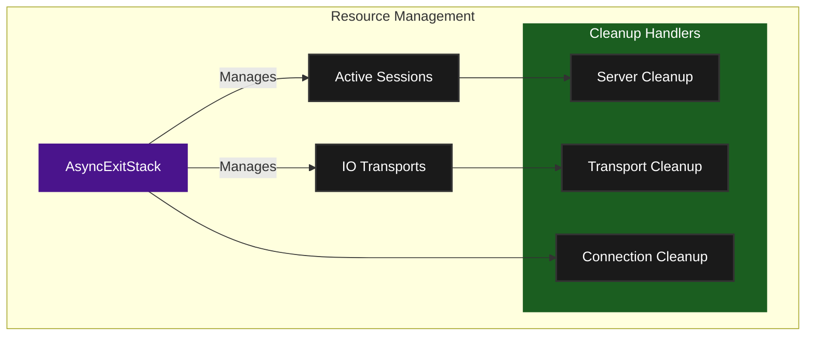
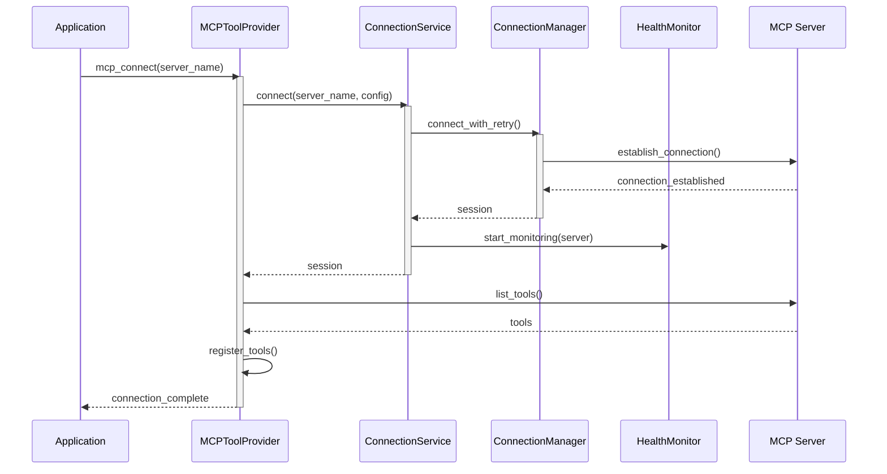
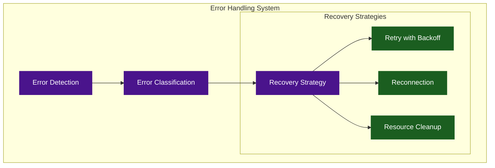

# Provider Architecture

## Overview

The MCP (Machine Control Protocol) Tool Provider system in Agentical is designed to integrate LLM backends with external tools through a robust, fault-tolerant connection management system. The architecture follows a layered approach with clear separation of concerns.



## Connection Management

The connection system manages server connections, health monitoring, and resource lifecycle:



## Health Monitoring

The health monitoring system ensures reliable server connections through regular heartbeat checks and automatic recovery:



Features:
- Regular heartbeat checks (every 30 seconds)
- Configurable miss tolerance (default: 2)
- Automatic reconnection with exponential backoff
- Maximum retry attempts (default: 3)
- Proper cleanup on failure

## Resource Management



Key features:
- Proper async resource management
- Ordered cleanup
- Connection state tracking
- Transport management
- Session lifecycle management

## Core Components

### 1. MCPToolProvider

The main facade that integrates LLMs with MCP tools. Key responsibilities:

```python
class MCPToolProvider:
    """Main facade for integrating LLMs with MCP tools."""
    
    def __init__(
        self, 
        llm_backend: LLMBackend,
        config_provider: Optional[MCPConfigProvider] = None,
        server_configs: Optional[Dict[str, ServerConfig]] = None
    ):
        self.exit_stack = AsyncExitStack()
        self.connection_service = MCPConnectionService(self.exit_stack)
        self.tool_registry = ToolRegistry()
        self.llm_backend = llm_backend
```

Key features:
- Server connection management
- Tool discovery and registration
- Query processing with LLM integration
- Resource cleanup and management

### 2. Connection Management



#### Connection Service (`MCPConnectionService`)

Provides high-level connection management with:
- Health monitoring
- Automatic reconnection
- Resource cleanup
- Session management

```python
class MCPConnectionService(ServerReconnector, ServerCleanupHandler):
    """Unified service for managing MCP server connections and health."""
    
    HEARTBEAT_INTERVAL = 30  # seconds
    MAX_HEARTBEAT_MISS = 2   # attempts before reconnection
```

Key responsibilities:
- Maintains server health status
- Schedules regular heartbeat checks
- Triggers reconnection on failures
- Manages cleanup on permanent failures

#### Connection Manager (`MCPConnectionManager`)

Handles low-level connection details:
- Connection establishment with retry
- Resource management
- Connection state tracking
- Error handling

```python
class MCPConnectionManager:
    """Manages connections to MCP servers."""
    
    MAX_RETRIES = 3
    BASE_DELAY = 1.0
```

### 3. Health Monitoring

The health monitoring system is implemented in the `MCPConnectionService` class:

```python
class MCPConnectionService(ServerReconnector, ServerCleanupHandler):
    """Unified service for managing MCP server connections and health."""
    
    HEARTBEAT_INTERVAL = 30  # seconds
    MAX_HEARTBEAT_MISS = 2   # attempts before reconnection
```

Key responsibilities:
- Maintains server health status
- Schedules regular heartbeat checks
- Triggers reconnection on failures
- Manages cleanup on permanent failures

### 4. Tool Registry

Manages tool discovery and registration:
- Tool metadata storage
- Server-tool mapping
- Tool validation
- Access control

## Error Handling and Recovery



Features:
- Exponential backoff retry
- Automatic reconnection
- Resource cleanup
- Error categorization
- Comprehensive logging

## Resource Management


Key features:
- Proper async resource management
- Ordered cleanup
- Connection state tracking
- Transport management
- Session lifecycle management 