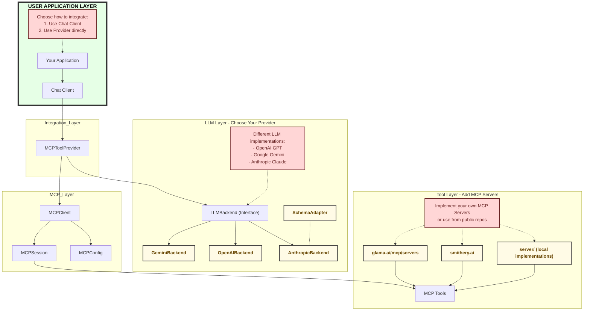
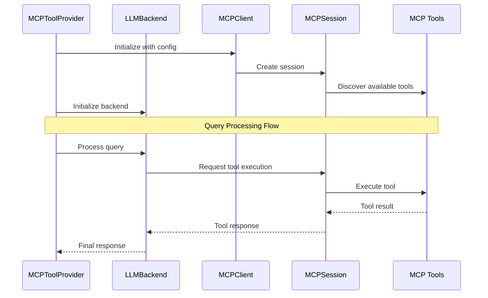
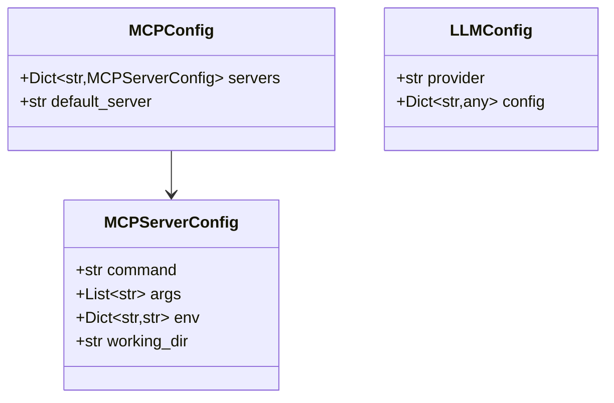

# MCP Integration Architecture

## Overview

The MCP Integration architecture provides a flexible way to connect LLM providers with MCP-compatible tools while maintaining a clean separation of concerns.

## Core Components



## Component Interactions



## Configuration Structure



## Key Abstractions

### MCPSession
- Manages connection to MCP server
- Handles tool discovery and execution
- Provides resource cleanup

### LLMBackend
- Abstract interface for LLM providers
- Handles message processing
- Manages tool integration with LLM

### MCPToolProvider
- Main facade for the integration
- Coordinates between LLM and MCP
- Manages configuration and lifecycle

## Configuration Example

```json
{
    "mcp": {
        "servers": {
            "terminal-server": {
                "command": "python",
                "args": ["server/terminal_server.py"]
            },
            "knowledge-graph": {
                "command": "npx",
                "args": ["-y", "@beanone/knowledge-graph"],
                "env": {
                    "MEMORY_FILE_PATH": "data/memory.json"
                }
            }
        },
        "default_server": "terminal-server"
    },
    "llm": {
        "provider": "gemini",
        "config": {
            "api_key": "YOUR_API_KEY",
            "model": "gemini-pro"
        }
    }
}
```

## Design Decisions

1. **Separation of Concerns**
   - MCP layer handles tool communication
   - LLM layer handles message processing
   - Integration layer coordinates between them

2. **Flexibility**
   - Pluggable LLM backends
   - Multiple MCP server support
   - Configurable tool integration

3. **Resource Management**
   - Proper session cleanup
   - Async context management
   - Error handling

4. **Extensibility**
   - Easy to add new LLM backends
   - Support for multiple tools
   - Configurable behaviors

## Next Steps

1. [ ] Implement core abstractions
2. [ ] Add provider implementations
3. [ ] Create configuration management
4. [ ] Add error handling
5. [ ] Write tests 