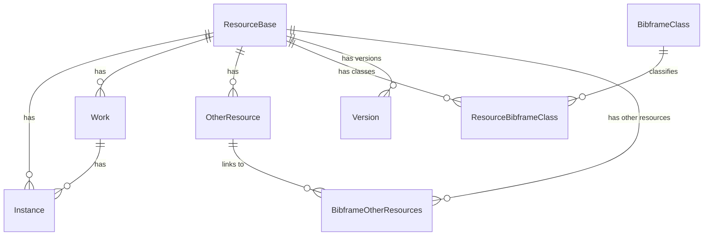

# Blue Core Data Models
The Blue Core Data Models are used in [Blue Core API](https://github.com/blue-core-lod/bluecore_api) 
and in the [Blue Core Workflows](https://github.com/blue-core-lod/bluecore-workflows) services.  

## Run Postgres with Docker
To run the Postgres with the Blue Core Database, run the following command from this directory:

`docker run --name bluecore_db -e POSTGRES_USER=bluecore_admin -e POSTGRES_PASSWORD=bluecore_admin -v ./create-db.sql:/docker-entrypoint-initdb.d/create_database.sql -p 5432:5432 postgres:17`

## Installing
- Install via pip: `pip install blue-core-data-models`
- Install via uv: `uv add blue-core-data-models`

## Database Management
The [SQLAlchemy](https://www.sqlalchemy.org/) Object Relational Mapper (ORM) is used to create
the Bluecore database models. 

### Database Migrations with Alembic
The [Alembic](https://alembic.sqlalchemy.org/en/latest/) database migration package is used
to manage database changes with the Bluecore Data models.

To create a new migration, ensure that the Postgres database is available and then run:
- `uv run alembic revision --autogenerate -m "{short message describing change}`

A new migration script will be created in the `bluecore_store_migration` directory. Be sure
to add the new script to the repository with `git`.

#### Applying Migrations
To apply all of the migrations, run the following command:
- `uv run alembic upgrade head`
