# celery-cloud

Implementation of celery workers using public cloud services.

## What is celery-cloud?

Celery-Cloud allows you to use cloud services to run Celery workers. Instead of launching a celery server you can use PaaS services such as AWS Lambda to execute your tasks, leveraging the infrastructure management to the cloud provider.

It's Celery Serverless.

Celery cloud defines a runner, which decodes the message received from a broker, such as AWS SQS, and executes the required task with the specfied parameters, calling a local defined function or a remote function (i.e. AWS Lambda, Azure Function, Google Function). After the execution the state and the result of the operation is stored in the defined backend.

The Celery Cloud runner is published as a Function in the Cloud Provider, and it manages events or triggers received from a sender defined in the infrastructure.

```mermaid
graph LR
    Celery_Client[💻 Celery Client]
    AWS_SQS[📨 SQS - Broker]
    AWS_Dispatcher[🔁 SWS Dispatcher]
    AWS_Lambda[⚙️ AWS Lambda]
    AWS_DB[🗄️ DynamoDB Backend]

    Celery_Client --> AWS_SQS
    AWS_SQS --> AWS_Dispatcher
    AWS_Dispatcher --> AWS_Lambda
    AWS_Lambda --> AWS_DB
    Celery_Client --> AWS_DB
```



## Installation

Using pip:

```bash
pip install celery-cloud
```

## How to use it

Celery Cloud manages two kind of tasks:

- Local tasks: they have to be included alongside the runner.
- Remote tasks: calliing a remote functions.

A docker image of the runner is provied which can be used as a runner to execute only remote functions. The image can be downloaded from:

If you intend to call local functions and want them to be included in your project, you'll need to create a new python project and include the functions in it.

### Using the runner container

Using the provided container directly in a Function, you can only call remote functions, that should be defined in the TASKS environment variable.

### Using local tasks

### Celery client

You can use the same celery client to call remote tasks and get the result.

```python

from celery import Celery, current_app
from time import sleep
import uuid
from typing import Any


CELERY_BROKER_URL=sqs://@
CELERY_BACKEND_URL=dynamodb://@eu-central-1/lambda-runner-tasks?read=5&write=5
CELERY_TASK_DEFAULT_QUEUE=lambda-runner-queue
CELERY_BROKER_SQS_QUEUE_URL=https://sqs.eu-central-1.amazonaws.com/000000000000/lambda-runner-queue
CELERY_BROKER_SQS_REGION=eu-central-1

class Celeryconfig:
    broker_connection_retry_on_startup: bool = True
    task_create_missing_queues: bool = True
    worker_enable_remote_control: bool = False
    worker_send_task_events: bool = False

    def __init__(self):
        self.task_default_queue = CELERY_TASK_DEFAULT_QUEUE

        self.broker_url = CELERY_BROKER_URL
        self.result_backend = CELERY_BACKEND_URL

        if self.broker_url.startswith("sqs"):
            self.broker_transport_options = {
                "predefined_queues": {
                    f"{CELERY_TASK_DEFAULT_QUEUE}": {
                        "url": CELERY_BROKER_SQS_QUEUE_URL,
                    },
                },
                "region": CELERY_BROKER_SQS_REGION,
                "visibility_timeout": 3600,  # 1 hour
                "polling_interval": 10,
                "dead_letter_queue": (
                    f"{CELERY_TASK_DEFAULT_QUEUE}-dlq",
                ),
            }

# Configure Celery
app = Celery("task_client")
app.config_from_object(Celeryconfig())


@app.task
def add(x: int, y: int) -> int:
    """Simple function to add two numbers.

    Args:
        x (_type_): _description_
        y (_type_): _description_

    Returns:
        _type_: _description_
    """
    ...


def check_task_status(task: Any) -> None:
    """Check task status

    Args:
        task_id (str): Task ID
    """

    print(f"Checking Task ID: {task.id}")
    counter:int = 0


    while not task.ready():
        print(f" . Task {task.id} not ready yet: {task.state}")
        sleep(1)
        counter += 1
        if counter > 10:
            print(f"Task {task.id} taking too long. Cancelling")
            task.revoke(terminate=True)
            return

    print(f"Task {task.id} finished. Result: {task.get()}")


def celery() -> None:
    """Generate celery test

    Returns:
        str: _description_
    """

    print("Starting celery client")

    # Print backend configuration
    app = current_app._get_current_object()
    print("-" * 40)

    print(f"Broker URL: {app.conf.broker_url}")
    print(f"Result Backend URL: {app.conf.result_backend}")
    print(
        f"Result Backend Transport Options: "
        f"{app.conf.result_backend_transport_options}"
    )
    print(f"Broker Transport Options: {app.conf.broker_transport_options}")
    print(f"Task Default Queue: {app.conf.task_default_queue}")
    print(
        f"Broker Connection Retry On Startup: "
        f"{app.conf.broker_connection_retry_on_startup}"
    )
    print(f"Task Create Missing Queues: {app.conf.task_create_missing_queues}")

    print("-" * 40)

    print("add")
    result = add.apply_async((10, 3)) #, countdown=10)

    check_task_status(result)


if __name__ == "__main__":
    celery()


```

## Celery Cloud Configuration

The configuration is done by environment variables (or using and .env file if your project uses python-dotenv).

The main variables are shown in the table below:

| Name                  | Description                   | Values                                | Default                                                                                                   |
| --------------------- | ----------------------------- | ------------------------------------- | --------------------------------------------------------------------------------------------------------- |
| LOG_LEVEL             | Log level for the application | DEBUG, INFO, WARNING, ERROR, CRITICAL | `INFO`                                                                                                    |
| LOG_FORMAT            | Log format                    | See Python logging docs               | `{time:YYYY-MM-DD HH:mm:ss} {level: <8} trace_id={extra[trace_id]} {name}:{function}: {line} - {message}` |
| CELERY_BACKEND_REGION | DynamoDB region               | A string                              |                                                                                                           |
| CELERY_BACKEND_TABLE  | Backend table name            | A string                              |                                                                                                           |
| TASKS                 | Task definition               | JSON string                           | `{}`                                                                                                      |

### Task definition

The tasks are defined as a json dictionary, where the key is the name of the tasks, as sent by Celery to the broker, and the value is a url defining the task to launch.

```json
{
  "celery_cloud.celery.task.sumar": "lambda://arn:aws:lambda:eu-central-1:670089840758:function:prompt-test",
  "celery_cloud.celery.task.restar": "task://celery_cloud.domain.restar/restar",
  "celery_cloud.celery.task.prompt": "task://celery_cloud.domain.prompt/prompt",
  "celery_cloud.celery.task.lsumar": "lambda://arn:aws:lambda:eu-central-1:670089840758:function:granite-api"
}
```
