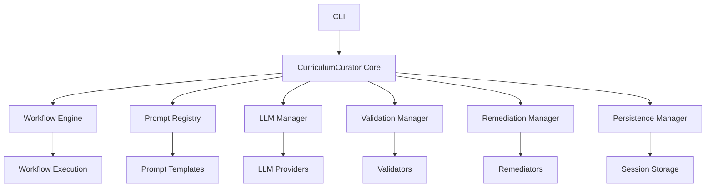

# Architecture Overview

Curriculum Curator is built around a modular architecture designed to provide flexibility, extensibility, and maintainability. This document provides a high-level overview of the system architecture.

## Core Components

The system is comprised of several core components that work together:



### CLI

The Command Line Interface (CLI) provides the entry point for users to interact with the system. It offers commands for running workflows, managing prompts, building workflows, and more.

### Core

The `CurriculumCurator` core class orchestrates the interaction between all components, managing the lifecycle of workflow execution and ensuring all components work together seamlessly.

### Workflow Engine

The Workflow Engine is responsible for parsing workflow configurations, validating them against schemas, and executing the workflows step by step.

### Prompt Registry

The Prompt Registry manages the collection of prompt templates, handling their loading, parsing of front matter metadata, and making them available to the workflow engine.

### LLM Manager

The LLM Manager provides a unified interface to different Language Model providers (Anthropic, OpenAI, Ollama, etc.), handling API communication, token tracking, and error handling.

### Validation Manager

The Validation Manager coordinates content validation using various validators for quality checks, ensuring content meets the specified criteria.

### Remediation Manager

The Remediation Manager handles the automated fixing of issues identified during validation, using various remediators to improve content quality.

### Persistence Manager

The Persistence Manager handles session state persistence, allowing workflows to be paused and resumed, and providing a record of completed workflows.

## Data Flow

The typical data flow in Curriculum Curator is:

1. User runs a workflow through the CLI
2. Workflow Engine loads and validates the workflow configuration
3. Workflow Engine executes each step:
   - Prompt steps: Load prompts from Prompt Registry, send to LLM through LLM Manager
   - Validation steps: Pass content to Validation Manager for quality checks
   - Remediation steps: Pass content and issues to Remediation Manager for fixing
   - Output steps: Write content to output files
4. Persistence Manager tracks the workflow state throughout execution
5. Results are returned to the user (CLI or interactive interface)

## Key Design Principles

### 1. Configuration-Driven

Workflow behavior is defined through configuration rather than code, allowing users to create complex workflows without programming.

### 2. Modular Components

Components are designed to be pluggable and replaceable, with well-defined interfaces between them.

### 3. Extensibility

The system is designed to be extended with new validators, remediators, and LLM providers with minimal code changes.

### 4. Progressive Disclosure

The system provides multiple interfaces, from simple CLI commands to interactive menus, allowing users to discover features gradually.

## Interactive Components

In addition to the core components, the system includes interactive components for a more user-friendly experience:

- **Interactive Mode**: A top-level menu-driven interface for all operations
- **Workflow Builder**: A guided interface for creating and editing workflow configurations
- **Prompt Editor**: An interface for creating and editing prompt templates with validation

## Folder Structure

The package is organized into modules that correspond to the major components:

```
curriculum_curator/
├── __init__.py
├── cli.py                 # Command-line interface
├── core.py                # Core orchestration
├── config/                # Configuration handling
├── workflow/              # Workflow engine
├── prompt/                # Prompt registry
├── llm/                   # LLM manager
├── validation/            # Validation framework
│   └── validators/        # Validator implementations
├── remediation/           # Remediation framework
│   └── remediators/       # Remediator implementations
├── persistence/           # Session persistence
└── utils/                 # Utility functions
```

## Further Reading

- [ADR-0002: Validation and Remediation Design](../adr/0002-validation-remediation-design.md)
- [ADR-0003: Workflow Configuration Format](../adr/0003-workflow-configuration-format.md)
- [ADR-0005: Interactive Interfaces](../adr/0005-interactive-interfaces.md)
