## 1. Introduction

CurriculumCurator is an educational content workflow orchestration tool designed to streamline the creation of comprehensive curriculum materials through Large Language Model (LLM) integration. This document outlines the architectural design, component interactions, and implementation considerations for the system.

## 2. Core Philosophy

CurriculumCurator is designed around two fundamental principles:

1. **Prompt-centric Content Generation**: All content is derived from well-designed prompts managed within the system.
2. **Workflow-driven Process**: Content creation follows configurable, automated educational workflows.

## 3. System Architecture

### 3.1 Prompt Registry (Filesystem-based with YAML Front Matter)

The foundation of the system is a managed collection of prompts stored directly as files with embedded metadata.

#### Storage Structure

```
prompts/
  course/
    overview.txt
    faq.txt
  module/
    slides.txt
    worksheet.txt
  assessment/
    mcq.txt
    short-answer.txt
    fill-blank.txt
```

#### Prompt Format

Each prompt file includes YAML Front Matter for metadata:

```yaml
---
description: Generates multiple-choice questions for a module.
requires:
  - module_title
  - key_concepts
  - num_questions
tags:
  - assessment
  - mcq
version: 1.1
---
Generate {num_questions} multiple-choice questions about the key concepts ({key_concepts}) for the module titled "{module_title}".
Each question should have one correct answer and three plausible distractors.
Format the output as Markdown list items.
```

#### Implementation

```python
import frontmatter
from pathlib import Path

class PromptRegistry:
    def __init__(self, base_path):
        self.base_path = Path(base_path)
        self.prompt_cache = {}

    def get_prompt(self, prompt_path):
        """Get a prompt by its path relative to the base path."""
        if prompt_path in self.prompt_cache:
            return self.prompt_cache[prompt_path]

        full_path = self.base_path / prompt_path
        if not full_path.exists():
            raise FileNotFoundError(f"Prompt not found: {prompt_path}")

        prompt_data = frontmatter.load(full_path)
        self.prompt_cache[prompt_path] = {
            "content": prompt_data.content,
            "metadata": prompt_data.metadata
        }

        return self.prompt_cache[prompt_path]

    def list_prompts(self, tag=None):
        """List all prompts, optionally filtered by tag."""
        prompts = []
        for file_path in self.base_path.glob("**/*.txt"):
            relative_path = file_path.relative_to(self.base_path)
            if tag is None:
                prompts.append(str(relative_path))
            else:
                try:
                    prompt_data = self.get_prompt(str(relative_path))
                    if tag in prompt_data["metadata"].get("tags", []):
                        prompts.append(str(relative_path))
                except Exception:
                    continue

        return prompts
```

### 3.2 LLM Integration Layer (Broker-based)

A flexible interface for interacting with various LLM providers using LiteLLM as the broker.

#### Configuration

```yaml
llm:
  default_provider: "ollama"  # Fallback provider
  providers:
    anthropic:
      api_key: "env(ANTHROPIC_API_KEY)"
      default_model: "claude-3-haiku"
      cost_per_1k_tokens:
        input: 0.25
        output: 0.75
      models:
        claude-3-haiku: {}
        claude-3-opus:
          cost_per_1k_tokens:
            input: 15.00
            output: 75.00

    openai:
      api_key: "env(OPENAI_API_KEY)"
      default_model: "gpt-3.5-turbo"
      cost_per_1k_tokens:
        input: 0.50
        output: 1.50
      models:
        gpt-3.5-turbo: {}
        gpt-4-turbo:
          cost_per_1k_tokens:
            input: 10.00
            output: 30.00

    ollama:
      base_url: "http://localhost:11434"
      default_model: "llama3"
      cost_per_1k_tokens:
        input: 0.00
        output: 0.00
      models:
        llama3: {}
        mistral: {}

    groq:
      api_key: "env(GROQ_API_KEY)"
      default_model: "llama3-8b-8192"
      cost_per_1k_tokens:
        input: 0.10
        output: 0.30
      models:
        llama3-8b-8192: {}

    gemini:
      api_key: "env(GOOGLE_API_KEY)"
      default_model: "gemini-pro"
      cost_per_1k_tokens:
        input: 0.50
        output: 1.50
      models:
        gemini-pro: {}
```

#### Implementation

```python
import os
import time
import litellm
from datetime import datetime
import backoff
import structlog

logger = structlog.get_logger()

class LLMRequestError(Exception):
    """Exception raised for errors in LLM requests."""
    pass

class LLMRequest:
    def __init__(self, prompt, provider, model, workflow_id=None, step_name=None):
        self.prompt = prompt
        self.provider = provider
        self.model = model
        self.workflow_id = workflow_id
        self.step_name = step_name
        self.timestamp = datetime.now()
        self.input_tokens = None
        self.output_tokens = None
        self.completion = None
        self.duration = None
        self.cost = None
        self.status = "pending"
        self.error = None

class LLMManager:
    def __init__(self, config):
        self.config = config
        self.history = []
        self.current_workflow_id = None
        self.current_step_name = None

        # Configure API keys from environment variables
        for provider, provider_config in config["llm"]["providers"].items():
            api_key = provider_config.get("api_key", "")
            if api_key.startswith("env(") and api_key.endswith(")"):
                env_var = api_key[4:-1]
                api_key = os.getenv(env_var, "")
                if provider != "ollama" and not api_key:
                    logger.warning(f"Missing API key for {provider}", env_var=env_var)

    def _resolve_model_alias(self, model_alias=None):
        """Resolve model alias to provider and model."""
        if model_alias is None:
            default_provider = self.config["llm"]["default_provider"]
            default_model = self.config["llm"]["providers"][default_provider]["default_model"]
            return default_provider, default_model

        # Check if alias is in provider/model format
        if "/" in model_alias:
            provider, model = model_alias.split("/", 1)
            if (provider in self.config["llm"]["providers"] and
                model in self.config["llm"]["providers"][provider]["models"]):
                return provider, model

        # Otherwise, assume it's a direct model reference and search for it
        for provider, provider_config in self.config["llm"]["providers"].items():
            if model_alias in provider_config["models"]:
                return provider, model_alias

        # Fall back to default if not found
        default_provider = self.config["llm"]["default_provider"]
        default_model = self.config["llm"]["providers"][default_provider]["default_model"]
        logger.warning(
            "model_alias_not_found",
            model_alias=model_alias,
            using_default=f"{default_provider}/{default_model}"
        )
        return default_provider, default_model

    def _calculate_cost(self, request):
        """Calculate cost based on token counts and configured rates."""
        provider_config = self.config["llm"]["providers"][request.provider]
        model_config = provider_config["models"].get(request.model, {})

        # Get costs, checking model-specific, then provider default
        input_cost = model_config.get("cost_per_1k_tokens", {}).get(
            "input", provider_config["cost_per_1k_tokens"]["input"]
        )
        output_cost = model_config.get("cost_per_1k_tokens", {}).get(
            "output", provider_config["cost_per_1k_tokens"]["output"]
        )

        # Calculate total cost
        request.cost = (
            (request.input_tokens / 1000) * input_cost +
            (request.output_tokens / 1000) * output_cost
        )
        return request.cost

    @backoff.on_exception(
        backoff.expo,
        (Exception),
        max_tries=3,
        jitter=backoff.full_jitter
    )
    async def generate(self, prompt, model_alias=None, **params):
        """Generate text using the specified model or defaults."""
        # Resolve provider and model from alias or defaults
        provider, model = self._resolve_model_alias(model_alias)

        # Create request object for tracking
        request = LLMRequest(
            prompt=prompt,
            provider=provider,
            model=model,
            workflow_id=self.current_workflow_id,
            step_name=self.current_step_name
        )
        self.history.append(request)

        logger.info(
            "llm_request_started",
            provider=provider,
            model=model,
            workflow_id=self.current_workflow_id,
            step_name=self.current_step_name
        )

        start_time = time.time()
        try:
            # Get provider-specific configuration
            provider_config = self.config["llm"]["providers"][provider]

            # Configure API key
            api_key = provider_config.get("api_key", "")
            if api_key.startswith("env(") and api_key.endswith(")"):
                env_var = api_key[4:-1]
                api_key = os.getenv(env_var, "")

            # Configure base URL if needed (for Ollama, etc.)
            base_url = provider_config.get("base_url", None)

            # Use LiteLLM to make the actual request
            response = await litellm.acompletion(
                model=f"{provider}/{model}",
                messages=[{"role": "user", "content": prompt}],
                api_key=api_key,
                base_url=base_url,
                **params
            )

            request.status = "success"
            request.completion = response.choices[0].message.content
            request.input_tokens = response.usage.prompt_tokens
            request.output_tokens = response.usage.completion_tokens

            logger.info(
                "llm_request_completed",
                provider=provider,
                model=model,
                input_tokens=request.input_tokens,
                output_tokens=request.output_tokens,
                workflow_id=self.current_workflow_id,
                step_name=self.current_step_name
            )

        except Exception as e:
            request.status = "error"
            request.error = str(e)
            logger.exception(
                "llm_request_failed",
                provider=provider,
                model=model,
                error=str(e),
                workflow_id=self.current_workflow_id,
                step_name=self.current_step_name
            )
            raise LLMRequestError(f"LLM request failed: {e}")
        finally:
            request.duration = time.time() - start_time
            if request.input_tokens and request.output_tokens:
                self._calculate_cost(request)

        return request.completion

    def generate_usage_report(self, workflow_id=None, step_name=None):
        """Generate a usage report for the specified workflow and/or step."""
        # Filter history by workflow_id and step_name if provided
        requests = [r for r in self.history
                if (workflow_id is None or r.workflow_id == workflow_id)
                and (step_name is None or r.step_name == step_name)]

        # Group by provider and model
        by_model = {}
        for r in requests:
            key = f"{r.provider}/{r.model}"
            if key not in by_model:
                by_model[key] = {
                    "count": 0,
                    "input_tokens": 0,
                    "output_tokens": 0,
                    "cost": 0,
                    "errors": 0,
                    "avg_duration": 0,
                }

            entry = by_model[key]
            entry["count"] += 1
            if r.status == "error":
                entry["errors"] += 1
            if r.status == "success":
                entry["input_tokens"] += r.input_tokens or 0
                entry["output_tokens"] += r.output_tokens or 0
                entry["cost"] += r.cost or 0
                entry["avg_duration"] = (entry["avg_duration"] * (entry["count"] - 1) + r.duration) / entry["count"]

        # Calculate totals
        totals = {
            "count": sum(m["count"] for m in by_model.values()),
            "input_tokens": sum(m["input_tokens"] for m in by_model.values()),
            "output_tokens": sum(m["output_tokens"] for m in by_model.values()),
            "cost": sum(m["cost"] for m in by_model.values()),
            "errors": sum(m["errors"] for m in by_model.values()),
        }

        return {
            "by_model": by_model,
            "totals": totals,
            "timestamp": datetime.now(),
            "workflow_id": workflow_id,
            "step_name": step_name,
        }
```

### 3.3 Content Transformation Layer

Parses and structures raw LLM outputs.

```python
import re
import json
import markdown
from bs4 import BeautifulSoup

class ContentTransformer:
    def __init__(self):
        pass

    def transform(self, raw_content, output_format, transformation_rules=None):
        """Transform raw LLM output into the desired format."""
        if output_format == "raw":
            return raw_content

        if output_format == "list":
            return self._extract_list_items(raw_content)

        if output_format == "json":
            return self._extract_json(raw_content)

        if output_format == "html":
            return self._markdown_to_html(raw_content)

        # Default to returning the raw content
        return raw_content

    def _extract_list_items(self, content):
        """Extract list items from markdown content."""
        items = []
        for line in content.split('\n'):
            # Match Markdown list items (both - and * style)
            match = re.match(r'^\s*[-*]\s+(.+)$', line)
            if match:
                items.append(match.group(1).strip())

            # Match numbered list items
            match = re.match(r'^\s*\d+\.\s+(.+)$', line)
            if match:
                items.append(match.group(1).strip())

        return items

    def _extract_json(self, content):
        """Extract JSON from the content."""
        # Find content between triple backticks and json
        match = re.search(r'```(?:json)?\n([\s\S]*?)\n```', content)
        if match:
            try:
                return json.loads(match.group(1))
            except json.JSONDecodeError:
                pass

        # Try parsing the entire content as JSON
        try:
            return json.loads(content)
        except json.JSONDecodeError:
            pass

        # Return empty dict if no valid JSON found
        return {}

    def _markdown_to_html(self, content):
        """Convert markdown to HTML."""
        return markdown.markdown(content)

    def extract_sections(self, content, section_markers=None):
        """Extract sections from content based on markdown headings."""
        if section_markers is None:
            # Default to extracting sections by headings
            sections = {}
            current_section = None
            current_content = []

            for line in content.split('\n'):
                heading_match = re.match(r'^(#{1,6})\s+(.+)$', line)
                if heading_match:
                    # Save previous section if exists
                    if current_section:
                        sections[current_section] = '\n'.join(current_content).strip()

                    # Start new section
                    current_section = heading_match.group(2).strip()
                    current_content = []
                else:
                    if current_section:
                        current_content.append(line)

            # Save the last section
            if current_section:
                sections[current_section] = '\n'.join(current_content).strip()

            return sections
        else:
            # Use custom section markers
            sections = {}
            for marker in section_markers:
                pattern = f"### {re.escape(marker)}\\s*\\n([\\s\\S]*?)(?=### [^#]|$)"
                match = re.search(pattern, content)
                if match:
                    sections[marker] = match.group(1).strip()

            return sections
```

### 3.4 Workflow Engine

Orchestrates the sequence of content generation, validation, and remediation steps.

```python
import uuid
import asyncio
import structlog
from datetime import datetime
from pathlib import Path

logger = structlog.get_logger()

class WorkflowError(Exception):
    """Exception raised for errors in workflow execution."""
    pass

class WorkflowStep:
    def __init__(self, name, config):
        self.name = name
        self.config = config

    async def execute(self, context, prompt_registry, llm_manager, content_transformer):
        """Execute this workflow step."""
        raise NotImplementedError("Subclasses must implement execute()")

class PromptStep(WorkflowStep):
    async def execute(self, context, prompt_registry, llm_manager, content_transformer):
        """Execute a prompt-based step."""
        # Get prompt
        prompt_path = self.config.get("prompt")
        if not prompt_path:
            raise WorkflowError(f"Missing prompt path for step {self.name}")

        try:
            prompt_data = prompt_registry.get_prompt(prompt_path)
        except FileNotFoundError as e:
            raise WorkflowError(f"Failed to load prompt: {e}")

        # Check required variables
        required_vars = prompt_data["metadata"].get("requires", [])
        missing_vars = [var for var in required_vars if var not in context]
        if missing_vars:
            raise WorkflowError(
                f"Missing required variables for prompt {prompt_path}: {', '.join(missing_vars)}"
            )

        # Fill in prompt template
        try:
            prompt_content = prompt_data["content"]
            filled_prompt = prompt_content.format(**context)
        except KeyError as e:
            raise WorkflowError(f"Error formatting prompt: {e}")

        # Get LLM response
        model_alias = self.config.get("llm_model_alias")
        try:
            response = await llm_manager.generate(filled_prompt, model_alias)
        except Exception as e:
            raise WorkflowError(f"LLM generation failed: {e}")

        # Transform content if requested
        output_format = self.config.get("output_format", "raw")
        transformation_rules = self.config.get("transformation_rules", {})

        try:
            transformed_content = content_transformer.transform(
                response, output_format, transformation_rules
            )
        except Exception as e:
            raise WorkflowError(f"Content transformation failed: {e}")

        # Store in context under output_variable
        output_variable = self.config.get("output_variable")
        if output_variable:
            context[output_variable] = transformed_content

        # Store usage information in context
        usage_stats = llm_manager.generate_usage_report(
            workflow_id=context.get("workflow_id"),
            step_name=self.name
        )

        context.setdefault("usage_stats", {})
        context["usage_stats"][self.name] = usage_stats

        return transformed_content

class ValidationStep(WorkflowStep):
    async def execute(self, context, prompt_registry, llm_manager, content_transformer):
        """Execute a validation step."""
        # Implementation for validation steps
        pass

class OutputStep(WorkflowStep):
    async def execute(self, context, prompt_registry, llm_manager, content_transformer):
        """Execute an output generation step."""
        # Implementation for output generation (e.g., using Pandoc)
        pass

class Workflow:
    def __init__(self, config, prompt_registry, llm_manager, content_transformer):
        self.config = config
        self.prompt_registry = prompt_registry
        self.llm_manager = llm_manager
        self.content_transformer = content_transformer
        self.session_dir = None

    def _create_step(self, step_config):
        """Create a workflow step from configuration."""
        step_type = step_config.get("type", "prompt")
        step_name = step_config.get("name")

        if step_type == "prompt":
            return PromptStep(step_name, step_config)
        elif step_type == "validation":
            return ValidationStep(step_name, step_config)
        elif step_type == "output":
            return OutputStep(step_name, step_config)
        else:
            raise WorkflowError(f"Unknown step type: {step_type}")

    def _initialize_session(self, session_id=None):
        """Initialize a new session or load an existing one."""
        if session_id is None:
            session_id = f"{datetime.now().strftime('%Y%m%d-%H%M%S')}-{uuid.uuid4().hex[:8]}"

        # Create session directory
        base_dir = Path(self.config.get("session_base_dir", ".curriculum_curator/sessions"))
        session_dir = base_dir / session_id
        session_dir.mkdir(parents=True, exist_ok=True)

        self.session_dir = session_dir
        return session_id

    def _save_session_state(self, context):
        """Save the current session state to disk."""
        if not self.session_dir:
            return

        # Save config used
        with open(self.session_dir / "config.yaml", "w") as f:
            import yaml
            yaml.dump(self.config, f)

        # Save session state (exclude large content)
        sanitized_context = {
            k: v for k, v in context.items()
            if isinstance(v, (str, int, float, bool, list, dict))
            and not isinstance(v, str) or len(v) < 10000
        }

        with open(self.session_dir / "session.json", "w") as f:
            import json
            json.dump(sanitized_context, f, default=str, indent=2)

        # Append to prompt history
        with open(self.session_dir / "prompt_history.jsonl", "a") as f:
            for request in self.llm_manager.history:
                if request.workflow_id == context.get("workflow_id"):
                    import json
                    json_record = {
                        "timestamp": request.timestamp.isoformat(),
                        "provider": request.provider,
                        "model": request.model,
                        "step_name": request.step_name,
                        "status": request.status,
                        "input_tokens": request.input_tokens,
                        "output_tokens": request.output_tokens,
                        "cost": request.cost,
                        "duration": request.duration,
                        "prompt": request.prompt[:1000] + "..." if len(request.prompt) > 1000 else request.prompt,
                    }
                    f.write(json.dumps(json_record) + "\n")

    async def execute(self, workflow_name, initial_context=None, session_id=None):
        """Execute the specified workflow."""
        # Get workflow configuration
        workflow_config = self.config.get("workflows", {}).get(workflow_name)
        if not workflow_config:
            raise WorkflowError(f"Workflow not found: {workflow_name}")

        # Initialize context
        context = initial_context or {}
        context["workflow_name"] = workflow_name
        context["workflow_id"] = session_id or str(uuid.uuid4())
        context["start_time"] = datetime.now()

        # Initialize session
        session_id = self._initialize_session(session_id)
        context["session_id"] = session_id

        # Configure LLM manager with workflow context
        self.llm_manager.current_workflow_id = context["workflow_id"]

        # Get workflow steps
        step_configs = workflow_config.get("steps", [])
        if not step_configs:
            raise WorkflowError(f"No steps defined for workflow: {workflow_name}")

        # Execute steps
        results = {}
        try:
            for i, step_config in enumerate(step_configs):
                step = self._create_step(step_config)
                context["current_step"] = step.name
                context["current_step_index"] = i

                logger.info(
                    "workflow_step_started",
                    workflow_name=workflow_name,
                    workflow_id=context["workflow_id"],
                    step_name=step.name,
                    step_index=i
                )

                self.llm_manager.current_step_name = step.name

                try:
                    result = await step.execute(
                        context,
                        self.prompt_registry,
                        self.llm_manager,
                        self.content_transformer
                    )
                    results[step.name] = result

                    logger.info(
                        "workflow_step_completed",
                        workflow_name=workflow_name,
                        workflow_id=context["workflow_id"],
                        step_name=step.name,
                        step_index=i
                    )
                except Exception as e:
                    logger.exception(
                        "workflow_step_failed",
                        workflow_name=workflow_name,
                        workflow_id=context["workflow_id"],
                        step_name=step.name,
                        step_index=i,
                        error=str(e)
                    )
                    context["error"] = str(e)
                    context["failed_step"] = step.name
                    self._save_session_state(context)
                    raise WorkflowError(f"Step {step.name} failed: {e}")

                # Save session state after each step
                self._save_session_state(context)

        finally:
            context["end_time"] = datetime.now()
            context["duration"] = (context["end_time"] - context["start_time"]).total_seconds()

            # Generate final usage report
            context["final_usage_report"] = self.llm_manager.generate_usage_report(
                workflow_id=context["workflow_id"]
            )

            # Save final session state
            self._save_session_state(context)

        return {
            "results": results,
            "context": context,
            "session_id": session_id
        }
```

### 3.5 Validation Framework

Ensures content quality and consistency through a suite of validators that can be applied to generated content.

```python
import re
from abc import ABC, abstractmethod
import numpy as np
from sklearn.feature_extraction.text import TfidfVectorizer
from sklearn.metrics.pairwise import cosine_similarity
import structlog

logger = structlog.get_logger()

class ValidationIssue:
    def __init__(self, severity, message, location=None, suggestion=None):
        self.severity = severity  # "error", "warning", "info"
        self.message = message
        self.location = location  # E.g., "section_name", "line:42"
        self.suggestion = suggestion  # Optional suggestion for fixing

    def __str__(self):
        return f"{self.severity.upper()}: {self.message}"

class Validator(ABC):
    def __init__(self, config):
        self.config = config

    @abstractmethod
    async def validate(self, content, context=None):
        """Validate content and return a list of validation issues."""
        pass

class SimilarityValidator(Validator):
    def __init__(self, config):
        super().__init__(config)
        self.threshold = config.get("threshold", 0.8)

    async def validate(self, content, context=None):
        """Check for content similarity across sections or files."""
        issues = []

        if isinstance(content, dict):
            # If content is a dictionary of sections
            sections = list(content.keys())
            texts = list(content.values())
        elif isinstance(content, list):
            # If content is a list of documents
            sections = [f"document_{i}" for i in range(len(content))]
            texts = content
        else:
            # Single document, nothing to compare
            return []

        if len(texts) < 2:
            return []

        # Calculate similarity matrix
        vectorizer = TfidfVectorizer(stop_words='english')
        try:
            tfidf_matrix = vectorizer.fit_transform(texts)
            similarity_matrix = cosine_similarity(tfidf_matrix)
        except Exception as e:
            issues.append(ValidationIssue(
                "error",
                f"Failed to calculate similarity: {e}",
                None
            ))
            return issues

        # Check for similarities above threshold
        for i in range(len(texts)):
            for j in range(i+1, len(texts)):
                similarity = similarity_matrix[i, j]
                if similarity > self.threshold:
                    issues.append(ValidationIssue(
                        "warning",
                        f"High similarity ({similarity:.2f}) between '{sections[i]}' and '{sections[j]}'",
                        f"{sections[i]},{sections[j]}",
                        "Consider merging or revising the content to reduce duplication."
                    ))

        return issues

class StructureValidator(Validator):
    def __init__(self, config):
        super().__init__(config)
        self.required_sections = config.get("required_sections", [])
        self.min_sections = config.get("min_sections", 0)
        self.section_pattern = config.get("section_pattern", r'^#{1,3}\s+(.+))

    async def validate(self, content, context=None):
        """Validate the structure of the content."""
        issues = []

        # Extract sections using regex
        sections = []
        for line in content.split('\n'):
            match = re.match(self.section_pattern, line)
            if match:
                sections.append(match.group(1).strip())

        # Check minimum number of sections
        if len(sections) < self.min_sections:
            issues.append(ValidationIssue(
                "error",
                f"Content has {len(sections)} sections, but at least {self.min_sections} are required",
                None,
                "Add more sections to fulfill the structural requirements."
            ))

        # Check required sections
        for required_section in self.required_sections:
            found = False
            for section in sections:
                if required_section.lower() in section.lower():
                    found = True
                    break

            if not found:
                issues.append(ValidationIssue(
                    "error",
                    f"Required section '{required_section}' not found",
                    None,
                    f"Add a '{required_section}' section to the content."
                ))

        return issues

class ReadabilityValidator(Validator):
    """Validates content for readability metrics."""

    def __init__(self, config):
        super().__init__(config)
        self.min_flesch_reading_ease = config.get("min_flesch_reading_ease", 60)  # Higher is easier to read
        self.max_avg_sentence_length = config.get("max_avg_sentence_length", 25)

    async def validate(self, content, context=None):
        """Check readability of content."""
        issues = []

        # Split content into sentences (basic implementation)
        sentences = re.split(r'[.!?]+\s+', content)

        # Calculate average sentence length
        if sentences:
            total_words = sum(len(re.findall(r'\b\w+\b', sentence)) for sentence in sentences)
            avg_sentence_length = total_words / len(sentences)

            if avg_sentence_length > self.max_avg_sentence_length:
                issues.append(ValidationIssue(
                    "warning",
                    f"Average sentence length ({avg_sentence_length:.1f} words) exceeds maximum ({self.max_avg_sentence_length})",
                    None,
                    "Consider breaking longer sentences into shorter ones for improved readability."
                ))

        # TODO: Implement Flesch Reading Ease calculation
        # This would typically involve syllable counting which is more complex

        return issues

class ValidationManager:
    """Manages and runs multiple validators on content.

    This class coordinates the execution of multiple validation checks
    on generated content, collecting and organizing the results.
    """

    def __init__(self, config):
        self.config = config
        self.validators = {}
        self._initialize_validators()

    def _initialize_validators(self):
        """Initialize validators from configuration."""
        validator_configs = self.config.get("validation", {})

        if "similarity" in validator_configs:
            self.validators["similarity"] = SimilarityValidator(validator_configs["similarity"])

        if "structure" in validator_configs:
            self.validators["structure"] = StructureValidator(validator_configs["structure"])

        if "readability" in validator_configs:
            self.validators["readability"] = ReadabilityValidator(validator_configs["readability"])

    async def validate(self, content, validator_names=None, context=None):
        """Run specified validators on content."""
        all_issues = []

        # Determine which validators to run
        if validator_names is None:
            validators_to_run = self.validators.values()
        else:
            validators_to_run = [
                self.validators[name] for name in validator_names
                if name in self.validators
            ]

        # Run each validator
        for validator in validators_to_run:
            validator_name = type(validator).__name__
            logger.info(
                "running_validator",
                validator=validator_name,
                content_type=type(content).__name__,
                content_length=len(content) if isinstance(content, str) else "N/A"
            )

            try:
                issues = await validator.validate(content, context)
                all_issues.extend(issues)

                logger.info(
                    "validator_completed",
                    validator=validator_name,
                    issues_found=len(issues)
                )
            except Exception as e:
                logger.exception(
                    "validator_failed",
                    validator=validator_name,
                    error=str(e)
                )

                all_issues.append(ValidationIssue(
                    "error",
                    f"Validation failed: {str(e)}",
                    None,
                    None
                ))

        return all_issues
```

## 4. User Interfaces

CurriculumCurator provides multiple ways for users to interact with the system.

### 4.1 Command Line Interface (CLI)

The CLI is implemented using Typer for command definition and argument parsing, combined with Rich for formatted terminal output and progress display. This combination provides a modern, user-friendly command-line experience with minimal dependencies.

The primary interface for running workflows and managing prompts.

```python
import asyncio
import sys
import yaml
import json
from pathlib import Path
from typing import List, Optional

import typer
import structlog
from rich import print # Optional: Use rich for nicer printing if desired

# Assuming CurriculumCurator is importable (adjust path if needed)
# from curriculum_curator.core import CurriculumCurator
# Placeholder for example:
class CurriculumCurator:
    def __init__(self, config):
        self.config = config
        self.prompt_registry = self # Simplified for example
        logger.info("CurriculumCurator Initialized (placeholder)")

    def list_prompts(self, tag=None):
        logger.info(f"Listing prompts (placeholder)", tag=tag)
        # Replace with actual logic from PromptRegistry
        if tag:
            return [f"prompt_with_{tag}.txt"]
        return ["course/overview.txt", "module/slides.txt", f"prompt_with_some_tag.txt"]

    async def run_workflow(self, workflow_name, variables, session_id=None):
        logger.info(f"Running workflow (placeholder)", workflow=workflow_name, vars=variables, session=session_id)
        # Replace with actual async WorkflowEngine logic
        await asyncio.sleep(0.1) # Simulate async work
        return {
            "results": {"output_files": {"html": f"output/{session_id or 'new_session'}/content.html"}},
            "session_id": session_id or "new_session_123",
            "context": {
                "final_usage_report": {
                    "by_model": {"ollama/llama3": {"count": 1, "input_tokens": 100, "output_tokens": 200, "cost": 0.0, "errors": 0}},
                    "totals": {"count": 1, "input_tokens": 100, "output_tokens": 200, "cost": 0.0, "errors": 0}
                }
            }
        }

    async def resume_workflow(self, session_id, from_step=None):
        logger.info(f"Resuming workflow (placeholder)", session=session_id, from_step=from_step)
        # Replace with actual async WorkflowEngine logic
        await asyncio.sleep(0.1) # Simulate async work
        return {
             "results": {"output_files": {"pdf": f"output/{session_id}/content.pdf"}},
             "session_id": session_id,
             "context": {"final_usage_report": {}} # Simplified
         }
# End Placeholder

logger = structlog.get_logger() # Assuming structlog is configured elsewhere

# Create the Typer app
app = typer.Typer(help="CurriculumCurator CLI - Orchestrate educational content workflows.")

# --- Helper Functions ---

def load_config(config_path: Path = typer.Option("config.yaml", "--config", "-c", help="Path to configuration file.")):
    """Loads configuration from YAML file. (Executed before commands needing it if used as dependency)"""
    try:
        with open(config_path, "r") as f:
            return yaml.safe_load(f)
    except FileNotFoundError:
        print(f"[bold red]Error:[/bold red] Configuration file not found at {config_path}")
        raise typer.Exit(code=1)
    except Exception as e:
        print(f"[bold red]Error:[/bold red] Failed to load or parse configuration file {config_path}: {e}")
        raise typer.Exit(code=1)

def parse_vars(var_list: Optional[List[str]] = typer.Option(None, "--var", "-v", help="Variables in key=value format. Can be used multiple times.")) -> dict:
    """Parses the --var options into a dictionary."""
    variables = {}
    if var_list:
        for var in var_list:
            if "=" in var:
                key, value = var.split("=", 1)
                variables[key] = value
            else:
                print(f"[yellow]Warning:[/yellow] Ignoring improperly formatted variable: {var}")
    return variables

def _print_result(result: dict, output_json: bool):
    """Helper to print workflow results."""
    if output_json:
        # Output JSON result
        print(json.dumps(result, indent=2, default=str))
    else:
        # Print summary using Rich
        print(f"[green]Workflow completed successfully.[/green]")
        print(f"Session ID: [bold cyan]{result['session_id']}[/bold cyan]")

        output_files = result.get("results", {}).get("output_files", {})
        if output_files:
            print("\n[bold]Output files:[/bold]")
            for format_name, path in output_files.items():
                print(f"  {format_name}: {path}")

        # Print usage statistics
        usage = result.get("context", {}).get("final_usage_report", {})
        if usage:
            print("\n[bold]Token Usage Summary:[/bold]")
            for model, stats in usage.get("by_model", {}).items():
                print(f"  [yellow]{model}[/yellow]:")
                print(f"    Requests: {stats['count']}")
                print(f"    Input tokens: {stats['input_tokens']}")
                print(f"    Output tokens: {stats['output_tokens']}")
                print(f"    Cost: ${stats['cost']:.4f}") # Requires cost calculation implementation

            totals = usage.get("totals", {})
            if totals:
                print("\n  [bold]Total:[/bold]")
                print(f"    Requests: {totals.get('count', 0)}")
                print(f"    Input tokens: {totals.get('input_tokens', 0)}")
                print(f"    Output tokens: {totals.get('output_tokens', 0)}")
                print(f"    Cost: ${totals.get('cost', 0):.4f}") # Requires cost calculation implementation


# --- Typer Commands ---

@app.command()
def run(
    workflow: str = typer.Argument(..., help="Name of the workflow to run."),
    var: Optional[List[str]] = typer.Option(None, "--var", "-v", help="Variables in key=value format. Can be used multiple times."),
    session_id: Optional[str] = typer.Option(None, help="Specify a session ID to use or resume."),
    config_path: Path = typer.Option("config.yaml", "--config", "-c", help="Path to configuration file."),
    output_json: bool = typer.Option(False, "--output-json", "-j", help="Output result as JSON.")
):
    """
    Run a specified workflow.
    """
    config = load_config(config_path)
    variables = parse_vars(var)
    curator = CurriculumCurator(config) # Assuming initialization with config
    try:
        print(f"Running workflow '{workflow}'...")
        result = asyncio.run(curator.run_workflow(workflow, variables, session_id))
        _print_result(result, output_json)
    except Exception as e: # Replace with more specific exceptions later
        logger.exception("workflow_failed", error=str(e))
        print(f"[bold red]Error running workflow '{workflow}':[/bold red] {e}")
        raise typer.Exit(code=1)

@app.command(name="list-workflows")
def list_workflows_command(
    config_path: Path = typer.Option("config.yaml", "--config", "-c", help="Path to configuration file.")
):
    """
    List available workflows defined in the configuration file.
    """
    config = load_config(config_path)
    workflows = config.get("workflows", {})
    if not workflows:
        print("[yellow]No workflows found in configuration.[/yellow]")
        return

    print("[bold]Available workflows:[/bold]")
    for name, workflow_config in workflows.items():
        description = workflow_config.get("description", "[i]No description[/i]")
        print(f"  [cyan]{name}[/cyan]: {description}")

@app.command(name="list-prompts")
def list_prompts_command(
    tag: Optional[str] = typer.Option(None, "--tag", "-t", help="Filter prompts by tag specified in YAML front matter."),
    config_path: Path = typer.Option("config.yaml", "--config", "-c", help="Path to configuration file.")
):
    """
    List available prompts, optionally filtering by tag.
    """
    config = load_config(config_path)
    curator = CurriculumCurator(config) # Assuming initialization needed for registry path
    try:
        # Assuming curator object has access to prompt_registry
        prompts = curator.prompt_registry.list_prompts(tag)
        if not prompts:
            print("[yellow]No prompts found.[/yellow]" + (f" matching tag '{tag}'." if tag else "."))
            return

        print("\n[bold]Available prompts" + (f" matching tag '{tag}'" if tag else "") + ":[/bold]")
        for prompt_path in prompts:
            print(f"  {prompt_path}")

    except Exception as e: # Replace with more specific exceptions later
        logger.exception("list_prompts_failed", error=str(e))
        print(f"[bold red]Error listing prompts:[/bold red] {e}")
        raise typer.Exit(code=1)

@app.command()
def resume(
    session_id: str = typer.Argument(..., help="The Session ID of the workflow to resume."),
    from_step: Optional[str] = typer.Option(None, help="Specific step name to resume from (implementation needed)."),
    config_path: Path = typer.Option("config.yaml", "--config", "-c", help="Path to configuration file."),
    output_json: bool = typer.Option(False, "--output-json", "-j", help="Output result as JSON.")
):
    """
    Resume a previously interrupted workflow session (basic placeholder).
    """
    config = load_config(config_path)
    curator = CurriculumCurator(config) # Assuming initialization with config
    try:
        print(f"Resuming workflow session '{session_id}'...")
        result = asyncio.run(curator.resume_workflow(session_id, from_step))
        print("[green]Workflow resumed successfully.[/green]") # Simplified message
        _print_result(result, output_json)
    except Exception as e: # Replace with more specific exceptions later
        logger.exception("resume_workflow_failed", error=str(e))
        print(f"[bold red]Error resuming workflow session '{session_id}':[/bold red] {e}")
        raise typer.Exit(code=1)


# --- Entry Point ---

if __name__ == "__main__":
    # Configure logging (basic example)
    structlog.configure(
        processors=[
            structlog.processors.add_log_level,
            structlog.processors.StackInfoRenderer(),
            structlog.dev.ConsoleRenderer(),
        ],
        logger_factory=structlog.stdlib.LoggerFactory(),
        cache_logger_on_first_use=True,
    )
    # Run the Typer app
    app()
```

### 4.2 Python API

For programmatic use and integration into other Python applications.

```python
# Example usage of the Python API
from curriculum_curator import CurriculumCurator

async def generate_course_materials():
    # Initialize with configuration
    curator = CurriculumCurator(config_path="config.yaml")

    # Define course parameters
    course_params = {
        "course_title": "Introduction to Python Programming",
        "learning_objectives": [
            "Understand basic Python syntax",
            "Write and execute simple programs",
            "Use control structures and functions"
        ],
        "num_modules": 4
    }

    # Run the course generation workflow
    result = await curator.run_workflow("standard_course", course_params)

    # Process the results
    print(f"Course materials generated successfully.")
    print(f"Output files:")
    for format, path in result.get("results", {}).get("output_files", {}).items():
        print(f"  {format}: {path}")

    # Get token usage info
    usage = result.get("context", {}).get("final_usage_report", {})
    print(f"Total cost: ${usage.get('totals', {}).get('cost', 0):.4f}")

    return result

# Run the example
if __name__ == "__main__":
    import asyncio
    asyncio.run(generate_course_materials())
```

### 4.3 Future User Interfaces

#### 4.3.1 Terminal User Interface (TUI)

A planned interactive terminal interface using libraries like textual or rich.

#### 4.3.2 Web Interface

#### Web Interface

A web-based dashboard for monitoring workflows and managing content, built with:

- **FastHTML**: Server-side rendered (SSR) Python web framework based on Starlette
- **HTMX**: Handles dynamic content updates without complex JavaScript
- **Pico CSS**: Lightweight CSS framework included with FastHTML by default

This stack allows maintaining Python as the single programming language while still delivering a responsive, interactive user experience. The server-side rendering approach simplifies deployment and improves initial page load performance.

Example implementation sketch:

```python
from fasthtml.common import *

app, rt = fast_app()

@rt("/")
def get():
    """Render the main dashboard."""
    return Titled("CurriculumCurator Dashboard",
        Div(id="workflows"),
        Div(id="usage-stats")
    )

@rt("/workflows")
def get():
    """List available workflows."""
    curator = get_curator_instance()
    workflows = curator.list_workflows()

    workflow_list = Ul()
    for name, workflow in workflows.items():
        description = workflow.get("description", "No description")
        workflow_list.append(Li(
            A(name, href=f"/workflows/{name}"),
            P(description)
        ))

    return Titled("Available Workflows", workflow_list)

@rt("/workflow/{name}")
def get(name: str):
    """Display workflow details and execution options."""
    curator = get_curator_instance()
    workflow = curator.get_workflow(name)

    form = Form(
        H2("Run Workflow"),
        Input(id="workflow_name", name="workflow_name", value=name, type="hidden"),
        Input(id="course_title", name="course_title", placeholder="Course Title"),
        Textarea(id="learning_objectives", name="learning_objectives",
                placeholder="Learning Objectives (one per line)"),
        Button("Start Workflow", type="submit"),
        hx_post="/api/run-workflow",
        hx_target="#execution-results"
    )

    return Titled(f"Workflow: {name}",
        Div(workflow.get("description", "No description")),
        form,
        Div(id="execution-results")
    )

@rt("/api/run-workflow")
def post(workflow_name: str, course_title: str, learning_objectives: str):
    """Execute a workflow with the provided parameters."""
    curator = get_curator_instance()

    # Parse learning objectives into a list
    objectives = [obj.strip() for obj in learning_objectives.split("\n") if obj.strip()]

    # Set up the context with the form values
    context = {
        "course_title": course_title,
        "learning_objectives": objectives
    }

    # Run the workflow asynchronously
    session_id = curator.start_workflow(workflow_name, context)

    # Return a message with the session ID and a refresh trigger
    return Div(
        H3("Workflow Started"),
        P(f"Session ID: {session_id}"),
        P("Results will appear here as they become available."),
        hx_trigger="load delay:2s",
        hx_get=f"/api/workflow-status/{session_id}",
        hx_target="#execution-results"
    )

@rt("/api/workflow-status/{session_id}")
def get(session_id: str):
    """Get the status of a workflow execution."""
    curator = get_curator_instance()
    status = curator.get_workflow_status(session_id)

    if status["completed"]:
        # Show completion details
        results = Div(
            H3("Workflow Completed"),
            P(f"Started: {status['start_time']}"),
            P(f"Completed: {status['end_time']}"),
            P(f"Duration: {status['duration']} seconds"),
            H4("Generated Files"),
            Ul(*[Li(A(format, href=path)) for format, path in status.get("output_files", {}).items()]),
            H4("Usage Statistics"),
            P(f"Total tokens: {status['usage']['total_tokens']}"),
            P(f"Total cost: ${status['usage']['cost']:.4f}")
        )
        return results
    else:
        # Show progress and trigger another refresh
        progress = Div(
            H3("Workflow In Progress"),
            P(f"Current step: {status.get('current_step', 'Initializing')}"),
            P(f"Progress: {status.get('progress', 0)}%"),
            hx_trigger="load delay:3s",
            hx_get=f"/api/workflow-status/{session_id}",
            hx_target="#execution-results"
        )
        return progress

serve()

## 5. Error Handling Strategy

CurriculumCurator implements a comprehensive error handling approach to ensure robustness in dealing with various failure scenarios.

### 5.1 Exception Hierarchy

```python
# Core exceptions
class CurriculumCuratorError(Exception):
    """Base exception for all curriculum curator errors."""
    pass

# Component-specific exceptions
class PromptError(CurriculumCuratorError):
    """Exceptions related to prompt loading and rendering."""
    pass

class LLMRequestError(CurriculumCuratorError):
    """Exceptions related to LLM API requests."""
    pass

class WorkflowError(CurriculumCuratorError):
    """Exceptions related to workflow execution."""
    pass

class ValidationError(CurriculumCuratorError):
    """Exceptions related to content validation."""
    pass

class RemediationError(CurriculumCuratorError):
    """Exceptions related to content remediation."""
    pass

class OutputError(CurriculumCuratorError):
    """Exceptions related to output production."""
    pass
```

### 5.2 Retry Mechanisms

CurriculumCurator uses the `backoff` library for intelligent retry of operations that might fail temporarily:

```python
import backoff

@backoff.on_exception(
    backoff.expo,
    (LLMRequestError, ConnectionError),
    max_tries=3,
    jitter=backoff.full_jitter
)
async def get_llm_response(prompt, model_alias, **params):
    """Get LLM response with exponential backoff retries."""
    # Implementation
```

### 5.3 Graceful Degradation

The system is designed to continue operation even when some components fail:

1. **LLM Provider Fallbacks**: If the primary LLM provider fails, the system can fall back to alternative providers.
2. **Validation Continuation**: If a validator fails, the validation process continues with other validators.
3. **Remediation Skipping**: If remediation fails, the original content is used instead.
4. **Output Format Alternatives**: If a particular output format conversion fails, other formats are still generated.

### 5.4 Structured Logging

All components use structured logging to provide detailed context for debugging:

```python
import structlog

logger = structlog.get_logger()

# Examples of structured logging
logger.info(
    "workflow_step_started",
    workflow_id="abc123",
    step_name="generate_overview",
    attempt=2
)

logger.error(
    "llm_request_failed",
    error="Rate limit exceeded",
    provider="openai",
    model="gpt-4"
)
```

### 5.5 User Feedback

Errors are communicated to users with clear, actionable information:

1. **CLI Feedback**: Error messages with suggested actions.
2. **API Error Responses**: Structured error objects with error codes and descriptions.
3. **Interactive UI**: Visual indicators of errors with resolution options.

## 6. Data Persistence Strategy

CurriculumCurator uses a lightweight, file-based approach to data persistence.

### 6.1 Session Management

Each workflow execution creates a session with the following structure:

```
.curriculum_curator/
  sessions/
    20240405-123456/
      config.yaml      # Copy of configuration used
      session.json     # Record of steps executed and their status
      prompt_history.jsonl  # Record of prompts sent and responses
      context.json     # Context variables at the end of execution
      usage_report.json  # Token usage and cost information
```

This approach offers several benefits:
- No database dependency
- Easy inspection and debugging
- Simple session resumption
- Historical record for billing and analysis

### 6.2 Output Management

Generated content is stored in an output directory structure:

```
output/
  20240405-123456/     # Timestamp-based subdirectory
    content.md         # Intermediate Markdown content
    metadata.yaml      # Content metadata
    content.html       # HTML output
    content.pdf        # PDF output
    content.docx       # DOCX output
    slides.html        # Presentation slides
```

This approach allows:
- Clean organization of outputs
- Multiple format versions of the same content
- Preservation of intermediate formats
- Easy sharing of output directories

### 6.3 Persistence Interfaces

```python
class PersistenceManager:
    """Manages data persistence for curriculum curator."""

    def __init__(self, config):
        self.config = config
        self.base_dir = Path(config.get("persistence_dir", ".curriculum_curator"))
        self.sessions_dir = self.base_dir / "sessions"
        self.sessions_dir.mkdir(parents=True, exist_ok=True)

    def create_session(self, session_id=None):
        """Create a new session directory and return the session ID."""
        if session_id is None:
            from datetime import datetime
            import uuid
            session_id = f"{datetime.now().strftime('%Y%m%d-%H%M%S')}-{uuid.uuid4().hex[:8]}"

        session_dir = self.sessions_dir / session_id
        session_dir.mkdir(exist_ok=True)

        return session_id, session_dir

    def save_session_state(self, session_id, context):
        """Save the current session state to disk."""
        session_dir = self.sessions_dir / session_id

        # Save context (excluding large content)
        sanitized_context = {
            k: v for k, v in context.items()
            if isinstance(v, (str, int, float, bool, list, dict))
            and not isinstance(v, str) or len(v) < 10000
        }

        with open(session_dir / "context.json", "w") as f:
            import json
            json.dump(sanitized_context, f, default=str, indent=2)

    def save_config(self, session_id, config):
        """Save the configuration used for this session."""
        session_dir = self.sessions_dir / session_id

        with open(session_dir / "config.yaml", "w") as f:
            import yaml
            yaml.dump(config, f)

    def append_prompt_history(self, session_id, request):
        """Append a prompt request to the prompt history."""
        session_dir = self.sessions_dir / session_id

        with open(session_dir / "prompt_history.jsonl", "a") as f:
            import json
            json_record = {
                "timestamp": request.timestamp.isoformat(),
                "provider": request.provider,
                "model": request.model,
                "step_name": request.step_name,
                "status": request.status,
                "input_tokens": request.input_tokens,
                "output_tokens": request.output_tokens,
                "cost": request.cost,
                "duration": request.duration,
                "prompt": request.prompt[:1000] + "..." if len(request.prompt) > 1000 else request.prompt,
            }
            f.write(json.dumps(json_record) + "\n")

    def save_usage_report(self, session_id, usage_report):
        """Save the usage report for this session."""
        session_dir = self.sessions_dir / session_id

        with open(session_dir / "usage_report.json", "w") as f:
            import json
            json.dump(usage_report, f, default=str, indent=2)

    def load_session(self, session_id):
        """Load a session state from disk."""
        session_dir = self.sessions_dir / session_id

        if not session_dir.exists():
            raise ValueError(f"Session not found: {session_id}")

        # Load context
        context = {}
        context_file = session_dir / "context.json"
        if context_file.exists():
            with open(context_file, "r") as f:
                import json
                context = json.load(f)

        # Load config
        config = None
        config_file = session_dir / "config.yaml"
        if config_file.exists():
            with open(config_file, "r") as f:
                import yaml
                config = yaml.safe_load(f)

        return {
            "session_id": session_id,
            "context": context,
            "config": config
        }

    def list_sessions(self):
        """List all available sessions."""
        return [d.name for d in self.sessions_dir.iterdir() if d.is_dir()]
```

## 7. Workflow Process

The educational content workflow follows a structured sequence that can be customized via configuration.

### 7.1 Standard Course Workflow

A typical course generation workflow includes the following steps:

1. **Course Planning**:
   - Define course topic and learning objectives
   - Establish module structure
   - Set the target audience and difficulty level

2. **Content Generation**:
   - Generate course overview document
   - Create slide decks for each module
   - Develop worksheets for hands-on activities
   - Compile FAQs for common questions

3. **Assessment Creation**:
   - Design multiple-choice questions
   - Craft short answer questions
   - Develop fill-in-the-blank exercises

4. **Validation & Remediation**:
   - Check content similarity across modules
   - Validate structure against requirements
   - Assess educational quality and readability
   - Apply automated fixes for identified issues

5. **Output Production**:
   - Convert to HTML for web viewing
   - Generate PDFs for printing
   - Create DOCX for editing
   - Build slide presentations

### 7.2 Example Workflow Configuration

```yaml
workflows:
  standard_course:
    description: "Standard course generation workflow"
    steps:
      - name: generate_course_overview
        type: prompt
        prompt: course/overview.txt
        llm_model_alias: default_smart
        output_variable: course_overview_md
        output_format: raw

      - name: generate_module_outlines
        type: prompt
        prompt: module/outline.txt
        llm_model_alias: default_smart
        output_variable: module_outlines_json
        output_format: json

      - name: generate_module_slides
        type: loop
        loop_variable: module
        loop_source: module_outlines_json
        steps:
          - name: generate_slides
            type: prompt
            prompt: module/slides.txt
            llm_model_alias: default_smart
            output_variable: "module_slides_${module.id}"
            output_format: raw

      - name: validate_content
        type: validation
        validators: [similarity, structure, readability]
        targets: [course_overview_md, "module_slides_*"]

      - name: remediate_content
        type: remediation
        remediators: [content_merger, sentence_splitter]
        targets: [course_overview_md, "module_slides_*"]

      - name: generate_output
        type: output
        formats: [html, pdf, docx, slides]
        content_variable: course_overview_md
        metadata:
          title: "${course_title}"
          author: "CurriculumCurator"
          date: "${current_date}"
```

### 7.3 Custom Workflow Steps

The workflow engine supports several types of steps:

1. **Prompt Steps**: Generate content using LLM prompts
2. **Validation Steps**: Check content quality and consistency
3. **Remediation Steps**: Fix issues identified during validation
4. **Output Steps**: Convert content to desired formats
5. **Loop Steps**: Repeat a sequence of steps for each item in a collection
6. **Conditional Steps**: Execute steps based on conditions
7. **Custom Steps**: User-defined steps for specific needs

## 8. Implementation Approach

### 8.1 Project Structure

```
curriculum_curator/
  __init__.py
  core.py               # Main CurriculumCurator class
  cli.py                # Command-line interface

  prompt/
    __init__.py
    registry.py         # Prompt registry implementation

  llm/
    __init__.py
    manager.py          # LLM integration layer

  content/
    __init__.py
    transformer.py      # Content transformation utilities

  workflow/
    __init__.py
    engine.py           # Workflow orchestration
    steps.py            # Step implementations

  validation/
    __init__.py
    manager.py          # Validation coordination
    validators/         # Individual validator implementations
      __init__.py
      similarity.py
      structure.py
      readability.py

  remediation/
    __init__.py
    manager.py          # Remediation coordination
    remediators/        # Individual remediator implementations
      __init__.py
      content_merger.py
      sentence_splitter.py

  output/
    __init__.py
    manager.py          # Output generation

  persistence/
    __init__.py
    manager.py          # Data persistence

  utils/
    __init__.py
    logging.py          # Logging configuration
    exceptions.py       # Exception hierarchy
```

### 8.2 Dependencies

The following external dependencies are used:

- **LiteLLM**: For LLM provider integration
- **python-frontmatter**: For parsing YAML front matter in prompt files
- **PyYAML**: For configuration loading and saving
- **structlog**: For structured logging
- **backoff**: For retry mechanics
- **scikit-learn**: For content similarity calculations
- **Pandoc**: External dependency for format conversion
- **FastHTML**: For building the web interface backend with server-side rendering
- **HTMX**: For interactive web functionality without complex JavaScript
- **Pico CSS**: Lightweight CSS framework included with FastHTML by default
- **Typer**: For building the CLI interface
- **Rich**: For terminal formatting and display

### 8.3 Development Tools

The project utilizes several modern Python development tools:

- **uv**: Fast package installer and virtual environment manager
- **ruff**: Fast Python linter and formatter
- **pytest**: Testing framework
- **mkdocs**: Documentation generation

### 8.4 Configuration

The system is highly configurable through YAML files:

```yaml
# System configuration
system:
  persistence_dir: ".curriculum_curator"
  output_dir: "output"
  log_level: "INFO"

# LLM providers configuration
llm:
  default_provider: "ollama"
  providers:
    anthropic:
      api_key: "env(ANTHROPIC_API_KEY)"
      default_model: "claude-3-haiku"
      cost_per_1k_tokens:
        input: 0.25
        output: 0.75
      models:
        claude-3-haiku: {}
        claude-3-opus:
          cost_per_1k_tokens:
            input: 15.00
            output: 75.00

    openai:
      api_key: "env(OPENAI_API_KEY)"
      default_model: "gpt-3.5-turbo"
      cost_per_1k_tokens:
        input: 0.50
        output: 1.50
      models:
        gpt-3.5-turbo: {}
        gpt-4-turbo:
          cost_per_1k_tokens:
            input: 10.00
            output: 30.00

    ollama:
      base_url: "http://localhost:11434"
      default_model: "llama3"
      cost_per_1k_tokens:
        input: 0.00
        output: 0.00
      models:
        llama3: {}
        mistral: {}

    groq:
      api_key: "env(GROQ_API_KEY)"
      default_model: "llama3-8b-8192"
      cost_per_1k_tokens:
        input: 0.10
        output: 0.30
      models:
        llama3-8b-8192: {}

    gemini:
      api_key: "env(GOOGLE_API_KEY)"
      default_model: "gemini-pro"
      cost_per_1k_tokens:
        input: 0.50
        output: 1.50
      models:
        gemini-pro: {}

# Prompt registry configuration
prompts:
  base_path: "./prompts"

# Validation configuration
validation:
  similarity:
    threshold: 0.85
    model: "all-MiniLM-L6-v2"

  structure:
    slides:
      min_sections: 5
      required_sections: ["title", "objectives", "summary"]

  readability:
    max_avg_sentence_length: 25
    min_flesch_reading_ease: 60

# Remediation configuration
remediation:
  content_merger:
    similarity_threshold: 0.8

  sentence_splitter:
    enabled: true

# Output configuration
output:
  html_options: ["--template=default", "--css=styles.css"]
  pdf_options: ["--pdf-engine=wkhtmltopdf"]
  docx_options: ["--reference-doc=template.docx"]
  slides_options: ["--variable=theme:moon"]
```

## 9. Deployment Strategy

CurriculumCurator can be deployed in several ways to meet different user needs.

### 9.1 Package Installation

The primary distribution method is via pip:

```bash
pip install curriculum-curator
```

This installs the core package and its Python dependencies. Users will need to install Pandoc separately for output format conversion.

### 9.2 Docker Container

For consistent deployment across environments, a Docker container is provided:

```dockerfile
FROM python:3.10-slim

# Install Pandoc and other dependencies
RUN apt-get update && \
    apt-get install -y --no-install-recommends \
    pandoc \
    wkhtmltopdf \
    && rm -rf /var/lib/apt/lists/*

# Install curriculum-curator
COPY . /app
WORKDIR /app
RUN pip install -e .

# Create volume mount points
VOLUME /data/prompts
VOLUME /data/output
VOLUME /data/sessions

# Set environment variables
ENV CURATOR_CONFIG=/data/config.yaml

# Set entrypoint
ENTRYPOINT ["curator"]
```

This allows users to run CurriculumCurator with all dependencies pre-installed:

```bash
docker run -v ./prompts:/data/prompts -v ./output:/data/output -v ./config.yaml:/data/config.yaml curriculum-curator run standard_course --var course_title="Python Programming"
```

### 9.3 GitHub Releases

Pre-built wheels and installation instructions are provided via GitHub Releases, making it easy for users to install specific versions.

### 9.4 Documentation

Comprehensive documentation is hosted on GitHub Pages using mkdocs, including:

- Installation instructions
- Configuration guide
- Prompt authoring guidelines
- Workflow examples
- API reference
- CLI command reference

### 9.5 Local Development

For developers contributing to the project or extending it:

```bash
# Clone the repository
git clone https://github.com/organization/curriculum-curator.git
cd curriculum-curator

# Create virtual environment and install in development mode
uv venv
source .venv/bin/activate
uv pip install -e ".[dev]"

# Run tests
pytest

# Run linter and formatter
ruff check .
ruff format .

# Build documentation
mkdocs build
```

## 10. Component Interaction Diagram

```mermaid
graph TD
    subgraph User_Configuration
        direction LR
        Config["YAML Config Files"]
        UserPrompts["prompts/*.txt"]
    end

    subgraph CurriculumCurator_Core
        direction TB
        WorkflowEngine["Workflow Engine"]
        PromptRegistry["Prompt Registry"]
        LLMLayer["LLM Integration Layer<br/>(using LiteLLM)"]
        Transformation["Content Transformation Layer"]
        Validation["Validation Framework"]
        Remediation["Remediation System"]
        Output["Output Production"]
        Persistence["Persistence Manager"]
    end

    subgraph External_Systems
        direction RL
        LLMAPIs["LLM APIs<br/>(OpenAI, Claude, Gemini, Groq, Ollama)"]
        Pandoc["Pandoc/Quarto"]
    end

    subgraph Interfaces
        direction TB
        CLI["CLI Interface"]
        API["Python API"]
        WebUI["Web Interface (Future)"]
        TUI["TUI Interface (Future)"]
    end

    %% Interactions %%
    Config --> WorkflowEngine
    Config --> LLMLayer
    Config --> Validation
    Config --> Remediation
    Config --> Output
    Config --> Persistence
    UserPrompts --> PromptRegistry

    WorkflowEngine -- "Reads Steps" --> Config
    WorkflowEngine -- "Gets Prompt Template" --> PromptRegistry
    WorkflowEngine -- "Requests Generation" --> LLMLayer
    LLMLayer -- "Returns Raw Content" --> WorkflowEngine
    WorkflowEngine -- "Sends for Transformation" --> Transformation
    Transformation -- "Returns Structured Content" --> WorkflowEngine
    WorkflowEngine -- "Sends Content for Validation" --> Validation
    Validation -- "Returns Validation Issues" --> WorkflowEngine
    WorkflowEngine -- "Sends Content+Issues for Remediation" --> Remediation
    Remediation -- "Returns Remediated Content" --> WorkflowEngine
    WorkflowEngine -- "Manages Context" --> WorkflowEngine
    WorkflowEngine -- "Sends Final Content" --> Output
    WorkflowEngine -- "Persists State" --> Persistence

    PromptRegistry -- "Loads Prompts" --> UserPrompts
    LLMLayer -- "Gets Provider Config" --> Config
    LLMLayer -- "Calls External API" --> LLMAPIs
    Validation -- "Gets Rules" --> Config
    Output -- "Calls External Tool" --> Pandoc

    CLI --> WorkflowEngine
    API --> WorkflowEngine
    WebUI --> WorkflowEngine
    TUI --> WorkflowEngine

    Output --> GeneratedFiles["Generated Curriculum Files"]
    Persistence --> SessionFiles["Session Records"]
```



## 11. Benefits of This Approach

1. **Simplicity (User)**: Filesystem prompts with standard YAML front matter are easy to manage; Markdown focus is intuitive.
2. **Maintainability**: Clear separation of concerns; LLM broker handles provider complexity; standard front matter parsing.
3. **Flexibility**: Highly configurable via YAML; extensible architecture.
4. **Performance**: Asynchronous processing for efficient LLM usage.
5. **Quality**: Built-in validation and remediation steps.
6. **Output Versatility**: Leverages powerful external tools (Pandoc) for broad format support from a common Markdown base.
7. **Cost Transparency**: Token usage and cost tracking at every step.
8. **Provider Independence**: Support for multiple LLM providers with seamless fallbacks.

## 12. Conclusion

This design document outlines a comprehensive architecture for CurriculumCurator, an educational content workflow orchestration tool. The system leverages the power of Large Language Models while providing a flexible, configurable framework that can be adapted to various educational content creation needs.

The implementation follows modern Python development practices, with clear separation of concerns, robust error handling, and a focus on usability. By combining prompt-centric content generation with workflow-driven processes, CurriculumCurator streamlines the creation of high-quality educational materials while maintaining full control and transparency.# CurriculumCurator: Comprehensive Design Document
