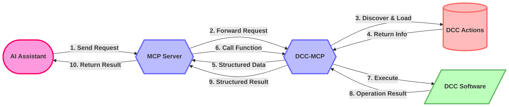

# dcc-mcp-core

[](https://pypi.org/project/dcc-mcp-core/)
[](https://www.python.org/)
[](https://opensource.org/licenses/MIT)
[](https://pepy.tech/project/dcc-mcp-core)
[](https://codecov.io/gh/loonghao/dcc-mcp-core)
[](https://github.com/loonghao/dcc-mcp-core/actions)
[](http://makeapullrequest.com)
[](https://github.com/loonghao/dcc-mcp-core/releases)

[中文文档](README_zh.md) | [English](README.md)

Foundational library for the DCC Model Context Protocol (MCP) ecosystem. It provides common utilities, base classes, and shared functionality that are used across all other DCC-MCP packages.

> **Note**: This project is in early development stage. The API may change at any time without prior notice.

## Design Philosophy and Workflow

DCC-MCP-Core is an action management system designed for Digital Content Creation (DCC) applications, aiming to provide a unified interface that allows AI to interact with various DCC software (such as Maya, Blender, Houdini, etc.).

### Core Workflow

1. **MCP Server**: Acts as a central coordinator, receiving requests from AI
2. **DCC-MCP**: Connects the MCP server and specific DCC software
3. **Action Discovery and Loading**: DCC-MCP-Core is responsible for discovering, loading, and managing actions
4. **Structured Information Return**: Returns action information in an AI-friendly structured format to the MCP server
5. **Function Calls and Result Return**: MCP server calls the corresponding action functions and returns the results to AI



## Class-Based Action Design

DCC-MCP-Core uses a class-based approach for defining actions, providing strong typing, validation, and structured output:

### Action Base Class

Actions inherit from the `Action` base class, which provides a standardized structure:

```python
from dcc_mcp_core.actions.base import Action
from dcc_mcp_core.models import ActionResultModel
from pydantic import Field, field_validator, model_validator
from typing import List, Optional

class CreateSphereAction(Action):
    # Metadata as class attributes
    name = "create_sphere"
    description = "Creates a sphere in the scene"
    tags = ["geometry", "creation"]
    dcc = "maya"  # DCC this action is for
    order = 0  # Execution order priority

    # Input parameters model with validation
    class InputModel(Action.InputModel):
        radius: float = Field(default=1.0, description="Radius of the sphere")
        position: List[float] = Field(default=[0, 0, 0], description="Position of the sphere")
        name: Optional[str] = Field(default=None, description="Name of the sphere")

        # Parameter validation example
        @field_validator('radius')
        def validate_radius(cls, v):
            if v <= 0:
                raise ValueError("Radius must be positive")
            return v
            
        # Model-level validation example
        @model_validator(mode='after')
        def validate_model(self):
            # Example: if name is provided, position must not be origin
            if self.name and self.position == [0, 0, 0]:
                raise ValueError("Position must not be origin when name is specified")
            return self

    # Output data model
    class OutputModel(Action.OutputModel):
        object_name: str = Field(description="Name of the created object")
        position: List[float] = Field(description="Final position of the object")
        # Inherited from base OutputModel
        prompt: Optional[str] = Field(default=None, description="Suggestion for AI about next steps")

    def _execute(self) -> None:
        # Access validated input parameters
        radius = self.input.radius
        position = self.input.position
        name = self.input.name or f"sphere_{radius}"

        # Access DCC context (e.g., Maya cmds)
        cmds = self.context.get("cmds")

        # Execute DCC-specific operation
        sphere = cmds.polySphere(r=radius, n=name)[0]
        cmds.move(*position, sphere)

        # Set structured output
        self.output = self.OutputModel(
            object_name=sphere,
            position=position,
            prompt="You can now modify the sphere's attributes or add materials"
        )
        
    # Optional: Override async execution for native async support
    async def _execute_async(self) -> None:
        # By default, this runs _execute in a thread pool
        # You can override for native async implementation
        import asyncio
        # Example of async operation
        await asyncio.sleep(0.1)  # Simulate async work
        # Then perform the same operations as in _execute
```

### Key Features

- **Strong Type Checking**: Input and output parameters are defined using Pydantic models
- **Input Validation**: Automatic validation of input parameters with custom validation rules
- **Structured Output**: Standardized output format with context and prompts
- **Metadata Declaration**: Clear metadata definition through class attributes
- **Error Handling**: Unified error handling and reporting

## ActionResultModel

The `ActionResultModel` provides a structured format for action results, making it easier for AI to understand and process the outcome:

```python
ActionResultModel(
    success=True,
    message="Successfully created sphere",
    prompt="You can now modify the sphere's attributes or add materials",
    error=None,
    context={
        "object_name": "sphere_1.0",
        "position": [0, 0, 0]
    }
)
```

### Fields

- **success**: Boolean indicating if the action was successful
- **message**: Human-readable result message
- **prompt**: Suggestion for AI about next steps or actions
- **error**: Error message when success is False
- **context**: Dictionary containing additional context data

### Methods

- **to_dict()**: Converts the model to a dictionary, with version-independent compatibility between Pydantic v1 and v2
- **model_dump()** / **dict()**: Native Pydantic serialization methods (version dependent)

### Usage Example

```python
# Create a result model
result = ActionResultModel(
    success=True,
    message="Operation completed",
    prompt="Next step suggestion",
    context={"key": "value"}
)

# Convert to dictionary (version-independent)
result_dict = result.to_dict()

# Access fields
if result.success:
    print(f"Success: {result.message}")
    if result.prompt:
        print(f"Next step: {result.prompt}")
    print(f"Context data: {result.context}")
else:
    print(f"Error: {result.error}")
```

## ActionManager

The `ActionManager` class is responsible for discovering, loading, and executing actions:

```python
from dcc_mcp_core.actions.manager import ActionManager

# Create an ActionManager for a specific DCC
manager = ActionManager("maya")

# Register action paths
manager.register_action_path("/path/to/actions")

# Refresh actions (discover and load)
manager.refresh_actions()

# Get information about all registered actions
actions_info = manager.get_actions_info()

# Execute an action with parameters
result = manager.call_action(
    "create_sphere",
    radius=2.0,
    position=[1, 1, 1]
)

# Access the result
if result.success:
    print(f"Created: {result.context['object_name']}")
    print(f"Next step: {result.prompt}")
else:
    print(f"Error: {result.error}")
```

### Key Features

- **Dynamic Discovery**: Automatically discovers and loads actions from registered paths
- **Validation**: Validates input parameters before execution
- **Context Injection**: Injects DCC context into actions
- **Middleware Support**: Supports middleware for cross-cutting concerns like logging and performance monitoring
- **Asynchronous Execution**: Supports both synchronous and asynchronous action execution

## Middleware System

DCC-MCP-Core includes a middleware system for inserting custom logic before and after action execution:

```python
from dcc_mcp_core.actions.middleware import LoggingMiddleware, PerformanceMiddleware, MiddlewareChain
from dcc_mcp_core.actions.manager import ActionManager

# Create a middleware chain
chain = MiddlewareChain()

# Add middleware (order matters - first added is executed first)
chain.add(LoggingMiddleware)  # Logs action execution details
chain.add(PerformanceMiddleware, threshold=0.5)  # Monitors execution time

# Create an action manager with the middleware chain
manager = ActionManager("maya", middleware=chain.build())

# Execute actions through the middleware chain
result = manager.call_action("create_sphere", radius=2.0)

# The result will include performance data added by the middleware
print(f"Execution time: {result.context['performance']['execution_time']:.2f}s")
```

### Built-in Middleware

- **LoggingMiddleware**: Logs action execution details and timing
- **PerformanceMiddleware**: Monitors execution time and warns about slow actions

### Custom Middleware

You can create custom middleware by inheriting from the `Middleware` base class:

```python
from dcc_mcp_core.actions.middleware import Middleware
from dcc_mcp_core.actions.base import Action
from dcc_mcp_core.models import ActionResultModel

class CustomMiddleware(Middleware):
    def process(self, action: Action, **kwargs) -> ActionResultModel:
        # Pre-processing logic
        print(f"Before executing {action.name}")
        
        # Call the next middleware in the chain (or the action itself)
        result = super().process(action, **kwargs)
        
        # Post-processing logic
        print(f"After executing {action.name}: {'Success' if result.success else 'Failed'}")
        
        # You can modify the result if needed
        if result.success:
            result.context["custom_data"] = "Added by middleware"
            
        return result
```

## Project Structure

DCC-MCP-Core is organized into several subpackages:

- **actions**: Action management and execution
  - `base.py`: Base Action class definition with Pydantic models
  - `manager.py`: ActionManager for action discovery and execution
  - `registry.py`: ActionRegistry for registering and retrieving actions
  - `middleware.py`: Middleware system for cross-cutting concerns
  - `events.py`: Event system for action communication
  - `generator.py`: Utilities for generating action templates
  - `adapter.py`: Adapters for legacy action functions

- **models**: Data models for the MCP ecosystem
  - `models.py`: Structured result model and other data models

- **utils**: Utility functions and helpers
  - `module_loader.py`: Module loading utilities
  - `filesystem.py`: File system operations
  - `decorators.py`: Function decorators for error handling
  - `dependency_injector.py`: Dependency injection utilities
  - `template.py`: Template rendering utilities
  - `platform.py`: Platform-specific utilities

## Features

- Class-based Action design with Pydantic models
- Parameter validation and type checking
- Structured result format with context and prompts
- Dynamic action discovery and loading
- Middleware support for cross-cutting concerns
- Event system for action communication
- Asynchronous action execution
- Comprehensive error handling

## Installation

```bash
# Install from PyPI
pip install dcc-mcp-core

# Or install from source
git clone https://github.com/loonghao/dcc-mcp-core.git
cd dcc-mcp-core
pip install -e .
```

## Development Setup

```bash
# Clone the repository
git clone https://github.com/loonghao/dcc-mcp-core.git
cd dcc-mcp-core

# Create and activate virtual environment
python -m venv venv
source venv/bin/activate  # On Windows: venv\Scripts\activate

# Install development dependencies
pip install -e .
pip install pytest pytest-cov pytest-mock pyfakefs

# Install development tools
pip install uvx nox ruff isort pre-commit
```

## Running Tests

```bash
# Run tests with coverage
uvx nox -s pytest

# Run specific tests
uvx nox -s pytest -- tests/test_action_manager.py -v

# Run linting checks
uvx nox -s lint-fix
```

## Example Usage

### Discovering and Loading Actions

```python
from dcc_mcp_core.actions.manager import ActionManager

# Create an action manager for Maya (without loading from environment)
manager = ActionManager('maya', load_env_paths=False)

# Register action paths
manager.register_action_path('/path/to/actions')

# Refresh actions (discover and load)
manager.refresh_actions()

# Get information about all registered actions
actions_info = manager.get_actions_info()

# Print information about available actions
for action_name, action_info in actions_info.items():
    print(f"Action: {action_name}")
    print(f"  Description: {action_info['description']}")
    print(f"  Tags: {', '.join(action_info['tags'])}")

# Call an action with parameters
result = manager.call_action(
    'create_sphere',
    radius=2.0,
    position=[0, 1, 0],
    name='my_sphere'
)

# Access the result
if result.success:
    print(f"Success: {result.message}")
    print(f"Created object: {result.context.get('object_name')}")
    if result.prompt:
        print(f"Next step suggestion: {result.prompt}")
else:
    print(f"Error: {result.error}")
```

### Creating a Custom Action

```python
# my_maya_action.py
from dcc_mcp_core.actions.base import Action
from pydantic import Field, field_validator

class CreateSphereAction(Action):
    # Action metadata
    name = "create_sphere"
    description = "Creates a sphere in Maya"
    tags = ["geometry", "creation"]
    dcc = "maya"
    order = 0

    # Input parameters model with validation
    class InputModel(Action.InputModel):
        radius: float = Field(1.0, description="Radius of the sphere")
        position: list[float] = Field([0, 0, 0], description="Position of the sphere")
        name: str = Field(None, description="Name of the sphere")

        # Parameter validation
        @field_validator('radius')
        def validate_radius(cls, v):
            if v <= 0:
                raise ValueError("Radius must be positive")
            return v

    # Output data model
    class OutputModel(Action.OutputModel):
        object_name: str = Field(description="Name of the created object")
        position: list[float] = Field(description="Final position of the object")

    def _execute(self) -> None:
        # Access validated input parameters
        radius = self.input.radius
        position = self.input.position
        name = self.input.name or f"sphere_{radius}"

        # Access DCC context (e.g., Maya cmds)
        cmds = self.context.get("cmds")

        try:
            # Execute DCC-specific operation
            sphere = cmds.polySphere(r=radius, n=name)[0]
            cmds.move(*position, sphere)

            # Set structured output
            self.output = self.OutputModel(
                object_name=sphere,
                position=position,
                prompt="You can now modify the sphere's attributes or add materials"
            )
        except Exception as e:
            # Exceptions will be caught by the Action.process method
            # and converted to an appropriate ActionResultModel
            raise Exception(f"Failed to create sphere: {str(e)}") from e
```

## Contributing

Contributions are welcome! Please feel free to submit a Pull Request.

## License

This project is licensed under the MIT License - see the LICENSE file for details.
