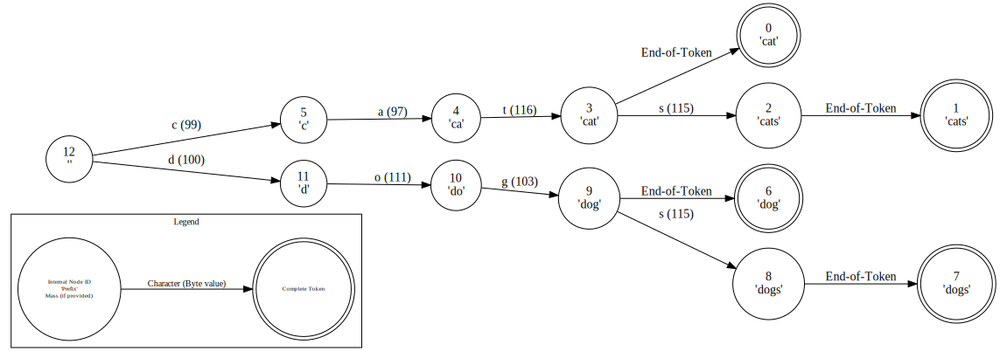
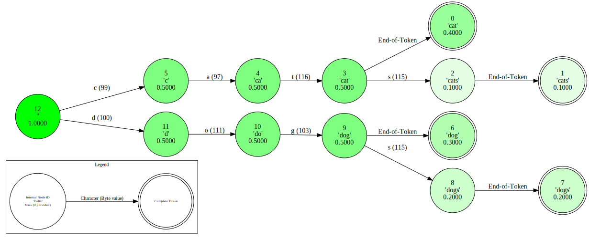

# GenLM Backend Documentation

GenLM Backend is a high-performance backend for language model probabilistic programs in the GenLM ecosystem. It provides essential tools and functions that serve as building blocks for more complex applications.

**Key Features**:

* **Asynchronous LLM Interfaces**: Asynchronous computation of next-token probabilities with `vllm` and `transformer` language models.
* **Tokenizer Vocabulary Decoding**: Decoding Hugging Face tokenizer vocabularies into their byte and string representations.
* **Token-Character Tries**: Efficient conversion from token distributions to byte-level distributions using a trie datastructure.

## Quick Start

This library can be installed via pip:

```bash
pip install genlm-backend
```


## Main Components

### Asynchronous Language Model Backends

The [`backend.llm`](reference/backend/llm/__init__/) module provides asynchronous interfaces for computing next-token probabilities with `vllm` and `transformer` language models.

```python
from genlm.backend.llm import AsyncVirtualLM
# Initialize model with vLLM backend from a HuggingFace model name
llm = AsyncVirtualLM.from_name("gpt2")
```

These interfaces enable automatic batching of concurrent requests:

```python
import time
import asyncio

async def my_model(i):
    time.sleep(0.01) # Simulate CPU work.
    # Get log probabilities of next tokens given token_ids.
    return await llm.next_token_logprobs(token_ids=[i] * 10)

# Both requests will be batched together by the underlying LM.
outs = asyncio.run(asyncio.gather(*[my_model(0), my_model(1)]))
```
as well as automatic output and KV caching, and CPU/GPU parallelization in certain scenarios.

This submodule includes two key classes:

- **AsyncVirtualLM** (GPU): vLLM-based backend optimized for next-token probability computations. Fastest and most memory-efficient; requires a GPU. Uses vLLM's prefix caching feature for KV caching.
- **AsyncTransformer** (CPU): HuggingFace-based backend for next-token probability computations. Slower and less memory-efficient; for CPU usage. Uses custom KV caching.

See the [LLM Code Reference](reference/backend/llm/__init__/) for detailed API documentation.

### Token-Character Tries

The [`backend.trie`](reference/backend/trie/__init__/) module provides an efficient trie data structure for mapping weight distributions over tokens to weight distributions over token prefixes.

```python
from genlm.backend.trie import TokenCharacterTrie
# Initialize TokenCharacterTrie from a byte vocabulary
trie = TokenCharacterTrie(decode=[b'cat', b'cats', b'dog', b'dogs'])
trie.visualize()
```



Each node in the trie corresponds to a prefix of one or multiple tokens in the vocabulary. Internal nodes correspond to the incomplete prefixes and leaf nodes to complete tokens. The `weight_sum` function provides the marginal weight of each prefix (i.e., node) given a distribution on the underlying vocabulary:

```python
# Get mass at each node given a distribution over the vocab
ws = trie.weight_sum([0.4, 0.1, 0.3, 0.2])
trie.visualize(ws)
```




This submodule includes three key classes:

- **TokenCharacterTrie** (CPU): Base implementation for CPU usage.
- **ParallelTokenCharacterTrie** (GPU): GPU-accelerated version which uses sparse matrix operations for mass summing.
- **AsyncTokenCharacterTrie** (Async): Asynchronous wrapper for use in asynchronous contexts; enables automatic batching of concurrent requests. This class can wrap either the sequential or parallel trie implementations.

See the [Trie Code Reference](reference/backend/trie/__init__/) for detailed API documentation.

### Vocabulary Decoding

The [`backend.tokenization`](reference/backend/tokenization/__init__/) module converts Hugging Face tokenizer vocabularies into byte and string representations, with each token's representation stored at its corresponding token ID in the output lists.

```python
from transformers import AutoTokenizer
from genlm.backend.tokenization import decode_vocab

# Load a tokenizer and decode its vocabulary
tokenizer = AutoTokenizer.from_pretrained("gpt2")
byte_vocab, str_vocab = decode_vocab(tokenizer)
byte_vocab[10] # Byte representation of token with ID 10
```

!!! warning
    The byte representation (`byte_vocab`) is the canonical form and should be preferred for reliable token handling. The string representation (`str_vocab`) is provided for convenience and debugging but may not correctly represent all tokens, especially those containing invalid UTF-8 sequences.

## Troubleshooting

* If you are getting:
    ```bash
    A module that was compiled using NumPy 1.x cannot be run in
    NumPy 2.0.2 as it may crash. To support both 1.x and 2.x
    versions of NumPy, modules must be compiled with NumPy 2.0.
    Some module may need to rebuild instead e.g. with 'pybind11>=2.12'.

    If you are a user of the module, the easiest solution will be to
    downgrade to 'numpy<2' or try to upgrade the affected module.
    We expect that some modules will need time to support NumPy 2.
    ```
    then you should downgrade your version of `numpy` with `pip install "numpy<2"`.
