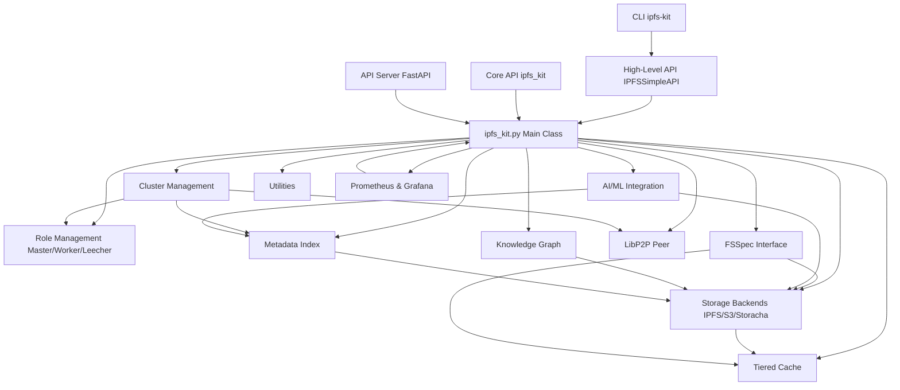

# IPFS Kit

IPFS Kit is a comprehensive Python toolkit for working with IPFS (InterPlanetary File System) technologies. It provides a unified interface for IPFS operations, cluster management, tiered storage, and AI/ML integration.

This library installs and configures IPFS services through Kubo and IPFS Cluster based on the contents in the config file. It supports different node roles (master, worker, or leecher) and allows IPFS content to be accessed through multiple backends, including local IPFS node, IPFS Cluster, Storacha (previously Web3.Storage), and S3-compatible storage.

## Architecture Overview

IPFS Kit is designed with a modular architecture:



-   **User Interfaces**: Provides multiple ways to interact with the kit (CLI, High-Level API, Core API, REST API Server).
-   **Core `ipfs_kit` Class**: The central orchestrator, managing configuration and initializing role-specific components.
-   **Role Management**: Handles the distinct behaviors and component loading for Master, Worker, and Leecher roles, including dynamic role switching.
-   **Cluster Management**: Advanced features for coordinating multiple nodes, including task distribution, state synchronization, monitoring, and authentication.
-   **Storage Backends**: Abstracts interactions with various storage systems (local IPFS, IPFS Cluster, S3, Storacha).
-   **FSSpec Interface**: Offers a standard Python filesystem interface for seamless data access.
-   **Tiered Cache**: Optimizes data retrieval speed using memory, disk, and memory-mapped caching.
-   **Metadata Index**: Enables efficient searching and discovery of content using Apache Arrow.
-   **LibP2P Peer**: Facilitates direct peer-to-peer communication and content exchange.
-   **AI/ML Integration**: Tools for managing ML models/datasets and integrating with frameworks like PyTorch/TensorFlow.
-   **Knowledge Graph**: Represents relationships between IPFS objects using IPLD.
-   **Utilities**: Common functions for error handling, validation, etc.
-   **Observability**: Comprehensive metrics collection and visualization using Prometheus and Grafana.

## Features

-   **High-Level API**: Simplified interface (`IPFSSimpleAPI`) with declarative configuration (YAML/JSON), automatic error handling, and a plugin architecture for easy extension. ([See Docs](docs/high_level_api.md))
-   **Role-based Architecture**: Configure nodes as master, worker, or leecher, each optimized for specific tasks (coordination, computation, consumption). ([See Docs](docs/core_concepts.md))
-   **Tiered Storage & Caching**: Intelligently manage content across multiple storage backends (IPFS, Cluster, S3, Storacha) with a high-performance Adaptive Replacement Cache (ARC) system featuring memory, disk, and memory-mapped tiers. ([See Docs](docs/tiered_cache.md))
-   **Standard Filesystem Interface**: Use the FSSpec integration (`IPFSFileSystem`) for familiar filesystem-like access to IPFS content, enabling seamless use with data science tools like Pandas and Dask. Features proper inheritance from AbstractFileSystem with graceful fallbacks and comprehensive error handling. ([See Docs](docs/fsspec_integration.md))
-   **Metadata Indexing**: Efficient Arrow-based metadata index with distributed synchronization (via IPFS PubSub and DAGs) for fast content discovery, querying, and multi-location tracking. ([See Docs](docs/metadata_index.md))
-   **Direct P2P Communication**: Establish direct peer connections using libp2p for daemon-less content exchange, featuring advanced DHT discovery, provider reputation, and NAT traversal. ([See Docs](docs/libp2p_integration.md))
-   **Advanced Cluster Management**: Sophisticated cluster coordination including leader election, task distribution, state synchronization (CRDTs, vector clocks), health monitoring, secure authentication (TLS, UCANs), and dynamic role adaptation based on resource availability. ([See Docs](docs/cluster_management.md))
-   **Storacha/S3 Integration**: Access content via Storacha (Web3.Storage) and S3-compatible storage as alternative backends. ([See Docs](docs/storage_backends.md))
-   **Comprehensive Error Handling**: Standardized error classes and detailed result dictionaries for robust application development.
-   **High Performance**: Optimized for speed with comprehensive profiling and optimization tools. Features include memory-mapped file access, result caching, adaptive replacement cache tuning, chunked uploads for large files, and low-latency Unix socket communication (2-3x faster than HTTP for local daemon). Performance tools in `examples/` provide benchmarking, optimization recommendations, and comparison metrics for measuring improvements.
-   **Arrow-Based Cluster State**: Efficient, zero-copy cluster state sharing across processes using Apache Arrow, enabling interoperability with C++, Rust, etc. ([See Docs](docs/cluster_state_helpers.md))
-   **Distributed Task Management**: Define, submit, and track computational tasks across a cluster of worker nodes.
-   **AI/ML Integration**: Comprehensive AI/ML integration providing tools for model registry, dataset management, LangChain/LlamaIndex integration, distributed training, and more. Features include efficient `IPFSDataLoader` for PyTorch/TensorFlow, versioned content-addressed ML assets, AI safety tools, fine-tuning infrastructure, and GraphRAG capabilities. ([See Docs](docs/ai_ml_integration.md), [IPFS DataLoader](docs/ipfs_dataloader.md))
-   **IPLD Knowledge Graph**: Model relationships between IPFS objects using IPLD for advanced data representation. ([See Docs](docs/knowledge_graph.md))
-   **SDK Generation**: Automatically generate client SDKs for Python, JavaScript, and Rust.
-   **Observability**: Comprehensive metrics collection and visualization using Prometheus and Grafana, with pre-configured dashboards for monitoring system performance, cache efficiency, operation latency, and more. ([See Docs](docs/observability.md))

## Installation

### From PyPI (Recommended)

You can install IPFS Kit directly from PyPI with optional dependency groups. The package implements graceful degradation patterns for optional dependencies, allowing you to install only what you need while providing helpful error messages when missing dependencies are required:

```bash
# Basic installation with core functionality
pip install ipfs_kit_py

# With filesystem support (fsspec integration)
pip install ipfs_kit_py[fsspec]

# With Arrow integration for high-performance data operations
pip install ipfs_kit_py[arrow]

# With AI/ML support for model and dataset management
pip install ipfs_kit_py[ai_ml]

# With HuggingFace Hub integration for model and dataset access
pip install ipfs_kit_py[huggingface]

# With API server support (FastAPI-based HTTP server)
pip install ipfs_kit_py[api]

# With Prometheus metrics support (for monitoring API and services)
pip install prometheus-fastapi-instrumentator

# Development installation with testing tools
pip install ipfs_kit_py[dev]

# Full installation with all dependencies
pip install ipfs_kit_py[full] prometheus-fastapi-instrumentator
```

The modular dependency system allows you to use the core functionality without installing all dependencies. When you try to use a feature that requires a missing optional dependency, you'll receive a helpful error message suggesting how to install the required dependencies.

#### Automatic Binary Download

IPFS Kit automatically downloads the appropriate platform-specific IPFS binaries (Kubo, IPFS Cluster, etc.) when the package is first imported. This ensures you have the correct binaries for your operating system (Windows, macOS, Linux) and architecture (x86_64, ARM64, etc.) without manual setup.

You can control this behavior by setting the `auto_download_binaries` parameter in the metadata:

```python
# Disable automatic binary downloads
kit = ipfs_kit(metadata={"auto_download_binaries": False})
```

Binary downloads happen:
1. When the package is first imported
2. When creating an ipfs_kit instance if binaries are missing
3. On-demand when specific functions that require binaries are called

The binary downloads are performed intelligently:
- **Platform Detection**: Automatically detects your OS (Windows/macOS/Linux) and architecture (x86_64/ARM64/etc.)
- **Correct Binaries**: Downloads binaries compiled specifically for your platform (.exe for Windows, etc.)
- **Execution Permissions**: Sets appropriate permissions automatically (executable bit on Unix)
- **Version Management**: Downloads the recommended/stable version for compatibility
- **Error Handling**: Gracefully handles download failures with helpful messages
- **Progress Reporting**: Shows download progress for large binaries

This automated binary management ensures a smooth experience regardless of your platform, eliminating the need to manually download, install, and configure IPFS binaries.

### From Source

For the latest development version or to contribute:

```bash
# Clone the repository
git clone https://github.com/endomorphosis/ipfs_kit_py
cd ipfs_kit_py

# Install in development mode with selected extras
pip install -e ".[fsspec,arrow]"

# Or install all dependencies for development
pip install -e ".[full,dev]"
```

### Docker Installation

For containerized deployment:

```bash
# Setup directories and configuration
./docker-setup.sh --cluster-secret

# Start the cluster with docker-compose
docker-compose up -d

# Scale worker nodes as needed
docker-compose up -d --scale ipfs-worker-2=3
```

For a production-ready deployment with Kubernetes:

```bash
# Deploy with Helm (recommended)
./kubernetes-deploy.sh

# Or use manual deployment
./kubernetes-deploy.sh --manual
```

See the [Containerization Guide](CONTAINERIZATION.md) for detailed instructions on Docker and Kubernetes deployments.

## Command-line Interface

IPFS Kit includes a comprehensive command-line interface for accessing all core functionality:

```bash
# Basic usage
ipfs-kit add example.txt              # Add a file to IPFS
ipfs-kit get QmCID                    # Get content from IPFS
ipfs-kit ls QmCID                     # List directory contents
ipfs-kit pin QmCID                    # Pin content to local node

# Core IPFS operations
ipfs-kit add --pin --wrap-with-directory file  # Add file with options
ipfs-kit get QmCID --output output.txt         # Save content to file
ipfs-kit cat QmCID                             # Display content to console
ipfs-kit list-pins                             # List pinned content
ipfs-kit unpin QmCID                           # Remove pin from local node
ipfs-kit stat QmCID                            # Display object stats

# Node and peer operations
ipfs-kit id                            # Show node identity information
ipfs-kit peers                         # List connected peers
ipfs-kit connect /ip4/1.2.3.4/tcp/4001 # Connect to a specific peer
ipfs-kit bootstrap list                # Show bootstrap peers
ipfs-kit bootstrap add /ip4/1.2.3.4    # Add bootstrap peer

# IPNS operations
ipfs-kit name publish QmCID           # Publish content to IPNS
ipfs-kit name resolve name            # Resolve IPNS name to CID
ipfs-kit key list                     # List IPNS keys
ipfs-kit key gen keyname              # Generate a new IPNS key

# Cluster operations (master/worker roles only)
ipfs-kit cluster-pin QmCID            # Pin content to cluster
ipfs-kit cluster-status QmCID         # Check pin status in cluster
ipfs-kit cluster-peers                # List cluster peers
ipfs-kit cluster-add example.txt      # Add file to cluster with replication

# Formatting options
ipfs-kit --format json ls QmCID       # Get results in JSON format
ipfs-kit --format yaml add file.txt   # Get results in YAML format

# Advanced settings
ipfs-kit --config path/to/config.yaml cmd  # Use custom configuration
ipfs-kit --timeout 60 get QmLargeFile      # Set longer timeout for large files
ipfs-kit --role worker add file.txt        # Explicitly set node role
```

### Global Command Options

| Option | Description |
|--------|-------------|
| `--help`, `-h` | Show help message |
| `--format` | Output format (json, yaml, table, text) |
| `--verbose`, `-v` | Enable verbose output |
| `--quiet`, `-q` | Suppress output |
| `--config` | Path to configuration file |
| `--timeout` | Operation timeout in seconds |
| `--role` | Node role (master, worker, leecher) |
| `--api-url` | Custom API URL |

### Environment Variables

The CLI respects the following environment variables:

- `IPFS_KIT_CONFIG`: Path to configuration file
- `IPFS_KIT_ROLE`: Node role (master, worker, leecher)
- `IPFS_KIT_API_URL`: Custom API URL
- `IPFS_KIT_TIMEOUT`: Default timeout in seconds
- `IPFS_KIT_FORMAT`: Default output format

## Quick Start

### Core API

```python
# Basic usage with core API
from ipfs_kit_py.ipfs_kit import ipfs_kit

# Initialize with default settings (leecher role)
kit = ipfs_kit()

# Add a file to IPFS (uses ipfs_add method)
result = kit.ipfs_add("example.txt")
cid = result.get("Hash") # Note: 'Hash' key might vary, check result dict
if cid:
    print(f"Added file with CID: {cid}")

    # Read content (uses ipfs_cat method)
    content_result = kit.ipfs_cat(cid)
    if content_result.get("success"):
        print(f"Content: {content_result.get('data')}")

    # Using the filesystem interface (requires fsspec extra)
    try:
        fs = kit.get_filesystem()
        if fs:
            with fs.open(f"ipfs://{cid}", "rb") as f:
                data = f.read()
                print(f"Read {len(data)} bytes using filesystem interface")
    except ImportError:
        print("Install 'fsspec' extra for filesystem interface: pip install ipfs_kit_py[fsspec]")
        
    # Try advanced metadata operations (requires arrow extra)
    try:
        # Import will succeed but creating an instance will give helpful error if PyArrow missing
        from ipfs_kit_py.arrow_metadata_index import ArrowMetadataIndex
        try:
            index = ArrowMetadataIndex()
            index.add_metadata(cid, {"title": "Example", "tags": ["test"]})
            print("Added metadata to index")
        except ImportError as e:
            print(f"{e}") # Will show helpful message about installing with [arrow] extra
    except Exception as e:
        print(f"Unexpected error with arrow features: {e}")

```

### High-Level API

The High-Level API (`IPFSSimpleAPI`) provides a simplified, user-friendly interface with declarative configuration and built-in error handling.

```python
# Simplified usage with High-Level API
from ipfs_kit_py.high_level_api import IPFSSimpleAPI

# Initialize with declarative configuration
api = IPFSSimpleAPI(
    config_path="config.yaml",  # Optional: Load from YAML/JSON config
    role="worker",              # Override config settings
    timeouts={"api": 30}        # Custom timeout settings
)

# Content operations
# ------------------

# Add content with simplified API
try:
    result = api.add("example.txt")
    cid = result["cid"]
    print(f"Added file with CID: {cid}")

    # Add content from string or bytes
    result_str = api.add("Hello, IPFS!")   # Add string content
    result_bytes = api.add(b"Binary data")   # Add binary content

    # Get content - returns bytes
    content = api.get(cid)
    print(f"Content: {content}")

    # File-like operations
    # -------------------

    # Use simplified filesystem methods with graceful fallbacks
    files = api.ls(cid)
    print(f"Directory contents: {files}")

    # Check if content exists
    if api.exists(cid):
        print(f"Content {cid} exists in IPFS")

    # Open files directly with context manager (works even if fsspec isn't installed)
    with api.open(cid) as f:
        data = f.read()
        print(f"Read {len(data)} bytes")

    # Read content directly
    content_read = api.read(cid)

    # Content management
    # -----------------

    # Pin content to local node
    api.pin(cid)

    # List pinned content
    pins = api.list_pins()
    print(f"Pinned content: {pins}")

    # Unpin content
    api.unpin(cid)

    # IPNS operations
    # --------------

    # Publish content to IPNS (uses default 'self' key)
    result_pub = api.publish(cid)
    ipns_name = result_pub["ipns_name"]
    print(f"Published to IPNS: {ipns_name}")

    # Resolve IPNS name to CID
    resolved = api.resolve(ipns_name)
    print(f"Resolved to: {resolved['resolved_cid']}")

    # Peer operations
    # -------------

    # Connect to a peer
    api.connect("/ip4/1.2.3.4/tcp/4001/p2p/QmPeerID")

    # List connected peers
    peers_info = api.peers()
    print(f"Connected to {peers_info['count']} peers")

    # Cluster operations
    # ----------------

    # Only available in master or worker roles
    if api.config.get("role") != "leecher":
        # Add content to cluster with replication
        cluster_add_result = api.cluster_add("example.txt", replication_factor=3)

        # Pin content to cluster
        api.cluster_pin(cid, replication_factor=3)

        # Check pin status in cluster
        status = api.cluster_status(cid)

        # List cluster peers
        cluster_peers = api.cluster_peers()
        
    # AI/ML operations (requires ai_ml extra)
    # ------------------------------
    try:
        # Import will succeed even without dependencies
        from ipfs_kit_py.ai_ml_integration import ModelRegistry
        
        try:
            # Create a mock client for testing
            from unittest.mock import MagicMock
            client = MagicMock()
            
            # Initialize model registry
            registry = ModelRegistry(client)
            
            # This will show what ML frameworks are available
            # If none are installed, you'll see a warning message
            
            # Create a simple model and add it
            from sklearn.ensemble import RandomForestClassifier
            model = RandomForestClassifier()
            model.fit([[0, 0], [1, 1]], [0, 1])
            
            registry.add_model(model, "example_model", version="1.0")
            print("Added model to registry")
            
        except ImportError as e:
            # If dependencies are missing, you'll get a helpful error message
            print(f"AI/ML dependencies not available: {e}")
            print("Install with: pip install ipfs_kit_py[ai_ml]")
    except Exception as e:
        print(f"Unexpected error with AI/ML features: {e}")

except Exception as e:
    print(f"An error occurred: {e}")


# Method call syntax options
# ------------------------

# Use direct method calls
api.add("another_example.txt")

# Or use the callable interface with method name string
api("add", "yet_another.txt")

# Call plugin methods via extension syntax (assuming MyPlugin is registered)
# result = api.call_extension("MyPlugin.custom_operation", arg1, arg2=value)

# Or use the shorthand callable syntax
# result = api("MyPlugin.custom_operation", arg1, arg2=value)
```

#### Configuration Management

The High-Level API supports flexible configuration options:

```python
# Load from standard locations (tries in order):
# ./ipfs_config.yaml, ./ipfs_config.json, ~/.ipfs_kit/config.yaml, etc.
api = IPFSSimpleAPI()

# Load from specific file
api = IPFSSimpleAPI(config_path="/path/to/config.yaml")

# Override with parameters
api = IPFSSimpleAPI(
    role="worker",
    resources={"max_memory": "2GB", "max_storage": "100GB"},
    cache={"memory_size": "500MB", "disk_size": "5GB"},
    timeouts={"api": 60, "gateway": 120}
)

# Save current configuration to file
# api.save_config("~/.ipfs_kit/my_config.yaml") # Requires implementation
```

Sample configuration file (YAML):

```yaml
# Node role
role: worker

# Resource limits
resources:
  max_memory: 2GB
  max_storage: 100GB

# Cache settings
cache:
  memory_size: 500MB
  disk_size: 5GB
  disk_path: ~/.ipfs_kit/cache

# Timeouts
timeouts:
  api: 60
  gateway: 120
  peer_connect: 30

# Logging
logging:
  level: INFO
  file: ~/.ipfs_kit/logs/ipfs.log

# Plugins
plugins:
  - name: MetricsPlugin
    path: ipfs_kit_py.plugins.metrics # Example path
    enabled: true
    config:
      interval: 60
#  - name: CustomPlugin
#    path: my_package.plugins # Example path
#    enabled: true
#    config:
#      setting1: value1

# Observability
observability:
  metrics_enabled: true
  prometheus_port: 9090
  metrics_path: /metrics
```

### API Server

IPFS Kit includes a FastAPI-based HTTP server that exposes functionality via a RESTful API:

```python
# Start API server
from ipfs_kit_py.api import run_server

# Run on localhost:8000
# run_server(host="127.0.0.1", port=8000) # Uncomment to run

# Advanced configuration
# run_server(
#     host="0.0.0.0",             # Listen on all interfaces
#     port=8000,                  # Port to listen on
#     reload=True,                # Enable auto-reload for development
#     workers=4,                  # Number of worker processes
#     config_path="config.yaml",  # Load configuration from file
#     log_level="info",           # Logging level
#     auth_enabled=True,          # Enable authentication
#     cors_origins=["*"]          # CORS allowed origins
# )
```

The API server provides:

-   **OpenAPI Documentation**: Interactive Swagger UI at `/docs`
-   **GraphQL API**: Flexible client-side querying at `/graphql` and IDE at `/graphql/playground`
-   **Authentication**: Optional token-based auth
-   **CORS Support**: Cross-Origin Resource Sharing configuration
-   **Health Checks**: Basic health monitoring endpoint at `/health`
-   **Metrics**: Prometheus-compatible metrics at `/metrics` (if enabled)
-   **API Versioning**: Support for multiple API versions (currently v0)

#### API Endpoints (v0)

| Endpoint | Method | Description |
|----------|--------|-------------|
| `/api/v0/add` | POST | Add content to IPFS (upload file) |
| `/api/v0/cat` | GET | Retrieve content by CID |
| `/api/v0/ls` | GET | List directory contents by CID |
| `/api/v0/pin/add` | POST | Pin content to local node by CID |
| `/api/v0/pin/rm` | POST | Unpin content by CID |
| `/api/v0/pin/ls` | GET | List pinned content on local node |
| `/api/v0/id` | GET | Get node identity information |
| `/api/v0/swarm/peers` | GET | List connected peers |
| `/api/v0/swarm/connect` | POST | Connect to a peer (provide multiaddr) |
| `/api/v0/name/publish` | POST | Publish content to IPNS (provide CID) |
| `/api/v0/name/resolve` | GET | Resolve IPNS name to CID |
| `/api/v0/cluster/pins` | GET | List cluster pins (Master/Worker only) |
| `/api/v0/cluster/pin/add` | POST | Pin content to cluster (Master only) |
| `/api/v0/cluster/status` | GET | Get cluster pin status by CID (Master only) |
| `/api/v0/cluster/peers` | GET | List cluster peers (Master only) |
| `/health` | GET | Basic health check |
| `/metrics` | GET | Prometheus metrics (if enabled) |

#### Client Connection Example

```python
import requests
import json

# Connect to API server
api_url = "http://localhost:8000" # Assuming server is running

try:
    # Add content to IPFS
    with open("example.txt", "w") as f: # Create dummy file
        f.write("API test content")
    with open("example.txt", "rb") as f:
        response = requests.post(
            f"{api_url}/api/v0/add",
            files={"file": f}
        )
    response.raise_for_status() # Raise exception for bad status codes
    result = response.json()
    cid = result.get("Hash") # Key might differ, adjust as needed
    if cid:
        print(f"Added content with CID: {cid}")

        # Get content from IPFS
        response = requests.get(
            f"{api_url}/api/v0/cat",
            params={"arg": cid}
        )
        response.raise_for_status()
        content = response.content
        print(f"Retrieved content: {content}")

        # List directory contents (assuming CID is a directory)
        # response = requests.get(
        #     f"{api_url}/api/v0/ls",
        #     params={"arg": cid}
        # )
        # response.raise_for_status()
        # files = response.json()
        # print(f"Directory contents: {json.dumps(files, indent=2)}")
    else:
        print(f"Failed to get CID from add response: {result}")

except requests.exceptions.RequestException as e:
    print(f"API request failed: {e}")
except Exception as e:
    print(f"An error occurred: {e}")

```

For more examples, see the `examples/` directory.

## Observability

IPFS Kit includes comprehensive observability features using Prometheus and Grafana, providing real-time metrics and visualization for:

- System resources (CPU, memory, disk usage)
- Cache performance (hit ratios, evictions, size)
- Operation latency (add, get, pin operations)
- Network traffic (bandwidth, peer connections)
- Error rates and patterns
- IPFS-specific metrics (repository size, pinned content, DHT)
- Cluster metrics (peers, pin status, role)
- AI/ML metrics (model loading, inference times)

### Prometheus Integration

The system exposes metrics in Prometheus format through a dedicated endpoint (`/metrics`). Key metrics include:

#### Core Metrics
- **System Metrics**: CPU, memory, and disk usage percentages
- **Cache Metrics**: Hit ratios, sizes, and item counts for each cache tier
- **Operation Metrics**: Counts, durations, and error rates for IPFS operations
- **Network Metrics**: Bytes sent/received, peer counts, and connection states
- **Content Metrics**: Content adds/retrievals, pin operations

#### IPFS-Specific Metrics
- **Repository Metrics**: Size, usage percentage, maximum storage capacity
- **Pin Metrics**: Direct/recursive/indirect pins, content size, pin counts
- **Peer Metrics**: Connected peer count, protocol usage statistics
- **DHT Metrics**: DHT peers, query counts by type
- **Bandwidth Metrics**: Rate and total bandwidth usage by direction

#### Cluster Metrics
- **Cluster Peers**: Number of peers in the IPFS cluster
- **Cluster Pins**: Pin counts by status (pinned, pinning, queued, error)
- **Cluster Role**: Current role in the IPFS cluster (master, worker, leecher)

#### AI/ML Metrics (when enabled)
- **Model Operations**: Model loading time, inference latency
- **Framework Metrics**: Operation counts by framework type
- **Task Metrics**: Task submission/completion rates

### Metrics Documentation

The system provides a dedicated metadata endpoint at `/metrics/metadata` containing:
- List of available metrics with descriptions
- Current IPFS node information (version, peer ID)
- Documentation links for further information

### Grafana Dashboards

Pre-configured Grafana dashboards provide comprehensive visualization:

- **System Dashboard**: Real-time monitoring of system resources, cache performance, and network activity
- **Operations Dashboard**: Detailed metrics on operation rates, latencies, and error patterns
- **IPFS Dashboard**: Focused view of IPFS-specific metrics including repository size, pin counts, and DHT metrics
- **Cluster Dashboard**: Visualization of cluster state, pin status, and inter-node communication
- **AI/ML Dashboard**: Metrics for model operations, loading times, and inference performance

### Deployment

The observability stack can be deployed using Kubernetes:

```bash
# Apply namespace
kubectl apply -f kubernetes/namespace.yaml

# Deploy Prometheus
kubectl apply -f kubernetes/prometheus-configmap.yaml
kubectl apply -f kubernetes/prometheus-deployment.yaml

# Deploy Grafana
kubectl apply -f kubernetes/grafana-dashboard-configmap.yaml
kubectl apply -f kubernetes/grafana-deployment.yaml

# Access Grafana (default password: ipfskitadmin)
kubectl port-forward -n ipfs-kit svc/grafana 3000:3000
```

### Using Prometheus Metrics

You can query the metrics directly or use Prometheus query language:

```bash
# View all metrics
curl http://localhost:8000/metrics

# View metadata and available metrics
curl http://localhost:8000/metrics/metadata

# Sample Prometheus queries
rate(ipfs_kit_operations_total[5m])               # Operation rate over 5 minutes
sum by (operation) (ipfs_kit_operations_total)    # Total operations by type
histogram_quantile(0.95, ipfs_kit_operation_latency_seconds_bucket{operation="add"}) # 95th percentile latency for add operations
ipfs_specific_pins_count{type="recursive"}        # Number of recursive pins
```

For more details on observability features, see the [Observability documentation](docs/observability.md).

## Advanced Features Documentation

Detailed documentation for advanced features can be found in the `docs/` directory:

-   [Core Concepts](docs/core_concepts.md)
-   [High-Level API](docs/high_level_api.md)
-   [Cluster Management](docs/cluster_management.md)
-   [Cluster State Helpers](docs/cluster_state_helpers.md)
-   [Tiered Cache System](docs/tiered_cache.md)
-   [Probabilistic Data Structures](docs/probabilistic_data_structures.md)
-   [FSSpec Filesystem Interface](docs/fsspec_integration.md)
-   [Metadata Index](docs/metadata_index.md)
-   [Direct P2P Communication (LibP2P)](docs/libp2p_integration.md)
-   [Performance Profiling & Optimization](examples/PERFORMANCE_PROFILING.md)
-   [AI/ML Integration](docs/ai_ml_integration.md)
-   [IPFS DataLoader](docs/ipfs_dataloader.md)
-   [IPLD Knowledge Graph](docs/knowledge_graph.md)
-   [Storage Backends (S3/Storacha)](docs/storage_backends.md)
-   [Streaming Security](docs/streaming_security.md)
-   [Advanced Prefetching](docs/advanced_prefetching.md)
-   [Resource Management](docs/resource_management.md)
-   [Credential Management](docs/credential_management.md)
-   [Extending IPFS Kit](docs/extensions.md)
-   [Observability](docs/observability.md)
-   [API Reference](docs/api_reference.md)
-   [CLI Reference](docs/cli_reference.md)
-   [Installation Guide](docs/installation_guide.md)

## For Developers

### Building and Distribution

IPFS Kit follows modern Python packaging practices using `setuptools` and `pyproject.toml`.

```bash
# Install build tools
pip install build twine

# Build the package
python -m build

# Check the package
twine check dist/*

# Upload to TestPyPI (for testing)
# twine upload --repository-url https://test.pypi.org/legacy/ dist/*

# Upload to PyPI (for real)
# twine upload dist/*
```

### Development Environment

Setup a development environment:

```bash
# Clone the repository
git clone https://github.com/endomorphosis/ipfs_kit_py
cd ipfs_kit_py

# Create a virtual environment (recommended)
python -m venv venv
source venv/bin/activate  # On Windows: venv\Scripts\activate

# Install in development mode with all dependencies
pip install -e ".[full,dev]"
```

### Running Tests

To run the tests, make sure you have installed the development dependencies and activated your virtual environment:

```bash
# Run all tests
python -m test.test

# Run a specific test module
python -m pytest test/test_huggingface_kit.py

# Run tests with verbose output
python -m pytest test/test_huggingface_kit.py -v

# Run tests with coverage report
python -m pytest --cov=ipfs_kit_py
```

For optimal testing experience, we recommend installing all optional dependencies:

```bash
# Install all optional dependencies for testing
pip install -e ".[full,dev]" prometheus-fastapi-instrumentator
```

```bash
# Install pre-commit hooks (optional, for code formatting/linting)
pip install pre-commit
pre-commit install
```

### Running Tests

### Command-line Interface

IPFS Kit includes a comprehensive command-line interface for accessing all core functionality. See the [CLI Reference](docs/cli_reference.md) for details.

```bash
# Basic usage
ipfs-kit add example.txt              # Add a file to IPFS
ipfs-kit get QmCID                    # Get content from IPFS
# ... (other examples remain the same) ...
```

### Global Command Options

| Option | Description |
|--------|-------------|
| `--help`, `-h` | Show help message |
| `--format` | Output format (json, yaml, table, text) |
| `--verbose`, `-v` | Enable verbose output |
| `--quiet`, `-q` | Suppress output |
| `--config` | Path to configuration file |
| `--timeout` | Operation timeout in seconds |
| `--role` | Node role (master, worker, leecher) |
| `--api-url` | Custom API URL |

### Environment Variables

The CLI respects the following environment variables:

- `IPFS_KIT_CONFIG`: Path to configuration file
- `IPFS_KIT_ROLE`: Node role (master, worker, leecher)
- `IPFS_KIT_API_URL`: Custom API URL
- `IPFS_KIT_TIMEOUT`: Default timeout in seconds
- `IPFS_KIT_FORMAT`: Default output format

## Quick Start

### Core API

```python
# Basic usage with core API
from ipfs_kit_py.ipfs_kit import ipfs_kit

# Initialize with default settings (leecher role)
kit = ipfs_kit()

# Add a file to IPFS (uses ipfs_add method)
result = kit.ipfs_add("example.txt")
cid = result.get("Hash") # Note: 'Hash' key might vary, check result dict
if cid:
    print(f"Added file with CID: {cid}")

    # Read content (uses ipfs_cat method)
    content_result = kit.ipfs_cat(cid)
    if content_result.get("success"):
        print(f"Content: {content_result.get('data')}")

    # Using the filesystem interface (requires fsspec extra)
    try:
        fs = kit.get_filesystem()
        if fs:
            with fs.open(f"ipfs://{cid}", "rb") as f:
                data = f.read()
                print(f"Read {len(data)} bytes using filesystem interface")
    except ImportError:
        print("Install 'fsspec' extra for filesystem interface: pip install ipfs_kit_py[fsspec]")
        
    # Try advanced metadata operations (requires arrow extra)
    try:
        # Import will succeed but creating an instance will give helpful error if PyArrow missing
        from ipfs_kit_py.arrow_metadata_index import ArrowMetadataIndex
        try:
            index = ArrowMetadataIndex()
            index.add_metadata(cid, {"title": "Example", "tags": ["test"]})
            print("Added metadata to index")
        except ImportError as e:
            print(f"{e}") # Will show helpful message about installing with [arrow] extra
    except Exception as e:
        print(f"Unexpected error with arrow features: {e}")

```

### High-Level API

The High-Level API (`IPFSSimpleAPI`) provides a simplified, user-friendly interface with declarative configuration and built-in error handling.

```python
# Simplified usage with High-Level API
from ipfs_kit_py.high_level_api import IPFSSimpleAPI

# Initialize with declarative configuration
api = IPFSSimpleAPI(
    config_path="config.yaml",  # Optional: Load from YAML/JSON config
    role="worker",              # Override config settings
    timeouts={"api": 30}        # Custom timeout settings
)

# Content operations
# ------------------

# Add content with simplified API
try:
    result = api.add("example.txt")
    cid = result["cid"]
    print(f"Added file with CID: {cid}")

    # Add content from string or bytes
    result_str = api.add("Hello, IPFS!")   # Add string content
    result_bytes = api.add(b"Binary data")   # Add binary content

    # Get content - returns bytes
    content = api.get(cid)
    print(f"Content: {content}")

    # File-like operations
    # -------------------

    # Use simplified filesystem methods with graceful fallbacks
    files = api.ls(cid)
    print(f"Directory contents: {files}")

    # Check if content exists
    if api.exists(cid):
        print(f"Content {cid} exists in IPFS")

    # Open files directly with context manager (works even if fsspec isn't installed)
    with api.open(cid) as f:
        data = f.read()
        print(f"Read {len(data)} bytes")

    # Read content directly
    content_read = api.read(cid)

    # Content management
    # -----------------

    # Pin content to local node
    api.pin(cid)

    # List pinned content
    pins = api.list_pins()
    print(f"Pinned content: {pins}")

    # Unpin content
    api.unpin(cid)

    # IPNS operations
    # --------------

    # Publish content to IPNS (uses default 'self' key)
    result_pub = api.publish(cid)
    ipns_name = result_pub["ipns_name"]
    print(f"Published to IPNS: {ipns_name}")

    # Resolve IPNS name to CID
    resolved = api.resolve(ipns_name)
    print(f"Resolved to: {resolved['resolved_cid']}")

    # Peer operations
    # -------------

    # Connect to a peer
    api.connect("/ip4/1.2.3.4/tcp/4001/p2p/QmPeerID")

    # List connected peers
    peers_info = api.peers()
    print(f"Connected to {peers_info['count']} peers")

    # Cluster operations
    # ----------------

    # Only available in master or worker roles
    if api.config.get("role") != "leecher":
        # Add content to cluster with replication
        cluster_add_result = api.cluster_add("example.txt", replication_factor=3)

        # Pin content to cluster
        api.cluster_pin(cid, replication_factor=3)

        # Check pin status in cluster
        status = api.cluster_status(cid)

        # List cluster peers
        cluster_peers = api.cluster_peers()
        
    # AI/ML operations (requires ai_ml extra)
    # ------------------------------
    try:
        # Import will succeed even without dependencies
        from ipfs_kit_py.ai_ml_integration import ModelRegistry
        
        try:
            # Create a mock client for testing
            from unittest.mock import MagicMock
            client = MagicMock()
            
            # Initialize model registry
            registry = ModelRegistry(client)
            
            # This will show what ML frameworks are available
            # If none are installed, you'll see a warning message
            
            # Create a simple model and add it
            from sklearn.ensemble import RandomForestClassifier
            model = RandomForestClassifier()
            model.fit([[0, 0], [1, 1]], [0, 1])
            
            registry.add_model(model, "example_model", version="1.0")
            print("Added model to registry")
            
        except ImportError as e:
            # If dependencies are missing, you'll get a helpful error message
            print(f"AI/ML dependencies not available: {e}")
            print("Install with: pip install ipfs_kit_py[ai_ml]")
    except Exception as e:
        print(f"Unexpected error with AI/ML features: {e}")

except Exception as e:
    print(f"An error occurred: {e}")


# Method call syntax options
# ------------------------

# Use direct method calls
api.add("another_example.txt")

# Or use the callable interface with method name string
api("add", "yet_another.txt")

# Call plugin methods via extension syntax (assuming MyPlugin is registered)
# result = api.call_extension("MyPlugin.custom_operation", arg1, arg2=value)

# Or use the shorthand callable syntax
# result = api("MyPlugin.custom_operation", arg1, arg2=value)
```

#### Configuration Management

The High-Level API supports flexible configuration options:

```python
# Load from standard locations (tries in order):
# ./ipfs_config.yaml, ./ipfs_config.json, ~/.ipfs_kit/config.yaml, etc.
api = IPFSSimpleAPI()

# Load from specific file
api = IPFSSimpleAPI(config_path="/path/to/config.yaml")

# Override with parameters
api = IPFSSimpleAPI(
    role="worker",
    resources={"max_memory": "2GB", "max_storage": "100GB"},
    cache={"memory_size": "500MB", "disk_size": "5GB"},
    timeouts={"api": 60, "gateway": 120}
)

# Save current configuration to file
# api.save_config("~/.ipfs_kit/my_config.yaml") # Requires implementation
```

Sample configuration file (YAML):

```yaml
# Node role
role: worker

# Resource limits
resources:
  max_memory: 2GB
  max_storage: 100GB

# Cache settings
cache:
  memory_size: 500MB
  disk_size: 5GB
  disk_path: ~/.ipfs_kit/cache

# Timeouts
timeouts:
  api: 60
  gateway: 120
  peer_connect: 30

# Logging
logging:
  level: INFO
  file: ~/.ipfs_kit/logs/ipfs.log

# Plugins
plugins:
  - name: MetricsPlugin
    path: ipfs_kit_py.plugins.metrics # Example path
    enabled: true
    config:
      interval: 60
#  - name: CustomPlugin
#    path: my_package.plugins # Example path
#    enabled: true
#    config:
#      setting1: value1

# Observability
observability:
  metrics_enabled: true
  prometheus_port: 9090
  metrics_path: /metrics
```

### API Server

IPFS Kit includes a FastAPI-based HTTP server that exposes functionality via a RESTful API:

```python
# Start API server
from ipfs_kit_py.api import run_server

# Run on localhost:8000
# run_server(host="127.0.0.1", port=8000) # Uncomment to run

# Advanced configuration
# run_server(
#     host="0.0.0.0",             # Listen on all interfaces
#     port=8000,                  # Port to listen on
#     reload=True,                # Enable auto-reload for development
#     workers=4,                  # Number of worker processes
#     config_path="config.yaml",  # Load configuration from file
#     log_level="info",           # Logging level
#     auth_enabled=True,          # Enable authentication
#     cors_origins=["*"]          # CORS allowed origins
# )
```

The API server provides:

-   **OpenAPI Documentation**: Interactive Swagger UI at `/docs`
-   **GraphQL API**: Flexible client-side querying at `/graphql` and IDE at `/graphql/playground`
-   **Authentication**: Optional token-based auth
-   **CORS Support**: Cross-Origin Resource Sharing configuration
-   **Health Checks**: Basic health monitoring endpoint at `/health`
-   **Metrics**: Prometheus-compatible metrics at `/metrics` (if enabled)
-   **API Versioning**: Support for multiple API versions (currently v0)

#### API Endpoints (v0)

| Endpoint | Method | Description |
|----------|--------|-------------|
| `/api/v0/add` | POST | Add content to IPFS (upload file) |
| `/api/v0/cat` | GET | Retrieve content by CID |
| `/api/v0/ls` | GET | List directory contents by CID |
| `/api/v0/pin/add` | POST | Pin content to local node by CID |
| `/api/v0/pin/rm` | POST | Unpin content by CID |
| `/api/v0/pin/ls` | GET | List pinned content on local node |
| `/api/v0/id` | GET | Get node identity information |
| `/api/v0/swarm/peers` | GET | List connected peers |
| `/api/v0/swarm/connect` | POST | Connect to a peer (provide multiaddr) |
| `/api/v0/name/publish` | POST | Publish content to IPNS (provide CID) |
| `/api/v0/name/resolve` | GET | Resolve IPNS name to CID |
| `/api/v0/cluster/pins` | GET | List cluster pins (Master/Worker only) |
| `/api/v0/cluster/pin/add` | POST | Pin content to cluster (Master only) |
| `/api/v0/cluster/status` | GET | Get cluster pin status by CID (Master only) |
| `/api/v0/cluster/peers` | GET | List cluster peers (Master only) |
| `/health` | GET | Basic health check |
| `/metrics` | GET | Prometheus metrics (if enabled) |

#### Client Connection Example

```python
import requests
import json

# Connect to API server
api_url = "http://localhost:8000" # Assuming server is running

try:
    # Add content to IPFS
    with open("example.txt", "w") as f: # Create dummy file
        f.write("API test content")
    with open("example.txt", "rb") as f:
        response = requests.post(
            f"{api_url}/api/v0/add",
            files={"file": f}
        )
    response.raise_for_status() # Raise exception for bad status codes
    result = response.json()
    cid = result.get("Hash") # Key might differ, adjust as needed
    if cid:
        print(f"Added content with CID: {cid}")

        # Get content from IPFS
        response = requests.get(
            f"{api_url}/api/v0/cat",
            params={"arg": cid}
        )
        response.raise_for_status()
        content = response.content
        print(f"Retrieved content: {content}")

        # List directory contents (assuming CID is a directory)
        # response = requests.get(
        #     f"{api_url}/api/v0/ls",
        #     params={"arg": cid}
        # )
        # response.raise_for_status()
        # files = response.json()
        # print(f"Directory contents: {json.dumps(files, indent=2)}")
    else:
        print(f"Failed to get CID from add response: {result}")

except requests.exceptions.RequestException as e:
    print(f"API request failed: {e}")
except Exception as e:
    print(f"An error occurred: {e}")

```

For more examples, see the `examples/` directory.

## Observability

IPFS Kit includes comprehensive observability features using Prometheus and Grafana, providing real-time metrics and visualization for:

- System resources (CPU, memory, disk usage)
- Cache performance (hit ratios, evictions, size)
- Operation latency (add, get, pin operations)
- Network traffic (bandwidth, peer connections)
- Error rates and patterns
- IPFS-specific metrics (repository size, pinned content, DHT)
- Cluster metrics (peers, pin status, role)
- AI/ML metrics (model loading, inference times)

### Prometheus Integration

The system exposes metrics in Prometheus format through a dedicated endpoint (`/metrics`). Key metrics include:

#### Core Metrics
- **System Metrics**: CPU, memory, and disk usage percentages
- **Cache Metrics**: Hit ratios, sizes, and item counts for each cache tier
- **Operation Metrics**: Counts, durations, and error rates for IPFS operations
- **Network Metrics**: Bytes sent/received, peer counts, and connection states
- **Content Metrics**: Content adds/retrievals, pin operations

#### IPFS-Specific Metrics
- **Repository Metrics**: Size, usage percentage, maximum storage capacity
- **Pin Metrics**: Direct/recursive/indirect pins, content size, pin counts
- **Peer Metrics**: Connected peer count, protocol usage statistics
- **DHT Metrics**: DHT peers, query counts by type
- **Bandwidth Metrics**: Rate and total bandwidth usage by direction

#### Cluster Metrics
- **Cluster Peers**: Number of peers in the IPFS cluster
- **Cluster Pins**: Pin counts by status (pinned, pinning, queued, error)
- **Cluster Role**: Current role in the IPFS cluster (master, worker, leecher)

#### AI/ML Metrics (when enabled)
- **Model Operations**: Model loading time, inference latency
- **Framework Metrics**: Operation counts by framework type
- **Task Metrics**: Task submission/completion rates

### Metrics Documentation

The system provides a dedicated metadata endpoint at `/metrics/metadata` containing:
- List of available metrics with descriptions
- Current IPFS node information (version, peer ID)
- Documentation links for further information

### Grafana Dashboards

Pre-configured Grafana dashboards provide comprehensive visualization:

- **System Dashboard**: Real-time monitoring of system resources, cache performance, and network activity
- **Operations Dashboard**: Detailed metrics on operation rates, latencies, and error patterns
- **IPFS Dashboard**: Focused view of IPFS-specific metrics including repository size, pin counts, and DHT metrics
- **Cluster Dashboard**: Visualization of cluster state, pin status, and inter-node communication
- **AI/ML Dashboard**: Metrics for model operations, loading times, and inference performance

### Deployment

The observability stack can be deployed using Kubernetes:

```bash
# Apply namespace
kubectl apply -f kubernetes/namespace.yaml

# Deploy Prometheus
kubectl apply -f kubernetes/prometheus-configmap.yaml
kubectl apply -f kubernetes/prometheus-deployment.yaml

# Deploy Grafana
kubectl apply -f kubernetes/grafana-dashboard-configmap.yaml
kubectl apply -f kubernetes/grafana-deployment.yaml

# Access Grafana (default password: ipfskitadmin)
kubectl port-forward -n ipfs-kit svc/grafana 3000:3000
```

### Using Prometheus Metrics

You can query the metrics directly or use Prometheus query language:

```bash
# View all metrics
curl http://localhost:8000/metrics

# View metadata and available metrics
curl http://localhost:8000/metrics/metadata

# Sample Prometheus queries
rate(ipfs_kit_operations_total[5m])               # Operation rate over 5 minutes
sum by (operation) (ipfs_kit_operations_total)    # Total operations by type
histogram_quantile(0.95, ipfs_kit_operation_latency_seconds_bucket{operation="add"}) # 95th percentile latency for add operations
ipfs_specific_pins_count{type="recursive"}        # Number of recursive pins
```

For more details on observability features, see the [Observability documentation](docs/observability.md).

## Advanced Features Documentation

Detailed documentation for advanced features can be found in the `docs/` directory:

-   [Core Concepts](docs/core_concepts.md)
-   [High-Level API](docs/high_level_api.md)
-   [Cluster Management](docs/cluster_management.md)
-   [Cluster State Helpers](docs/cluster_state_helpers.md)
-   [Tiered Cache System](docs/tiered_cache.md)
-   [Probabilistic Data Structures](docs/probabilistic_data_structures.md)
-   [FSSpec Filesystem Interface](docs/fsspec_integration.md)
-   [Metadata Index](docs/metadata_index.md)
-   [Direct P2P Communication (LibP2P)](docs/libp2p_integration.md)
-   [Performance Profiling & Optimization](examples/PERFORMANCE_PROFILING.md)
-   [AI/ML Integration](docs/ai_ml_integration.md)
-   [IPFS DataLoader](docs/ipfs_dataloader.md)
-   [IPLD Knowledge Graph](docs/knowledge_graph.md)
-   [Storage Backends (S3/Storacha)](docs/storage_backends.md)
-   [Streaming Security](docs/streaming_security.md)
-   [Advanced Prefetching](docs/advanced_prefetching.md)
-   [Resource Management](docs/resource_management.md)
-   [Credential Management](docs/credential_management.md)
-   [Extending IPFS Kit](docs/extensions.md)
-   [Observability](docs/observability.md)
-   [API Reference](docs/api_reference.md)
-   [CLI Reference](docs/cli_reference.md)
-   [Installation Guide](docs/installation_guide.md)

## For Developers

### Building and Distribution

IPFS Kit follows modern Python packaging practices using `setuptools` and `pyproject.toml`.

```bash
# Install build tools
pip install build twine

# Build the package
python -m build

# Check the package
twine check dist/*

# Upload to TestPyPI (for testing)
# twine upload --repository-url https://test.pypi.org/legacy/ dist/*

# Upload to PyPI (for real)
# twine upload dist/*
```

### Development Environment

Setup a development environment:

```bash
# Clone the repository
git clone https://github.com/endomorphosis/ipfs_kit_py
cd ipfs_kit_py

# Create a virtual environment (recommended)
python -m venv venv
source venv/bin/activate  # On Windows: venv\Scripts\activate

# Install in development mode with all dependencies
pip install -e ".[full,dev]"
```

### Running Tests

To run the tests, make sure you have installed the development dependencies and activated your virtual environment:

```bash
# Run all tests
python -m test.test

# Run a specific test module
python -m pytest test/test_huggingface_kit.py

# Run tests with verbose output
python -m pytest test/test_huggingface_kit.py -v

# Run tests with coverage report
python -m pytest --cov=ipfs_kit_py
```

For optimal testing experience, we recommend installing all optional dependencies:

```bash
# Install all optional dependencies for testing
pip install -e ".[full,dev]" prometheus-fastapi-instrumentator
```

```bash
# Install pre-commit hooks (optional, for code formatting/linting)
pip install pre-commit
pre-commit install
```

### Running Tests

```bash
# Run all tests using pytest
pytest

# Run tests for a specific file
pytest test/test_high_level_api.py

# Run tests with coverage report
pytest --cov=ipfs_kit_py --cov-report=html
```

## Development Status

### Test Coverage

The project currently has **350+ passing tests** and 45+ skipped tests (as of 2025-04-03). Skipped tests typically require external services, specific environment setups (like a running IPFS daemon or cluster), or are platform-specific (running only on Linux, Windows, or macOS).

Recent improvements (April 2025):
-   **HuggingFace Integration Testing**: Added comprehensive test suite for HuggingFace Hub integration:
    - Created `test_huggingface_kit.py` to test authentication, repository operations, and file management
    - Implemented proper mocking for HuggingFace Hub API interactions
    - Added tests for all major functionality including login, repository operations, and file uploads/downloads
    - Ensured tests work even without HuggingFace Hub credentials
    - Enabled robust testing of optional dependency integration

-   **Binary Download Testing**: Added comprehensive test files to verify automatic platform-specific binary downloads:
    - Created `test_binary_download.py` to test the automatic download mechanism for different platforms
    - Created `test_binary_functionality.py` to verify downloaded binaries work correctly
    - Created `test_first_run_initialization.py` to test complete environment initialization
    - Added platform-specific tests to handle Windows, Linux, and macOS differences
    - Implemented proper binary functionality verification
    - Added role-specific initialization testing for master, worker, and leecher nodes

-   **Optional Dependency Handling**: Improved testing with various dependency combinations to ensure graceful degradation works correctly. Added comprehensive verification tests for modules with optional dependencies (including FastAPI, Prometheus, HuggingFace Hub).
-   Resolved multiple `TypeError` issues in test setup fixtures related to component initialization.
-   Fixed `AssertionError` in `test_cluster_state_helpers` by correcting patch targets and function logic.
-   Resolved class name collision between main `ipfs_kit` and test `MockIPFSKit`.
-   Fixed PyArrow schema type mismatch issues by implementing special patching in `conftest.py`.
-   Added monkeypatch fixtures to handle PyArrow's immutable Schema objects during tests.
-   Improved error suppression in cleanup methods to prevent test output noise.
-   Enhanced test isolation with state reset fixtures to prevent test interference.
-   Fixed FSSpec integration in high_level_api.py with proper AbstractFileSystem inheritance.
-   Added comprehensive tests for package installation with different combinations of optional dependencies to verify correct behavior.

The test suite covers:
-   Core IPFS operations (add, get, pin, etc.)
-   High-Level API functionality
-   Filesystem interface (FSSpec integration)
-   Tiered caching system
-   Cluster state management and helpers
-   Role-based architecture and dynamic switching
-   LibP2P integration basics
-   Metadata indexing basics
-   AI/ML integration basics
-   Parameter validation and error handling
-   CLI basic operations
-   Optional dependency handling and graceful degradation

#### Optional Dependency Testing

The project includes specialized tests for verifying correct behavior with different combinations of optional dependencies:

- **Clean installation testing**: Verifies that the package can be installed and imported without any optional dependencies
- **Partial dependency testing**: Tests functionality with only specific optional dependency groups installed (e.g., only fsspec, only arrow, etc.)
- **Full installation testing**: Verifies all features with all dependencies installed
- **Import-time error prevention**: Ensures modules can be imported without error even when dependencies are missing
- **Runtime error messages**: Verifies helpful error messages are provided when attempting to use features with missing dependencies

These tests confirm that the package properly implements graceful degradation, allowing users to install only the dependencies they need while providing clear guidance when additional dependencies are required.

### CI/CD Pipeline

IPFS Kit features a comprehensive CI/CD (Continuous Integration/Continuous Deployment) pipeline implemented with GitHub Actions. This automates testing, building, publishing, and deploying the software across different environments.

### Key CI/CD Features

- **Automated Testing**: Runs 336+ tests on multiple Python versions (3.8-3.11)
- **Code Quality Checks**: Enforces code style with Black and isort
- **Package Building**: Automatically builds and validates Python packages
- **PyPI Publishing**: Publishes to TestPyPI on main branch and PyPI on tags
- **Docker Builds**: Creates multi-architecture Docker images (AMD64/ARM64)
- **Container Security**: Scans Docker images for vulnerabilities with Trivy
- **Helm Chart Publishing**: Packages and publishes Helm charts for Kubernetes deployments
- **Automated Releases**: Simplifies version bumping and release creation
- **Dependency Management**: Automatically checks for updates and security issues
- **Documentation Publishing**: Builds and deploys documentation to GitHub Pages

### Workflow Files

The pipeline is implemented in several GitHub Actions workflow files:

| Workflow | Purpose |
|----------|---------|
| `workflow.yml` | Python package testing, building, and publishing |
| `docker.yml` | Docker image building, testing, and publishing |
| `release.yml` | Automated release management |
| `dependencies.yml` | Dependency scanning and updates |
| `pages.yml` | Documentation and Helm chart publishing |

For more details on the CI/CD pipeline, see the [CI/CD documentation](docs/CI_CD.md).

## WebRTC Performance Benchmarking

IPFS Kit includes a comprehensive benchmarking system for WebRTC streaming performance, enabling detailed analysis and monitoring of streaming quality:

```python
from ipfs_kit_py.high_level_api import IPFSSimpleAPI
from ipfs_kit_py.webrtc_streaming import WebRTCStreamingManager, WebRTCConfig
from ipfs_kit_py.webrtc_benchmark import WebRTCStreamingManagerBenchmarkIntegration

# Initialize API and streaming manager
api = IPFSSimpleAPI()
manager = WebRTCStreamingManager(api, config=WebRTCConfig.get_optimal_config())

# Add benchmarking capabilities
WebRTCStreamingManagerBenchmarkIntegration.add_benchmarking_to_manager(
    manager, 
    enable_benchmarking=True,
    benchmark_reports_dir="/path/to/reports"
)

# Create offer and start streaming
offer = await manager.create_offer("QmCID")
pc_id = offer["pc_id"]

# After streaming for a while, generate a benchmark report
report_result = await manager.generate_benchmark_report(pc_id)
```

### CI/CD Integration for WebRTC Benchmarking

IPFS Kit includes a command-line tool for integrating WebRTC benchmarking into CI/CD pipelines:

```bash
# Run a benchmark and save as baseline
python bin/webrtc_benchmark_ci.py run --cid=QmCID --duration=60 --save-baseline

# Run a benchmark and compare with baseline
python bin/webrtc_benchmark_ci.py run --cid=QmCID --duration=60 --compare-baseline

# Compare two benchmark reports directly
python bin/webrtc_benchmark_ci.py compare --baseline=/path/to/baseline.json --current=/path/to/current.json
```

A GitHub Actions workflow is included in `.github/workflows/webrtc_benchmark.yml` that automatically:

1. Runs benchmarks on code changes affecting WebRTC components
2. Maintains performance baselines over time
3. Detects performance regressions using configurable thresholds
4. Reports detailed metrics on network performance, media quality, and connection establishment

The benchmarking system provides comprehensive metrics including:

- **Connection Performance**: ICE gathering time, connection establishment time, time to first frame
- **Network Performance**: RTT, jitter, packet loss, available bandwidth
- **Media Quality**: Resolution, frame rate, bitrate, end-to-end latency 
- **Resource Usage**: CPU utilization, memory consumption, bandwidth utilization
- **Quality Scoring**: Composite quality scores for objective performance evaluation

## Current Development Focus

Current development is focused on:
1.  **API Stability**: Finalizing and stabilizing the High-Level API and REST API interfaces.
2.  ✅ **PyPI Release Preparation**: Finalized package structure and metadata for publication.
3.  ✅ **Containerization**: Created comprehensive Docker and Kubernetes deployments with detailed documentation.
4.  ✅ **CI/CD Pipeline**: Established complete continuous integration and deployment workflows for packages, containers, and documentation.
5.  ✅ **Observability Stack**: Implemented comprehensive metrics collection and visualization with Prometheus and Grafana.
6.  ✅ **WebRTC Benchmarking**: Implemented comprehensive performance benchmarking for WebRTC streaming with CI/CD integration.
7.  **Test Stability and Reliability**: Enhancing test fixtures and mocking systems for consistent test results.
8.  **Improving Test Coverage**: Increasing coverage for cluster management, advanced libp2p features, and AI/ML components.

Recent accomplishments:
1.  ✅ **Automatic Platform-Specific Binary Downloads**: Implemented smart binary installation:
   - Added automatic detection and download of platform-specific binaries on first import
   - Created cross-platform support for Windows, macOS, and Linux architectures
   - Implemented fallback mechanisms when downloads fail
   - Added configuration options to control download behavior
   - Ensured correct binaries are available regardless of the user's platform

2.  ✅ **Graceful Optional Dependency Handling**: Implemented a robust system for optional dependencies:
   - Created graceful degradation patterns for modules with optional dependencies
   - Added helpful error messages suggesting how to install missing dependencies
   - Implemented placeholder variables for missing imports to prevent import-time errors
   - Extended testing to verify behavior with various dependency combinations
   - Ensured packages can be imported without errors even when dependencies are missing
3.  ✅ **Fixed FSSpec Integration**: Improved the filesystem interface with proper AbstractFileSystem inheritance and graceful fallbacks.
4.  ✅ **Performance Profiling & Optimization**: Implemented comprehensive profiling and optimization tools with significant speed improvements:
   - Created detailed benchmarking for all key operations
   - Added caching for high-level API methods to reduce overhead
   - Optimized tiered cache configuration for better hit rates
   - Implemented chunked upload for large files
   - Added performance comparison tool for measuring improvements
   - Implemented probabilistic data structures for memory-efficient tracking with comprehensive integration examples
5.  ✅ **Documentation Enhancement**: Completed comprehensive documentation across all project components:
   - Created unified documentation index with clear navigation structure
   - Verified and enhanced all key documentation files
   - Improved cross-linking between related documentation
   - Added detailed references to examples and external resources
   - Updated API documentation with latest methods and parameters
6.  ✅ **Containerization**: Created production-ready containerization solution:
   - Multi-stage Docker builds with security best practices
   - Docker Compose setup for multi-node deployment
   - Kubernetes manifests and Helm chart for production deployment
   - Comprehensive documentation with examples and best practices
7.  ✅ **CI/CD Pipeline**: Implemented comprehensive automation workflow:
   - GitHub Actions workflows for testing, building, and publishing
   - Automated version management and release creation
   - Docker image building with security scanning
   - Documentation publishing with API references
8.  ✅ **Observability Stack**: Implemented comprehensive metrics collection and visualization:
   - Prometheus exporter for IPFS kit metrics
   - Custom Grafana dashboards for system and operations monitoring
   - Kubernetes manifests for observability deployment
   - Pre-configured alerting and visualization
9.  **Fixed PyArrow Testing**: Resolved schema type mismatch issues in cluster state tests.
10. **Enhanced Test Framework**: Improved fixtures and state handling for isolated tests.
11. **Custom Mocking Systems**: Created specialized patches for third-party libraries like PyArrow.
12. **Core Development Roadmap**: Completed all planned development phases with fully functional components.

## Contributing

Contributions are welcome! Please see [CONTRIBUTING.md](CONTRIBUTING.md) for guidelines.

To contribute to the project:
1.  Fork the repository
2.  Create a feature branch (`git checkout -b feature/your-feature`)
3.  Make your changes
4.  Add or update tests for your changes
5.  Ensure all tests pass: `pytest`
6.  Format your code (e.g., using `black`, `isort`, or `pre-commit`)
7.  Commit your changes (`git commit -m 'Add some amazing feature'`)
8.  Push to the branch (`git push origin feature/your-feature`)
9.  Open a Pull Request

We particularly welcome contributions in these areas:
-   Increasing test coverage
-   Performance optimizations
-   Documentation improvements and examples
-   Support for additional storage backends
-   Integration with more AI/ML frameworks or tools

---

Author - Benjamin Barber
QA - Kevin De Haan
Testing & Documentation - Claude
