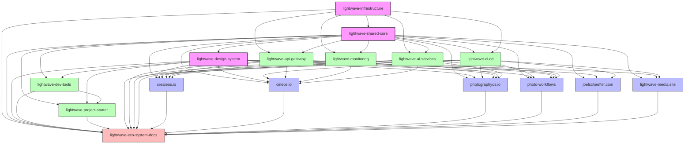

# LightWave Ecosystem Dependency Graph

> **Note**: This document serves as the single source of truth for dependencies between repositories across the LightWave ecosystem. It provides a visual representation of dependencies with build order requirements.

## Table of Contents

1. [Dependency Overview](#dependency-overview)
2. [Build Order](#build-order)
3. [Core Infrastructure Dependencies](#core-infrastructure-dependencies)
4. [Application Dependencies](#application-dependencies)
5. [Development Tool Dependencies](#development-tool-dependencies)
6. [Direct vs. Indirect Dependencies](#direct-vs-indirect-dependencies)
7. [Implementation Guidelines](#implementation-guidelines)

## Dependency Overview

## Build Order

Based on the dependency graph, the recommended build order for the LightWave ecosystem is:

### 1. Core Infrastructure

| Order | Repository | Description | Dependencies |
|-------|------------|-------------|-------------|
| 1 | **lightwave-infrastructure** | Infrastructure as Code (IaC) | None |
| 2 | **lightwave-shared-core** | Shared libraries and utilities | lightwave-infrastructure |
| 3 | **lightwave-design-system** | UI components and design patterns | lightwave-shared-core |

### 2. Development Tools and Services

| Order | Repository | Description | Dependencies |
|-------|------------|-------------|-------------|
| 4 | **lightwave-dev-tools** | Development utilities | lightwave-shared-core, lightwave-design-system |
| 5 | **lightwave-ci-cd** | CI/CD pipelines | lightwave-shared-core, lightwave-infrastructure |
| 6 | **lightwave-project-starter** | Project templates | lightwave-shared-core, lightwave-design-system, lightwave-dev-tools |
| 7 | **lightwave-api-gateway** | API gateway service | lightwave-infrastructure, lightwave-shared-core |
| 8 | **lightwave-monitoring** | Monitoring service | lightwave-infrastructure, lightwave-shared-core |
| 9 | **lightwave-ai-services** | AI services | lightwave-infrastructure, lightwave-shared-core |

### 3. Applications

| Order | Repository | Description | Dependencies |
|-------|------------|-------------|-------------|
| 10 | **createos.io** | Central business platform | lightwave-shared-core, lightwave-design-system, lightwave-ci-cd, lightwave-api-gateway, lightwave-monitoring, lightwave-ai-services |
| 11 | **cineos.io** | Cinematography workflow | lightwave-shared-core, lightwave-design-system, lightwave-ci-cd, lightwave-api-gateway, lightwave-monitoring, lightwave-ai-services |
| 12 | **photographyos.io** | Photography workflow | lightwave-shared-core, lightwave-design-system, lightwave-ci-cd, lightwave-api-gateway, lightwave-monitoring, lightwave-ai-services |
| 13 | **photo-workflows** | Photo processing automation | lightwave-shared-core, lightwave-design-system, lightwave-ci-cd, lightwave-api-gateway, lightwave-monitoring, lightwave-ai-services |
| 14 | **joelschaeffer.com** | Portfolio site | lightwave-shared-core, lightwave-design-system, lightwave-ci-cd |
| 15 | **lightwave-media.site** | Corporate website | lightwave-shared-core, lightwave-design-system, lightwave-ci-cd |

### 4. Documentation

| Order | Repository | Description | Dependencies |
|-------|------------|-------------|-------------|
| 16 | **lightwave-eco-system-docs** | System documentation | All repositories |

## Core Infrastructure Dependencies

### lightwave-infrastructure

The **lightwave-infrastructure** repository (<https://github.com/lightwave-media/lightwave-infrastructure>) has:

* **Direct Dependencies**: None (root node)
* **Depended Upon By**:
  * lightwave-shared-core
  * lightwave-ci-cd
  * lightwave-api-gateway
  * lightwave-monitoring
  * lightwave-ai-services
  * lightwave-eco-system-docs

### lightwave-shared-core

The **lightwave-shared-core** repository (<https://github.com/lightwave-media/lightwave-shared-core>) has:

* **Direct Dependencies**:
  * lightwave-infrastructure
* **Depended Upon By**:
  * lightwave-design-system
  * lightwave-dev-tools
  * lightwave-project-starter
  * lightwave-ci-cd
  * lightwave-api-gateway
  * lightwave-monitoring
  * lightwave-ai-services
  * createos.io
  * cineos.io
  * photographyos.io
  * photo-workflows
  * joelschaeffer.com
  * lightwave-media.site
  * lightwave-eco-system-docs

### lightwave-design-system

The **lightwave-design-system** repository (<https://github.com/lightwave-media/lightwave-design-system>) has:

* **Direct Dependencies**:
  * lightwave-shared-core
* **Depended Upon By**:
  * lightwave-dev-tools
  * lightwave-project-starter
  * createos.io
  * cineos.io
  * photographyos.io
  * photo-workflows
  * joelschaeffer.com
  * lightwave-media.site
  * lightwave-eco-system-docs

## Application Dependencies

### createos.io

The **createos.io** repository (<https://github.com/lightwave-media/createos.io>) has:

* **Direct Dependencies**:
  * lightwave-shared-core
  * lightwave-design-system
  * lightwave-ci-cd
  * lightwave-api-gateway
  * lightwave-monitoring
  * lightwave-ai-services
* **Depended Upon By**:
  * lightwave-eco-system-docs

### cineos.io

The **cineos.io** repository (<https://github.com/lightwave-media/cineos.io>) has:

* **Direct Dependencies**:
  * lightwave-shared-core
  * lightwave-design-system
  * lightwave-ci-cd
  * lightwave-api-gateway
  * lightwave-monitoring
  * lightwave-ai-services
* **Depended Upon By**:
  * lightwave-eco-system-docs

### photographyos.io

The **photographyos.io** repository (<https://github.com/lightwave-media/photographyos.io>) has:

* **Direct Dependencies**:
  * lightwave-shared-core
  * lightwave-design-system
  * lightwave-ci-cd
  * lightwave-api-gateway
  * lightwave-monitoring
  * lightwave-ai-services
* **Depended Upon By**:
  * lightwave-eco-system-docs

### photo-workflows

The **photo-workflows** repository (<https://github.com/lightwave-media/photo-workflows>) has:

* **Direct Dependencies**:
  * lightwave-shared-core
  * lightwave-design-system
  * lightwave-ci-cd
  * lightwave-api-gateway
  * lightwave-monitoring
  * lightwave-ai-services
* **Depended Upon By**:
  * lightwave-eco-system-docs

### joelschaeffer.com

The **joelschaeffer.com** repository (<https://github.com/lightwave-media/joelschaeffer.com>) has:

* **Direct Dependencies**:
  * lightwave-shared-core
  * lightwave-design-system
  * lightwave-ci-cd
* **Depended Upon By**:
  * lightwave-eco-system-docs

### lightwave-media.site

The **lightwave-media.site** repository (<https://github.com/lightwave-media/lightwave-media.site>) has:

* **Direct Dependencies**:
  * lightwave-shared-core
  * lightwave-design-system
  * lightwave-ci-cd
* **Depended Upon By**:
  * lightwave-eco-system-docs

## Development Tool Dependencies

### lightwave-dev-tools

The **lightwave-dev-tools** repository (<https://github.com/lightwave-media/lightwave-dev-tools>) has:

* **Direct Dependencies**:
  * lightwave-shared-core
  * lightwave-design-system
* **Depended Upon By**:
  * lightwave-project-starter
  * lightwave-eco-system-docs

### lightwave-project-starter

The **lightwave-project-starter** repository (<https://github.com/lightwave-media/lightwave-project-starter>) has:

* **Direct Dependencies**:
  * lightwave-shared-core
  * lightwave-design-system
  * lightwave-dev-tools
* **Depended Upon By**:
  * lightwave-eco-system-docs

### lightwave-ci-cd

The **lightwave-ci-cd** repository (<https://github.com/lightwave-media/lightwave-ci-cd>) has:

* **Direct Dependencies**:
  * lightwave-shared-core
  * lightwave-infrastructure
* **Depended Upon By**:
  * createos.io
  * cineos.io
  * photographyos.io
  * photo-workflows
  * joelschaeffer.com
  * lightwave-media.site
  * lightwave-eco-system-docs

## Direct vs. Indirect Dependencies

Many repositories have both direct and indirect dependencies. For example:

* **createos.io** directly depends on **lightwave-shared-core**, but it also indirectly depends on **lightwave-infrastructure** (through **lightwave-shared-core**)
* **lightwave-project-starter** directly depends on **lightwave-dev-tools**, and indirectly depends on **lightwave-shared-core** (through **lightwave-dev-tools**)

Understanding these dependencies is crucial for:

1. **Build Order**: Ensuring repositories are built in the correct order
2. **Version Management**: Coordinating version updates across repositories
3. **CI/CD**: Setting up proper pipeline triggers
4. **Development**: Understanding the impact of changes

## Implementation Guidelines

### Adding New Dependencies

When adding a new dependency between repositories:

1. **Document the dependency**: Update this document with the new relationship
2. **Update CI/CD pipelines**: Ensure that the build order respects the dependency
3. **Version management**: Specify compatible version ranges
4. **Dependency tests**: Add tests to verify compatibility

### Resolving Dependency Conflicts

To resolve version conflicts in dependencies:

1. **Identify dependency paths**: Trace the dependency graph to find conflicts
2. **Set compatible version ranges**: Use semver to specify compatible versions
3. **Pin problematic dependencies**: In extreme cases, pin to specific versions
4. **Refactor common dependencies**: Consider moving shared code to lightwave-shared-core

### Dependency Versioning Strategy

The LightWave ecosystem follows this versioning strategy:

1. **Core infrastructure**: Uses semantic versioning with minimal breaking changes
2. **Development tools**: Uses semantic versioning, maintains backwards compatibility
3. **Applications**: Uses calendar versioning (YYYY.MM.PATCH)

### CI/CD Pipeline Integration

Integration with the CI/CD pipeline:

1. **Dependency triggers**: Changes in dependencies trigger downstream builds
2. **Propagation testing**: Changes are tested against dependent repositories
3. **Version validation**: CI checks that version constraints are satisfied
4. **Integration testing**: Full dependency graph is tested for compatibility

## Related Documentation

* [Ecosystem Strategy](../ecosystem-strategy.md)
* [LightWave Infrastructure Overview](../lightwave-infrastructure/overview.md)
* [LightWave Shared Core Guide](../lightwave-shared-core/overview.md)
* [Development Guidelines](../lightwave-dev-tools/development-guidelines.md)