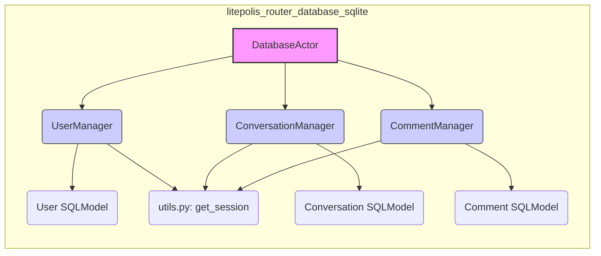

# LitePolis Database Example

This repository provides a working example of a database module for LitePolis, using SQLite as the database backend. It demonstrates a structured approach to database interactions using SQLModel and a Manager/Actor pattern, separating database logic from potential API layers.

This example is based on the `LitePolis-database-template` and showcases how to implement database operations for Users, Conversations, and Comments. You can use this example as a starting point to build your own custom database modules for LitePolis.

> While this README focus on how to build your own database module, our Wiki shows [how to use this database module](https://github.com/NewJerseyStyle/LitePolis-database-example/wiki/Developer-Manual) 🚀

## Core Concepts: Manager Pattern

This module utilizes a Manager pattern to organize database operations:

1.  **SQLModels:** Define the database table structure (e.g., `User`, `Conversation`, `Comment` in `Users.py`, `Conversations.py`, `Comments.py`).
2.  **Manager Classes:** Each model has a corresponding Manager class (e.g., `UserManager`, `ConversationManager`) located in the same file. These classes contain static methods that encapsulate the specific CRUD (Create, Read, Update, Delete) logic for that model, using a shared database session (`with_session` from `utils.py`).
3.  **DatabaseActor:** A central `DatabaseActor` class (`Actor.py`) inherits from all Manager classes. This provides a single, unified interface to access all database operations for the module.



This pattern promotes separation of concerns: the database module focuses solely on data persistence logic, while the main LitePolis application (or a separate router module) would handle API endpoints and call methods on the `DatabaseActor`.

## Getting Started

Follow these steps to understand and adapt this example for your own LitePolis database module:

1.  **Clone the Repository:** Clone this repository to your local machine.

2.  **Install Dependencies:** Install the required Python packages. Note that `fastapi` is *not* a direct dependency of this module anymore; it depends on `litepolis` and `sqlmodel`.
    ```bash
    pip install -r requirements.txt
    ```

3.  **Examine `setup.py`:** This file contains metadata about the package.
    *   `name`: Change to your package's unique name (e.g., `litepolis-mydatabase`).
    *   `version`, `description`, `author`, `url`: Update these fields.
    *   `install_requires`: Should list runtime dependencies like `litepolis` and `sqlmodel`. Add any others your specific logic requires.

4.  **Understand the Structure (`litepolis_database_example/`):**
    *   **`utils.py`:** Sets up the database engine (`create_engine`) and provides the `with_session` context manager for database interactions. It also defines `DEFAULT_CONFIG`.
    *   **`Users.py`, `Conversations.py`, `Comments.py`:** Each file defines:
        *   A SQLModel class for the data table (e.g., `User`).
        *   A Manager class (e.g., `UserManager`) with static methods for CRUD operations using `with_session`.
    *   **`Actor.py`:** Defines the `DatabaseActor` class, inheriting from all Manager classes.
    *   **`__init__.py`:** Exports the key components (`DatabaseActor`, SQLModels, `DEFAULT_CONFIG`) for use by other parts of LitePolis.

5.  **Adapt and Extend:**
    *   Rename the `litepolis_database_example` folder to your desired package name (e.g., `litepolis_database_mydatabase`). Update imports accordingly.
    *   **Create New Models/Managers:** For new data types, create a new Python file (e.g., `Products.py`). Inside, define your `Product` SQLModel and a `ProductManager` class with static CRUD methods using `get_session`.
    *   **Update `Actor.py`:** Add your new `ProductManager` to the inheritance list of `DatabaseActor`.
        ```python
        from .Products import ProductManager
        # ... other imports ...

        class DatabaseActor(UserManager, ConversationManager, CommentManager, ProductManager):
            pass
        ```
                
        ```mermaid
        classDiagram
            class DatabaseActor {
                +create_user()
                +create_conversation()
                +read_users()
                +read_conversations()
            }
            DatabaseActor --|> UserManager
            DatabaseActor --|> ConversationManager
            DatabaseActor --|> CommentManager
        ```
    *   **Update `__init__.py`:** Export your new `Product` model and potentially the `ProductManager` if needed externally. Update the `__all__` list.
    *   **Update `setup.py`:** Adjust metadata (`name`, `version`, etc.).
    *   **Update `requirements.txt`:** Add any new dependencies required by your managers.

6.  **Testing (`tests` folder):**
    *   The tests (`test_Users.py`, `test_Conversations.py`, `test_Comments.py`, `test_Actor.py`) demonstrate how to test the database logic by directly calling methods on the `DatabaseActor`.
    *   When adapting this example, update existing tests and add new ones for your models, ensuring you test the methods within your new Manager classes via the `DatabaseActor`.
    *   Run tests using:
        ```bash
        pytest
        ```

7.  **Integration with LitePolis:** This module provides the `DatabaseActor`. The main LitePolis application or a dedicated LitePolis router module would import and use this `DatabaseActor` to interact with the database, potentially exposing operations via API endpoints.

8.  **Deployment:**
    *   Release your package to PyPI so the LitePolis package manager can fetch it.
    *   Document any pre-requirements for your specific database backend (e.g., setting up PostgreSQL, MySQL). The example uses SQLite (`database.db`), which requires no external setup.

## Key Libraries

*   **SQLModel:** Simplifies database interactions by combining Pydantic and SQLAlchemy. [https://sqlmodel.tiangolo.com/](https://sqlmodel.tiangolo.com/)
*   **Pytest:** Used for writing and running tests. [https://docs.pytest.org/en/stable/](https://docs.pytest.org/en/stable/)
*   **LitePolis:** The framework this module is designed to integrate with. [https://github.com/NewJerseyStyle/LitePolis](https://github.com/NewJerseyStyle/LitePolis).
