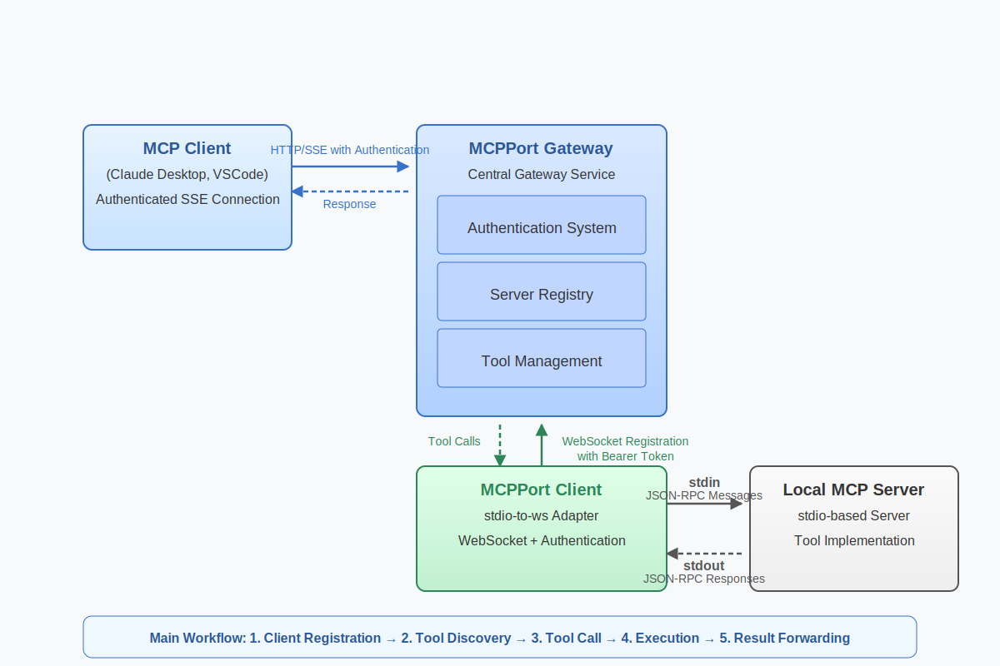
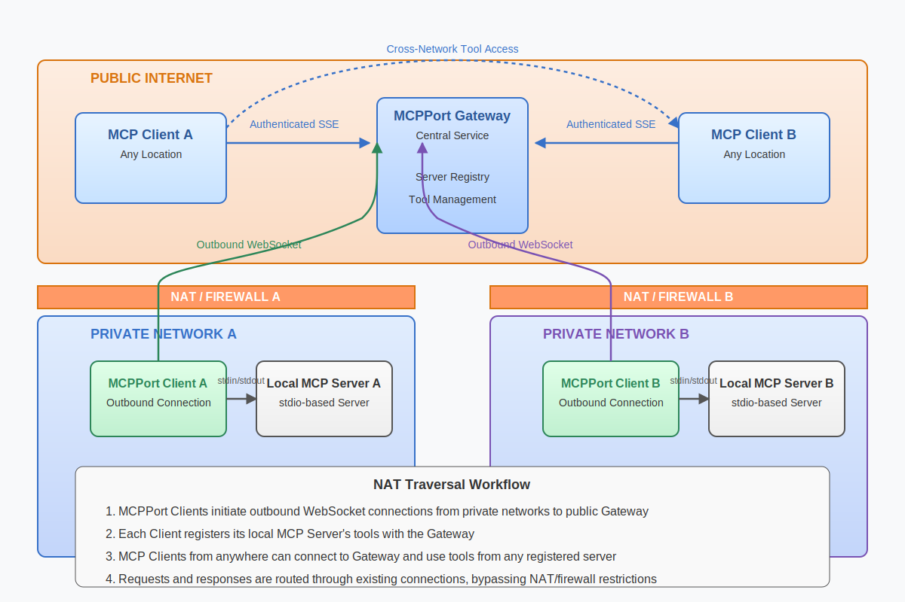

# mcpport

mcpport — A lightweight gateway &amp; registry for Model Context Protocol (MCP), enabling standardized connectivity for AI applications.

## Quick Start

1. Start your MCP Gateway

```bash
uvx mcpport gateway
```

It will start the gateway on port 8765 by default. And the common access points are:

- `ws://localhost:8765/mcp/register` is the registration endpoint.
- `http://localhost:8765/sse` is the event stream endpoint(`SSE`).
- `http://localhost:8765/messages` is the message endpoint(`HTTP`).

2. Register your MCP Server to the Gateway

```bash
uvx mcpport register \
--stdio "npx -y @modelcontextprotocol/server-filesystem ./" \
--gateway-url "ws://localhost:8765/mcp/register" \
--server-name "file"
```

It will register a MCP server named `file` to the gateway. The server is a simple file system server, which is implemented by `@modelcontextprotocol/server-filesystem`.


## Authentication

You can use `--auth-token` to set the auth token for the gateway.

```bash
uvx mcpport gateway --auth-token "my-token1" --auth-token "my-token2"
```

The default authentication method is `Bearer` token(Set to `Authorization` header). 

If you set the auth token for the gateway, you need to set the same auth token for the MCP server when you register it.

```bash
uvx mcpport register \
--stdio "npx -y @modelcontextprotocol/server-filesystem ./" \
--gateway-url "ws://localhost:8765/mcp/register" \
--server-name "file" \
--header "Authorization: Bearer my-token1"
```

And you must set the auth token for SSE connections. You can set the auth token in the `Authorization` header.

## Architecture

The architecture of the MCP gateway is as follows:



**NAT Traversal Architecture for Cross-Network MCP Tool Access**

The MCPPort solution enables edge devices to seamlessly provide MCP services through secure NAT traversal. By establishing persistent bidirectional WebSocket connections between MCPPort Clients (running on edge devices) and the central MCPPort Gateway, the system creates secure tunnels that bypass firewall restrictions.





## Advanced Usage

### ipv6 Support

Start Your MCP Gateway With `ipv6` Support

```bash
uvx mcpport gateway --host "::" --ipv6
```

### SSL Support

You can use `--ssl-enabled` to enable SSL support for the gateway.

```bash
uv run mcpport gateway \
--ssl-enabled \
--ssl-keyfile {path_to_your_keyfile} \
--ssl-certfile {path_to_your_certfile}
```

Then you can register your MCP server to the gateway with `wss://` protocol. And access the SSE and message endpoints with `https://` protocol.

```bash
uvx mcpport register \
--stdio "npx -y @modelcontextprotocol/server-filesystem ./" \
--gateway-url "wss://localhost:8765/mcp/register" \
--server-name "file" 
```

If you want to disable the SSL verification, you can use `--no-ssl-verify` option.

```bash
uvx mcpport register \
--stdio "npx -y @modelcontextprotocol/server-filesystem ./" \
--gateway-url "wss://localhost:8765/mcp/register" \
--server-name "file" \
--no-ssl-verify
```
Note: This is not safe and should only be used for testing purposes.

### SSL Support With CA Cert

You use your own CA cert to sign the server certificate. It is recommended if you not have a trusted CA cert.

Fist, you need to generate a CA cert and sign the server certificate with it. We have a [script](https://github.com/fangyinc/mcpport/blob/main/scripts/generate-certs.sh) to do this. You can find it in the `scripts` folder.

```bash
./scripts/generate-certs.sh --domain localhost
```

The all generated files will be in the `certs` folder. It will generate the following files:
```bash
ls certs     
ca.crt  ca.key  ca.srl  index.txt  openssl.cnf  serial  server.crt  server.csr  server.key
```

Then start the gateway with the CA cert.

```bash
uvx mcpport gateway \
--ssl-enabled \
--ssl-keyfile ./certs/server.key \
--ssl-certfile ./certs/server.crt
```

Then register your MCP server to the gateway with the CA cert.

```bash
uvx mcpport register \
--stdio "npx -y @modelcontextprotocol/server-filesystem ./" \
--gateway-url "wss://localhost:8765/mcp/register" \
--ssl-ca-cert ./certs/ca.crt
```

### More Options

Other options are also available, you can use `uvx mcpport gateway --help` to get more information.

There are some options for the gateway:

- `--host` is the host of the gateway.
- `--port` is the port of the gateway, default is `8765`.
- `--ipv6` is to enable `ipv6` support, default is `false`.
- `--log-level` is the log level of the gateway, default is `INFO`.
- `--timeout-rpc` is the timeout of communication with the MCP server, default is `10s`.
- `--timeout-run-tool` is the timeout to run the tool, default is `120s`.
- `--sse-path` is the path of the event stream endpoint, default is `/sse`.
- `--messages-path` is the path of the message endpoint, default is `/messages`.
- `--auth-token` is the auth token for the gateway, (can be used multiple times).
- `--ssl-enabled` is to enable SSL support, default is `false`.
- `--ssl-keyfile` is the path to the SSL key file.
- `--ssl-certfile` is the path to the SSL cert file.
- `--ssl-ca-cert` is the path to the SSL CA cert file.

And there are some options for the register command:

- `--stdio` is the command to run the MCP server, it will be run in a subprocess.
- `--gateway-url` is the URL of the gateway, default is `ws://localhost:8765/mcp/register`.
- `--port` Local HTTP port, 0 means don't start local server, default is `0`.
- `--enable-cors` is to enable CORS for the local server, default is `false`.
- `--health-endpoint` is the health endpoint of local server, default is `/health`.
- `--server-name` is the name of the MCP server, must be provided.
- `--server-id` is the id of the MCP server, default is `uuid`.
- `--require-gateway` Exit if unable to connect to gateway
- `--log-level` is the log level of the gateway, default is `INFO`.
- `--header` Add one or more headers (format: 'Key: Value'). Can be used multiple times.
- `--no-ssl-verify` Disable SSL certificate verification.
- `--ssl-ca-cert` Path to CA certificate bundle for verification