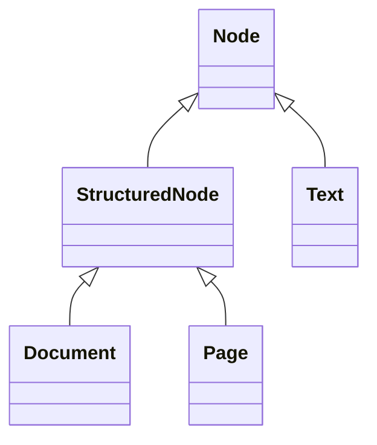

[](https://docs.pydantic.dev/latest/contributing/#badges)
[](LICENSE)

# Parse Document Model (Python)

**Parse Document Model** (Python) provides Pydantic models for representing text documents using a hierarchical model. 
This library allows you to define documents as a hierarchy of (specialised) nodes where each node can represent a document, page, text, heading, body, and more.

These models aim to preserve the underlying structure of text documents for further processing, such as creating a table of contents or transforming between formats, e.g. converting a parsed PDF to Markdown.

- **Hierarchical structure**: The document is modelled as a hierarchy of nodes. Each node can represent a part of the 
document itself, pages, text.
- **Rich text support**: Nodes can represent not only the content but also the formatting (e.g. bold, italic) applied to the text. 
- **Attributes**: Each node can have attributes that provide additional information such as page number, 
bounding box, etc.
- **Built-in validation and types**: Built with [`Pydantic`](https://docs.pydantic.dev/latest/), ensuring type safety, validation and effortless creation of complex document structures.


**Requirements**

- Python 3.12 or above (Python 3.9, 3.10 and 3.11 are supported on best-effort).


**Next steps**

- [Explore the document model](#document-model-overview)
- [Install the library and use the models](#getting-started)


## Document Model Overview

We want to represent the document structure using a hierarchy so that the inherited structure is preserved when chapters, sections and headings are used. Consider a generic document with two pages, one heading per page and one paragraph of text. The resulting representation might be the following.

```
Document
 ├─Page
 │  ├─Text (category: heading)
 │  └─Text (category: body)
 └─Page
    ├─Text (category: heading)
    └─Text (category: body)
```

At a glance you can see the structure, the document is composed of two pages and there are two headings. To do so we defined a hierarchy around the concept of a Node, like a node in a graph.

### Node types




#### 1. **Node** (Base Class)

This is the abstract class from which all other nodes inherit. 

Each node has:

- `category`: The type of the node (e.g., `doc`, `page`, `heading`).
- `attributes`: Optional field to attach extra data to a node. See [Attributes](#attributes).

#### 2. **StructuredNode**

This extends the [`Node`](#1-node-base-class). It is used to represent the hierarchy as a node whose content is a list of other nodes, such as like [`Document`](#3-document) and [`Page`](#4-page).

- `content`: List of `Node`.


#### 3. **Document**

This is the root node of a document.

- `category`: Always set to `"doc"`.
- `attributes`: Document-wide attributes can be set here.
- `content`: List of [`Page`](#4-page) nodes that form the document.

#### 4. **Page**

Represents a page in the document:

- `category`: Always set to `"page"`.
- `attributes`: Can contain metadata like page number.
- `content`: List of [`Text`](#5-text) nodes on the page.

#### 5. **Text**

This node represent a paragraph, a heading or any text within the document.

- `category`: The [category](#category) of the text within the document, e.g. `heading`, `title`
- `content`: A string representing the textual content.
- `marks`: List of [marks](#marks) applied to the text, such as bold, italic, etc.
- `attributes`: Can contain metadata like the bounding box representing where this portion of text is located in the page.

### Category 

Each block of text is assigned a _category_.

- `abstract`: The abstract of the document.
- `acknowledgments`: Section acknowledging contributors.
- `affiliation`: Author's institutional affiliation.
- `appendix`: Text within an appendix.
- `authors`: List of authors.
- `body`: Main body text of the document.
- `caption`: Caption associated with a figure or table.
- `categories`: Categories or topics listed in the document.
- `figure`: Represents a figure or an image.
- `footer`: Represents the footer of the page.
- `footnote`: Text at the bottom of the page providing additional information.
- `formula`: Mathematical formula or equation.
- `general-terms`: General terms section.
- `heading`: Any heading within the document.
- `keywords`: List of keywords.
- `itemize-item`: Item in a list or bullet point.
- `other`: Any other unclassified text.
- `page-header`: Represents the header of the page.
- `reference`: References or citations within the document.
- `table`: Represents a table.
- `title`: The title of the document.
- `toc`: Table of contents.

### Marks

Marks are used to add style or functionality to the text within a [`Text`](#5-text) node. 
For example, bold text, italic text, links and custom styles such as font or colour.

**Mark Types**

- `Bold`: Represents bold text.
- `Italic`: Represents italic text.
- `TextStyle`: Allows customization of font and color.
- `Link`: Represents a hyperlink.

Marks are validated and enforced with the help of `Pydantic` model validators.

### Attributes

Attributes are optional fields that can store additional information for each node. Some predefined attributes are:

- `DocumentAttributes`: General attributes for the document (currently reserved for the future).
- `PageAttributes`: Specific page related attributes, such as the page number.
- `TextAttributes`: Text related attributes, such as bounding boxes or level.
- `BoundingBox`: A box that specifies the position of a text in the page.
- `Level`: The specific level of the text within a document, for example, for headings.


## Getting started

### Installation

Parse Document Model is distributed with PyPI. You can install it with `pip`.

```bash
pip install parse-document-model
```

### Quick Example

Here’s how you can represent a simple document with one page and some text:

```python
from document_model_python.document import Document, Page, Text

doc = Document(
    category="doc",
    content=[
        Page(
            category="page",
            content=[
                Text(
                    category="heading",
                    content="Welcome to parse-document-model",
                    marks=["bold"]
                ),
                Text(
                    category="body",
                    content="This is an example text using the document model."
                )
            ]
        )
    ]
)
```

## Testing

Parse Document Model is tested using [pytest](https://docs.pytest.org/en/stable/). Tests run for each commit and pull request.

Install the dependencies.

```bash
pip install -r requirements.txt -r requirements-dev.txt
```

Execute the test suite.

```bash
pytest
```


## Contributing

Thank you for considering contributing to the Parse Document Model! The contribution guide can be found in the [CONTRIBUTING.md](./.github/CONTRIBUTING.md) file.

> [NOTE]
> Consider opening a [discussion](https://github.com/OneOffTech/parse-document-model-python/discussions) before submitting a pull request with changes to the model structures.

## Security Vulnerabilities

Please review [our security policy](./.github/SECURITY.md) on how to report security vulnerabilities.

## Credits

- [OneOffTech](https://github.com/OneOffTech)
- [All Contributors](../../contributors)

## Supporters

The project is provided and supported by [OneOff-Tech (UG)](https://oneofftech.de).

<p align="left"><a href="https://oneofftech.de" target="_blank"></a></p>

## Aknowledgements

The format and structure takes inspiration from [ProseMirror](https://prosemirror.net/docs/ref/#model.Document_Schema).

## License

The MIT License (MIT). Please see [License File](LICENSE.md) for more information.
