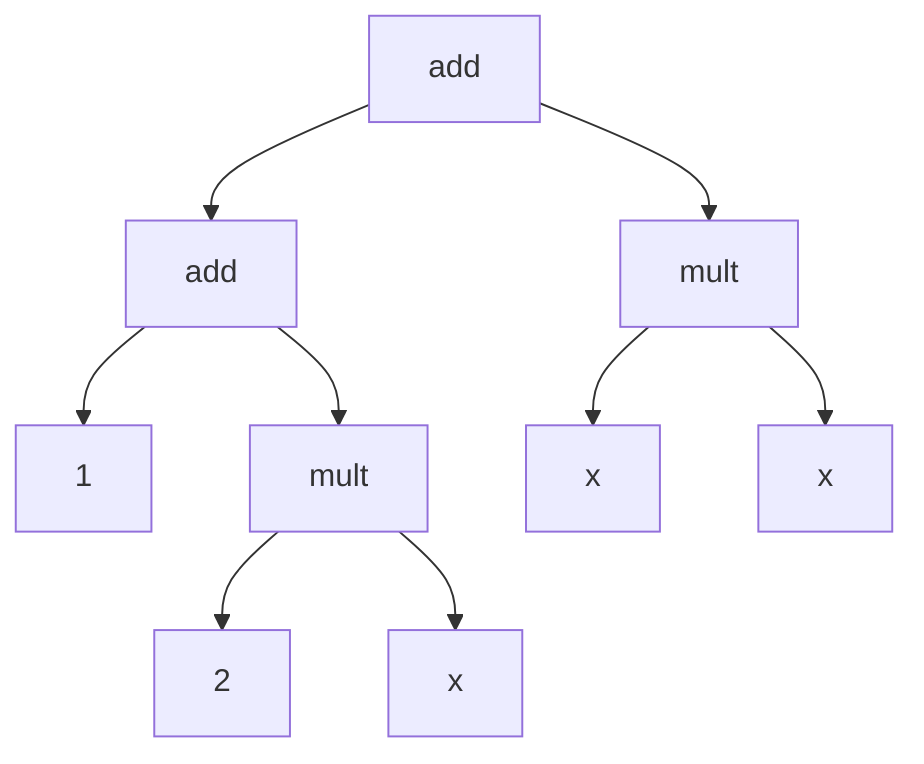

# Multivariate Polynomial Library

**PolyMat** is a Python library designed for the representation and manipulation of multivariate polynomial matrices.


## Features

* Expression Building: Create polynomial expressions using various operators provided by the library.
* Efficient Internal Representation: Uses a sparse internal structure to optimize intermediate computations.
* Stateful Computation: The sparse internal structures are computed based on a state object. This eliminates any dependency on global variables and provides control over the sparse intermediate structures stored in memory for reuse.
* Performance Optimized: Designed for speed, it outperforms symbolic computation tools like *sympy*, while remaining lightweidgth and purely written in Python, unlike *CasADi* or [*Drake*](https://drake.mit.edu/).
<!-- Designed for speed, the library outperforms other symbolic computation tools like `sympy`, making it ideal for large matrix expressions. -->


## Installation

You can install **PolyMat** via pip:

```
pip install polymat
```


## Basic Usage

Polynomial expressions are built from constants and variables.
The variable $x$ can be defined as follows:

``` python
import polymat

x = polymat.define_variable('x')
```

This variable can then be used to define the polynomial matrix expression:
``` python
p = polymat.from_((
    (1 + x, 1 + 2*x + x**2),
    (1, 1 - x**2),
))
```

The package provides various operators to construct new polynomial expressions from existing ones.
For instance, matrix multiplication can be performed as:
``` python
ones = polymat.from_(np.ones((2, 1)))

# matrix multiplication
p @ ones
```

Polynomial expressions in **PolyMat** stores the necessary information to compute the polynomial monomials and coefficients.
Internally, they are represented as tree-like structures, where each node corresponds to an operation (e.g. addition or multiplication) or a terminal value (e.g. a constant or a variable).
For example, the polynomial expression $p_{12}(x) = 1 + 2 x + x^2$ can be visualized as the following tree stucture:


## Operations

**PolyMat** defines the following operations to create or manipulate polynomial expressions.

### Creating Polynomial Expressions

- **Polynomial Variable**: Define a polynomial variable.
    ``` python
    x = polymat.define_variable('x')
    ```
- **From Data**: Create a polynomial expression from:
    - Tuple of numbers and polynomial variables
        ``` python
        j = polymat.from_(((0, -1), (1, 0)))
        # Matrix([[0, -1], [1, 0]])
        ```
    - `numpy` arrays (possibly containing polynomial variables)
        ``` python
        i = polymat.from_(np.eye(2))
        # Matrix([[1, 0], [0, 1]])
        ```
    - `sympy` expressions (symbols are automatically converted to polynomial variables).

### Combining Polynomial Expressions

- **Block Diagonal**: Combine expression into block diagonal matrices.
    ``` python
    xblk = polymat.block_diag((x, x))
    # Matrix([[x, 0], [0, x]])
    ```
- **Horizontal Stacking**: Stack multiple polynomial expressions horizontally.
    ``` python
    xhstack = polymat.h_stack((x, x))
    # Matrix([[x, x]])
    ```
<!-- - **Product**: Form vectors containing the Cartesian product of polynomial expressions using the `polymat.product` function.
    ``` python
    xhstack = polymat.h_stack((x, x))
    # Matrix([[x, x]])
    ``` -->
- **Vertical Stacking**: Stack multiple polynomial expressions vertically.
    ``` python
    xvstack = polymat.v_stack((x, x))
    # Matrix([[x], [x]])
    ```

### Polynomial Expression Manipulation

- **Arithmetic operations**: Perform addition (`+`), subtraction (`-`), scalar multiplication and division (`*`, `/`), matrix multiplication (`@`), and exponentiation (`**`).
    ``` python
    f = j * x**2 - i
    # Matrix([[-1.0, -1.0*x**2], [x**2, -1.0]])
    ```
- **Caching**: Cache the polynomial expression to store intermediate results and speed up computation.
    ``` python
    x = x.cache()
    ```
- [**Combinations**](https://github.com/MichaelSchneeberger/polymat/blob/main/polymat/expressiontree/operations/combinations.py): Stack multiplied combinations of elements from polynomial vectors. For instance, the vector of monomials $\begin{bmatrix}1&x&x^2\end{bmatrix}$ can be created as follows:
    ``` python
    m = x.combinations((0, 1, 2))
    # Matrix([[1], [x], [x**2]])
    ```
- **Diagonalization**: Extract a diagonal or construct diagonal matrix.
    ``` python
    mdiag = m.diag()
    # Matrix([[1, 0, 0], [0, x, 0], [0, 0, x**2]])
    ```
- **Differentiation**: Compute the Jacobian matrix of a polynomial vector.
    ``` python
    mdiff = m.diff(x)
    # Matrix([[0], [1], [2.0*x]])
    ```
- **Evaluation**: Replace variable symbols within tuple of floats.
    ``` python
    meval = m.eval({x.symbol: (2,)})
    # Matrix([[1], [2.0], [4.0]])
    ```
- **Kronecker Product**: Compute the Kronecker products.
    ``` python
    fkron = f.kron(i)
    # Matrix([[-1.0, 0, -1.0*x**2, 0], [0, -1.0, 0, -1.0*x**2], [x**2, 0, -1.0, 0], [0, x**2, 0, -1.0]])
    ```
- **Repmat**: Repeat polynomial expressions.
    ``` python
    xrepmat = x.rep_mat(3, 1)
    Matrix([[x], [x], [x]])
    ```
- **Reshape**: Modify the shape of polynomial matrices.
    ``` python
    freshape = f.reshape(-1, 1)
    # Matrix([[-1.0], [x**2], [-1.0*x**2], [-1.0]])
    ```
- **Summation**: Sum the rows of the polynomial expression.
    ``` python
    fsum = f.sum()
    # Matrix([[-1.0*x**2 - 1.0], [x**2 - 1.0]])
    ```

Specialized methods:
- **Monomial Vector**: Construct a monomial vector $Z(x)$ appearing in a polynomial expression.
    ``` python
    p = x**3 - 2*x + 3

    p_monom = p.monomial_vector(x)
    # Matrix([[1], [x], [x**3]])
    ```
- **Coefficient Vector**: Compute a coefficient matrix $Q$ associated with a vector of monomials $Z(x)$ and a polynomial vector $p(x) = Q Z(x)$.
    ``` python
    p_coeff = p.coefficient_vector(x, monomials=p_monom)
    # Matrix([[3, -2.0, 1]])
    ```
<!-- - [**Quadratic Monomial Terms**](https://github.com/MichaelSchneeberger/polymat/blob/main/polymat/expressiontree/operations/quadraticmonomials.py): Construct a monomial vector $Z(x)$ for the quadratic form of the polynomial $p(x) = Z(x)^\top Q Z(x)$.
    ``` python
    p_monom = p.to_quadratic_monomials(x)
    # Matrix([[1], [x], [x**2]])
    ``` -->
<!-- - [**Quadratic Coefficient Matrix**](https://github.com/MichaelSchneeberger/polymat/blob/main/polymat/expressiontree/operations/quadraticcoefficients.py): Compute the symmetric coefficient matrix $Q$ appearing in the quadratic form of the polynomial $p(x) = Z(x)^\top Q Z(x)$.
    ``` python
    p_coeff = p.to_gram_matrix(x, monomials=p_monom)
    # Matrix([[3.0, -1.0, 0], [-1.0, 0, 0.5], [0, 0.5, 0]])
    ``` -->


## Internal Sparse Representation

**PolyMat** uses an internal sparse polynomial structure to optimize intermediate computations.
This internal structure can be accessed by calling the `apply` method of the polynomial expression using a state object:
``` python
state = polymat.init_state()

state, internal_repr = p.apply(state)

# prints the internal sparse structure
# FromPolynomialMatrixImpl(
#   data={
#     (0, 0): {(): 1, ((0, 1),): 1.0}, 
#     (0, 1): {(): 1}, 
#     (1, 0): {(): 1, ((0, 1),): 2.0, ((0, 2),): 1.0},
#     (1, 1): {(): 1, ((0, 2),): -1.0}}, 
#  shape=(2, 2))
print(internal_repr)
```

The internal sparse structure is built using nested Python dictionaries and tuples, allowing for efficient construction and modifications of sparse representations.
While polynomial expressions only maintain a tree-structured representation of how to construct the polynomial matrix, the internal sparse structure explicitly computes and stores the coefficient for each monomial in the matrix.
As a result, generating an internal sparse structure is computationally expensive and has been carefully designed to optimize performance.


## Output Functions

<!-- The output functions listed below perform stateful computations. As a result, they return a StateMonad object, which must be applied with a state object to generate the desired output value. -->

**PolyMat** provides output functions that convert polynomial expressions into structured objects for use outside of **PolyMat**.
The following list summarizes these output functions:

- **Sympy Representation**: Convert a polynomial expression to a `sympy` expression.
    ``` python
    state, sympy_repr = polymat.to_sympy(f).apply(state)
    # Matrix([[-1.0, -1.0*x**2], [x**2, -1.0]])
    ```
- **Array Representation**: Convert polynomial expressions to an array representation (implemented through numpy and scipy array).
    ``` python
    state, farray = polymat.to_array(f, x).apply(state)
    # {0: array([[-1.], [ 0.], [ 0.], [-1.]]), 2: array([[ 0.], [ 1.], [-1.], [ 0.]])}
    ```
- **Tuple Representation**: Output the constant parts of each component of the polynomial matrix as nested tuples.
    ``` python
    # Setting assert_constant=False will prevent an exception form being raised, even if f is not a constant polynomial expression
    state, ftuple = polymat.to_tuple(f, assert_constant=False).apply(state)
    # ((-1.0,), (-1.0,))
    ```
- **Polynomial Degrees**: Obtain degrees of each component of the polynomial matrix.
    ``` python
    state, fdegree = polymat.to_degree(f).apply(state)
    # ((0, 2), (2, 0))
    ```
- **Shape of the Matrix**: Retrieve the shape of the polynomial matrix.
    ``` python
    state, fshape = polymat.to_shape(f).apply(state)
    # (2, 2)
    ```

### Array Representation

The first output function `polymat.to_array` returns an object of type `ArrayRepr`, a class included in the \textit{PolyMat} package.
This array representation serves two purposes.
First, it enables efficient evaluation of a polynomial at multiple points.
Second, it provides a structured format suitable for input to an SDP solver.
For example, when applied to a polynomial vector expression $r(x) \in (R[x])^n$, the resulting `ArrayRepr` object contains a matrix $R_d$ for each degree $d$ of the polynomial expression, such that

$$r(x) = R_0 + R_1 x + R_2 (x \otimes x) + ...$$

where $R_0 \in \mathbb R^n$, $R_1 \in \mathbb R^{n \times n}$, and $R_2 \in \mathbb R^{n \times n^2}$.
To optimize performance, low-degree coefficient matrices ($R_0$ and $R_1$) are stored as dense matrices using *numpy*, whereas higher degree matrices ($R_2$, ...) are stored as sparse matrices using *scipy*.
The following code snippet demonstrates how to evaluate the polynomial $r(x)$ at different points:

``` python
import numpy as np

context, array_repr = polymat.to_array(r).apply(context)

for i in range(5):
    x_eval = np.array(i, 0, 0).reshape(-1, 1)

    # evaluation is implemented by calling the array object
    print(array_repr(x_eval))
```

## Example

The following example computes a vector field defined by the gradient of a scalar polynomial

$$f(x_1, x_2) := (0.1 x_1^2 + 0.2 x_1 x_2 + 0.1 x_2^2 - 1) (x_1 x_2 + x_1 + x_2- 1).$$

The vector field is visualized by first converting the polnyomial expression into its array representation and then evaluating it at each point within the plot domain.


``` python
import polymat

# Define polynomial variables and stack them into a vector
names = ('x1', 'x2')
x1, x2 = (polymat.define_variable(n) for n in names)
x = polymat.v_stack((x1, x2))

# Create a polynomial expressions using arithmetic operations
f1 = 0.1*x1**2 + 0.2*x1*x2 + 0.1*x2**2 - 1
f2 = x1*x2 + x1 + x2 - 1
f = f1 * f2

# compute the gradient of the scalar polynomial expression
df = f.diff(x)

# Print the human-readable string representation
# diff(mul(add(add(add(mul(0.1, mul(x1, x1)), mul(mul(0.2, x1), x2)), mul(0.1, mul(x2, x2))), -1), add(add(add(mul(x1, x2), x1), x2), -1)), v_stack(x1,x2))
print(f'{df}')

# Print the internal Python representation of the expression
print(f'{df=}')

# Initialize state
state = polymat.init_state()

# sympy representation
state, sympy_repr = polymat.to_sympy(f).apply(state)
print(f'{sympy_repr}')

# array representation
context, df1_array = polymat.to_array(df[0, 0], x).apply(context)
context, df2_array = polymat.to_array(df[0, 1], x).apply(context)

def plot_vector_field(ax):
    x1 = np.linspace(-2, 2, 20)
    x2 = np.linspace(-2, 2, 20)
    X1, X2 = np.meshgrid(x1, x2)

    def to_array(x1, x2):
        return np.array((x1, x2)).reshape(-1, 1)

    U1 = np.vectorize(lambda x1, x2: df1_array(to_array(x1, x2)))(X1, X2)
    U2 = np.vectorize(lambda x1, x2: df2_array(to_array(x1, x2)))(X1, X2)

    ax.quiver(X1, X2, U1, U2)
```


## References

Here are some references related to the probject:

* [State-Monad](https://github.com/MichaelSchneeberger/state-monad) is a Python library that encapsulates stateful computations into a monadic structure.
* [CasADi](https://web.casadi.org/) is a tool for nonlinear optimization and algorithmic differentiation.
* [Drake](https://drake.mit.edu/) is a tool for model-based design and verification for robotics.
* [DynamicPolynomials.jl](https://github.com/JuliaAlgebra/DynamicPolynomials.jl) is a Julia library that provides a sparse dynamic representation of multivariate polynomials.