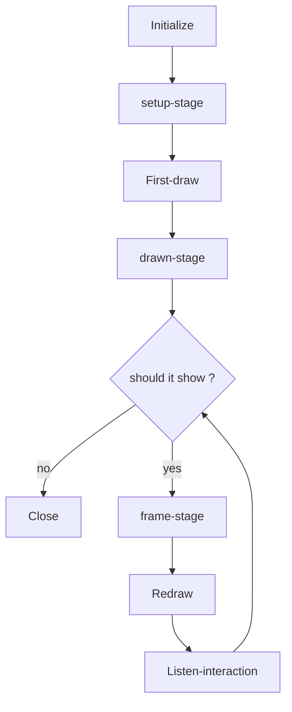

# PsychoPy-Scene


English | [简体中文](README-zh.md)

This project is a lightweight experiment framework for [PsychoPy](https://github.com/psychopy/psychopy), source code **<300 lines**.

> [!NOTE]
> this project aim to provide a new way to build PsychoPy experiments, only provide the basic API and encourage developers to develop on top of this project.

## Features

- Lightweight: Only 1 file, no extra dependencies
- Type-safe: All parameters are type annotated
- Newcomer-friendly: Only the concepts of `Context` and `Scene` are required to get started.

## Install

```bash
pip install psychopy-scene
```

or copy the `psychopy_scene` folder directly to the root directory of your project.

## Usage

### Context

Experiment context `Context` means this experiment's global settings,
including environment parameters, task parameters, and so on.
The first step to writing an experiment is to create an experiment context.

```python
from psychopy_scene import Context
from psychopy.visual import Window
from psychopy.monitors import Monitor

# create monitor
monitor = Monitor(
    name="testMonitor",
    width=52.65,
    distance=57,
)
monitor.setSizePix((1920, 1080))

# create window
win = Window(
    monitor=monitor,
    units="deg",
    fullscr=False,
    size=(800, 600),
)

# create experiment context
ctx = Context(win)
```

### Scene

The experiment can be seen as a composition of a series of scenes `Scene`,
only 2 steps are required to write an experiment program:

1. create scene
2. write scene presentation logic

we can pass several stimuli to be drawn directly into
the `Scene` method, and these stimuli will be drawn automatically:

```python
from psychopy.visual import TextStim

# create stimulus
stim_1 = TextStim(win, text="Hello")
stim_2 = TextStim(win, text="World")
# create scene
scene = ctx.Scene(stim_1) # draw stim_1
scene = ctx.Scene([stim_1, stim_2]) # draw stim_1 and stim_2
# show scene
scene.show()
```

The scene has 2 configuration methods, each method should be called once.
`duration` method sets the duration of the scene,
`close_on` method sets the [keys](#keys) to close the scene,

```python
scene = ctx.Scene(stim).duration(1).close_on("f", 'j')
```

The duration of some scenes isn't fixed,
so we can set its duration dynamically by [state management](#state-management):

```python
scene = ctx.Scene(stim).duration()
scene.show(duration=1)
```

> [!CAUTION]
> error example of configuring scene:
>
> ```python
> scene = ctx.Scene(stim).duration(1).duration(2)
> ```
>
> ```python
> scene_1 = ctx.Scene(stim).duration(1)
> scene_2 = scene_1.close_on("f", 'j')
> ```

Different scenes may draw the same type of stimulus,
such as guide and end scenes need to draw text stimulus.
In this case, we only need to create 1 text stimulus,
then use the `hook` method to add a custom function to a specific stage of the scene,
this function is named [lifecycle](#lifecycle) hook.
In the following example,
the guide and end scenes will show different text,
but they use the same stimulus. Because the hook is added to the `setup` stage will be called before the first draw.

```python
# this is equivalent to:
# guide = ctx.Scene(stim).hook('setup')(lambda: stim.text = "Welcome to the experiment")
@(ctx.Scene(stim).hook('setup'))
def guide():
    # change stimulus parameters before first drawing
    stim.text = "Welcome to the experiment"

@(ctx.Scene(stim).hook('setup'))
def end():
    # change stimulus parameters again, becasue this scene will show another text
    stim.text = "Thanks for your participation"

guide.show()
end.show()
```

In this way, we can draw stimlus flexibly.
if we want to draw dynamic stimuli, just add a lifecycle hook to the `frame` stage:

```python
from psychopy import core

@(ctx.Scene(stim).hook('frame'))
def scene():
    stim.text = f"Current time is {core.getTime()}"

scene.show()
```

### State Management

Always, we need to show a series of scenes with the same type of stimulus but different content.
In this case, we can use these kinds of parameters that will be changed
in each show as the **state** of the scene:

```python
@(ctx.Scene(stim).duration(0.1).hook('setup'))
def scene():
    stim.text = scene.get("text") # get `text` state

for instensity in ['A', 'B', 'C']:
    scene.show(text=instensity) # set `text` state and show
```

> [!NOTE]
> the `show` method will **reset state** during
> its initialization phase at each call. See [lifecycle](#lifecycle) for details.

#### Built-in State

Some states will be set automatically by the configured method of the scene.

| State         | Description                           | Which method |
| ------------- | ------------------------------------- | ------------ |
| show_time     | timestamp of the start of the display | show         |
| close_time    | timestamp of the end of the display   | show         |
| duration      | duration                              | duration     |
| keys          | pressed keys                          | close_on     |
| response_time | timestamp of key press                | close_on     |

### Handle Interaction

In most cases, using `close_on` method to configure the keys to close the scene is enough.
However, if we want to do other things when the keys are pressed,
we can use the `on` method to add custom functions for different keys.
These functions are named event listeners, ref [wiki](https://en.wikipedia.org/wiki/Publish%E2%80%93subscribe_pattern):

```python

# add listener for keys, listener will be executed when the corresponding key is pressed
ctx.Scene().on(
    space=lambda e: print(f"space key was pressed, this event is: {e}"),
    mouse_left=lambda e: print(f"left mouse button was pressed, this event is: {e}"),
)
```

Note that one key with one listener, the last listener will cover the previous listeners:

```python
# only the last listener will be emitted when multiple listeners are added for the same key
ctx.Scene().on(
    space=lambda e: print("this listener won't be executed")
).on(
    space=lambda e: print("this listener will be executed")
)

# when `f` is pressed, the scene won't be closed
ctx.Scene().close_on("f", "j").on(
    f=lambda e: print("this listener will cover `close_on` listener")
)
```

Every listener function should accept an event object as parameter `e`,
which includes the scene that emits the event and the pressed keys

```python
ctx.Scene().on(
    space=lambda e: print(f"this scene is: {e.target}; pressed keys are: {e.keys}")
)
```

#### Keys

- keyboard: same as the return value of `keyboard.getKeys()`
- mouse: `mouse_left`、`mouse_right`、`mouse_middle`

### Data Collection

PsychoPy's recommended way of collecting experimental data is to use `ExperimentHandler`.
Now we can use `ctx.addLine` for data collection,
and access the `ExperimentHandler` object via `ctx.expHandler`.

```python
# it will call `ctx.expHandler.addData` and `ctx.expHandler.nextEntry` automatically
ctx.addLine(correct=..., rt=...)
```

As stated in the [State Management](#state-management) section,
some interaction data are automatically collected by `close_on`.
If we use the `close_on` method, we can access these states after the `show` method is executed:

```python
scene = ctx.Scene().close_on("f", "j")
scene.show()

keys = scene.get("keys") # KeyPress or str
response_time = scene.get("response_time") # float
```

Of course, we can also add listeners manually
as in the [Handle Interaction](#handle-interaction) section:

```python
scene = ctx.Scene().on(space=lambda e: scene.set(rt=core.getTime() - scene.get("show_time")))
scene.show()

rt = scene.get("rt") # float
```

### Lifecycle

There are a series of steps involved
in drawing a picture to the screen using the `show` method:
Resetting and initializing the state, clearing the event buffer,
drawing the stimulus, recording the start of the display time, and so on,
this entire process is named the lifecycle of the scene.
During this process, lifecycle hooks are executed at the same time,
allowing us to perform some custom actions at specific stages of the screen showing process.

| Stage | Execution Timing  | Common Usage                 |
| ----- | ----------------- | ---------------------------- |
| setup | before first draw | set stimulus parameters      |
| drawn | after first draw  | execute time-consuming tasks |
| frame | every frame       | update stimulus parameters   |

Illustration of the lifecycle:



## Best Practices

### Separation of context and task

It is recommended to write the task as a function,
pass the experimental context as the first parameter,
the task-specific parameters as the rest of the parameters,
and return the experimental data.

```python
from psychopy_scene import Context

def task(ctx: Context, duration: float):
    from psychopy.visual import TextStim

    stim = TextStim(ctx.win, text="")
    scene = ctx.Scene(stim).duration(duration)
    scene.show()
    return ctx.expHandler.getAllEntries()
```

### Focus only on task-related logic

Task functions should not contain any logic that is not related to the task itself, for example:

- Introductory and closing statements
- Number of blocks
- Data processing, analysis, presentation of results

If there are no data dependencies between blocks,
it is recommended to write the task function as a single block.
For experiments that require the presentation of multiple blocks,
consider the following example.

```python
from psychopy_scene import Context
from psychopy.visual import Window

def task(ctx: Context):
    from psychopy.visual import TextStim

    stim = TextStim(ctx.win, text="")
    scene = ctx.Scene(stim).duration(0.2)
    scene.show()
    return ctx.expHandler.getAllEntries()

win = Window()
data = []
for block_index in range(10):
    ctx = Context(win)
    ctx.expHandler.extraInfo['block_index'] = block_index
    block_data = task(ctx)
    data.extends(block_data)
```

### Separate of TrialHandler and task

Thanks to PsychoPy's encapsulation, we can easily control the next trial.

```python
from psychopy.data import TrialHandler

handler = TrialHandler(trialsList=['A', 'B', 'C'], nReps=1, nTrials=10)
for trial in handler:
    trial # except: 'A" or 'B' or 'C'
```

For the separation of the trial iterator from the task function,
the library provides the `ctx.handler` property.
It can be used to control the next trial and collect trial-related data into `ctx.expHandler`.
All we need to do is set the `handler` parameter when creating the context.

```python
from psychopy_scene import Context
from psychopy.visual import Window
from psychopy.data import TrialHandler

def task(ctx: Context):
    from psychopy.visual import TextStim

    stim = TextStim(ctx.win, text="")
    @(ctx.Scene(stim).duration(0.2).hook('setup'))
    def scene():
        stim.text = scene.get("text")
    for instensity in ctx.handler:
        scene.show(text=instensity)
    return ctx.expHandler.getAllEntries()

ctx = Context(
    Window(),
    handler=TrialHandler(trialsList=['A', 'B', 'C'], nReps=1, nTrials=10),
)
data = task(ctx)
```

However, when we intend to use `StairHandler` and access `ctx.handler.addResponse`,
the Pylance type checker will report an error,
even though `ctx.handler` is a `StairHandler` object.
This is because `ctx.handler` does not have an `addResponse` method of type `ctx.handler`.
To work around this, we can use `ctx.responseHandler` instead of `ctx.handler`.

> [!WARNING]
> If the `ctx.handler` does not have an `addResponse` method at runtime,
> accessing `ctx.responseHandler` will throw an exception.
> So make sure the `handler` parameter passed in
> has an `addResponse` method when using `ctx.responseHandler`.
