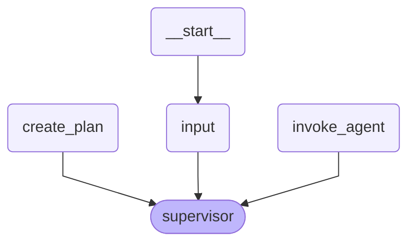
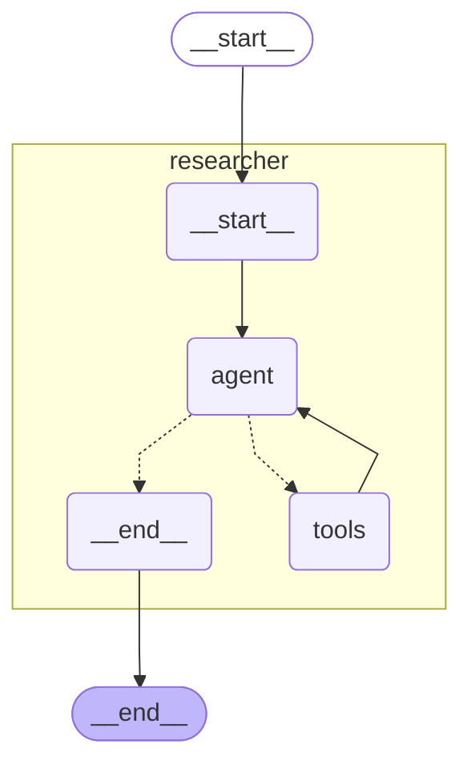
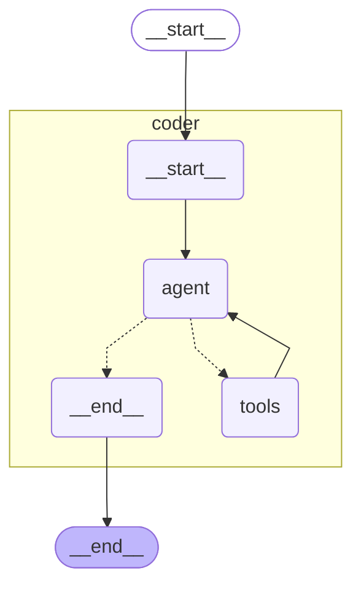

# Multi-Agent Task Execution System

This repository contains a multi-agent system that breaks down complex tasks into discrete steps and routes them to specialized agents for execution. The system consists of three main components:

1. **Planner agent**: Orchestrates the workflow by planning task execution and routing subtasks to worker agents
2. **Researcher Agent**: Finds information, formulas, and reference material without performing calculations
3. **Coder Agent**: Performs calculations and evaluates formulas with specific values

Each agent functions as an independent entrypoint and can be deployed as a separate process, while still being packaged together as part of an Orchestrator Agent Package.

## System Architecture

The system uses LangGraph to create a directed graph of agents that can communicate and pass state to each other.

### Planner Graph


### Researcher Agent


### Coder Agent


## Agent Responsibilities

- **Planner Agent**:
  - Takes user questions and creates execution plans
  - Routes tasks to appropriate worker agents
  - Manages the execution flow and state tracking
  - Returns final results to the user

- **Researcher Agent**:
  - Retrieves information using a Tavily search tool
  - Provides factual content, definitions, and formulas
  - Never performs calculations (strictly enforced)

- **Coder Agent**:
  - Performs calculations using Python code execution
  - Evaluates formulas with specific input values
  - Returns precise numerical results

## Usage

### Running the System

To run the entire system, use the following command with the complete JSON input:

```bash
uipath run planner '{"question": "First, please state the Pythagorean theorem. Give only the formula, using variables a, b, and c. Then apply this formula to calculate the value when a=2 and b=3."}'
```

### Debugging Individual Agents

You can debug individual agents by directly invoking them:

#### Researcher Agent
Run the researcher agent with:

```bash
uipath run researcher '{"messages":[{"content":"State the Pythagorean theorem formula using variables a, b, and c","type":"human"}]}'
```

#### Coder Agent
Run the coder agent with:

```bash
uipath run coder '{"messages":[{"content":"Let me help you state the Pythagorean theorem formula. The Pythagorean theorem is a fundamental mathematical formula that describes the relationship between the sides of a right triangle.\n\nThe formula is:\n\na² + b² = c²\n\nWhere:\n- a and b are the lengths of the two legs (the sides adjacent to the right angle)\n- c is the length of the hypotenuse (the longest side, opposite to the right angle).","type":"human","name":"researcher-agent"},{"content":"Calculate the result using the formula when a=2 and b=3","type":"human"}]}'
```

## Sample Workflow

1. User submits a question about the Pythagorean theorem
2. Planner creates an execution plan with two steps:
   - Step 1: Researcher agent retrieves the Pythagorean theorem formula
   - Step 2: Coder agent applies the formula to calculate the result for a=2, b=3
3. Planner executes Step 1 by invoking the researcher agent
4. Researcher agent returns the formula a² + b² = c²
5. Planner executes Step 2 by invoking the coder agent
6. Coder agent calculates c = √(2² + 3²) = √(4 + 9) = √13 ≈ 3.606
7. Planner combines the responses and returns the final answer to the user

## Implementation Details

The system is implemented using:

- LangGraph for agent orchestration
- LangChain for agent creation and tool integration
- Claude 3.5 Sonnet for LLM capabilities
- Tavily for search functionality in the researcher agent
- Python REPL for code execution in the coder agent

## Requirements

- Python 3.10+
- LangGraph
- LangChain
- Anthropic API key
- Tavily API key
